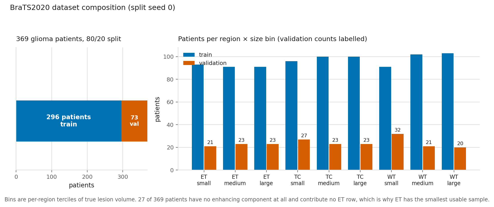
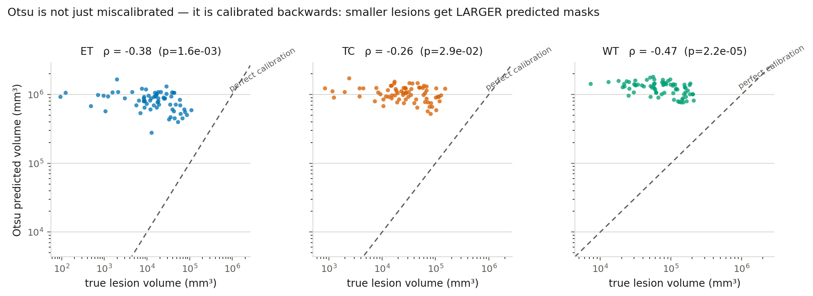
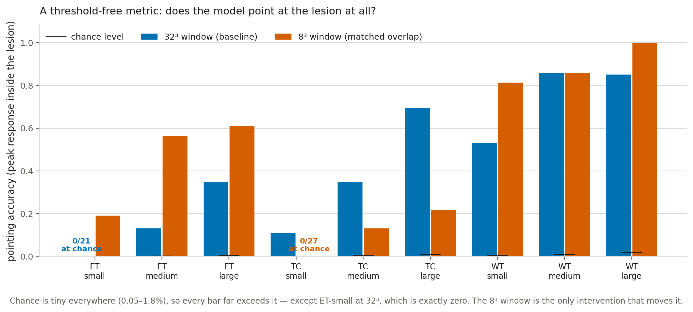
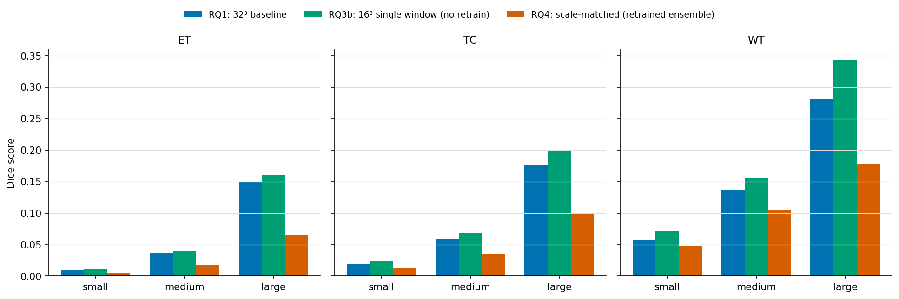
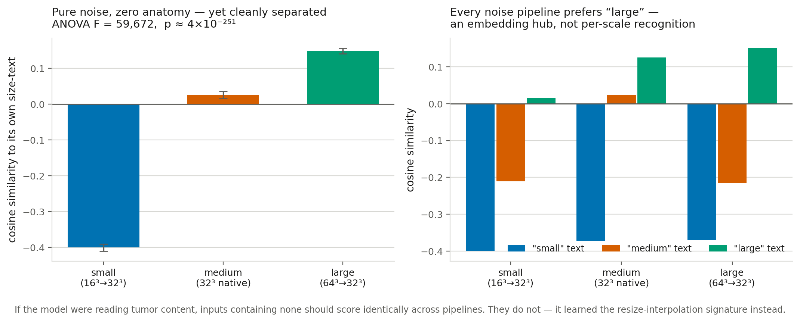
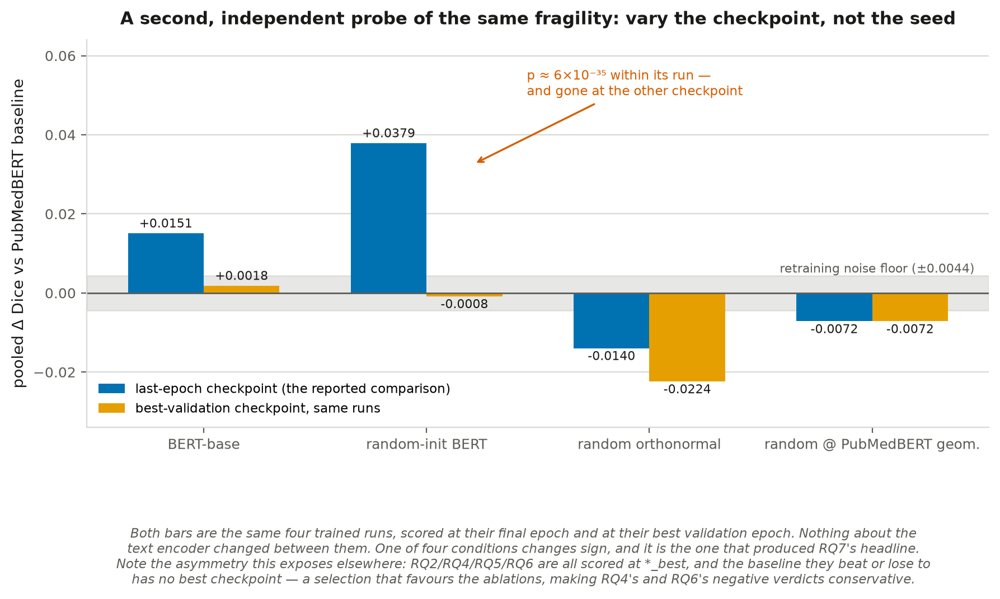
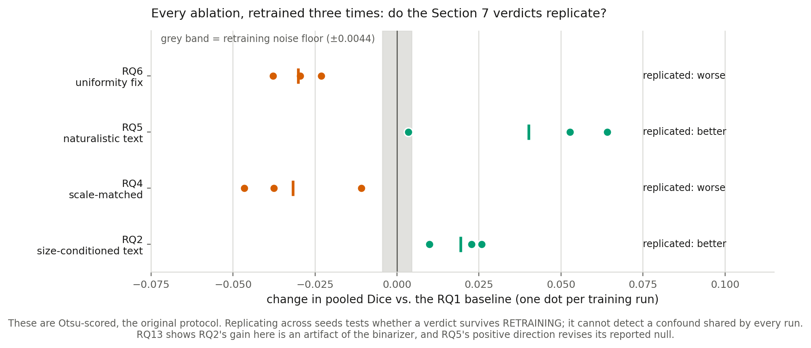
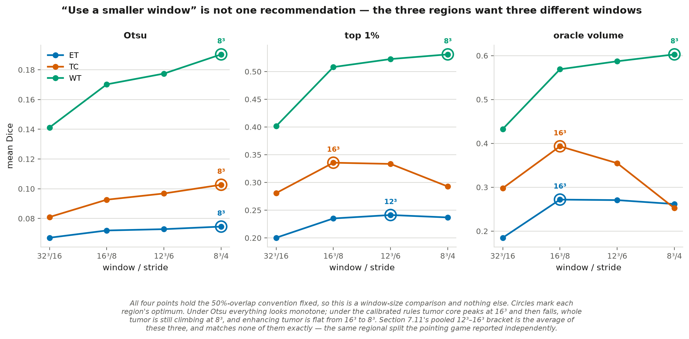
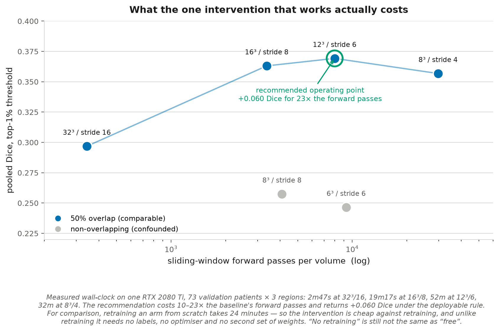

# Architecture, Not Language: Diagnosing Small-Lesion Grounding Failure in Text-Conditioned 3D Medical Localization

**MPCS 53113 Natural Language Processing — Final Report**
University of Chicago

Source code: [https://github.com/rajhansini/Diagnosing-Small-Lesion-Grounding-Failure-in-Text-Conditioned-3D-Medical-Localization](https://github.com/rajhansini/Diagnosing-Small-Lesion-Grounding-Failure-in-Text-Conditioned-3D-Medical-Localization)

## Abstract

Recent 3D medical vision-language models can detect *that* a pathological finding is present but often fail to say *where* when the finding is small, defaulting to oversized, imprecise regions. This has been reported qualitatively but not quantified as a function of lesion size on volumetric data. We build a text-conditioned contrastive localization pipeline — PubMedBERT sentence embeddings aligned with 3D ResNet-10 patch embeddings on BraTS2020 brain MRI — and measure Dice stratified by true lesion volume across three tumor subregions, running seventeen controlled experiments and 171 FDR-corrected paired tests.

**The failure is real and specific.** Localization collapses monotonically with lesion size — 2.4–14.4× Dice degradation large-to-small once binarization is controlled for, and 5–15× as first measured under the unsupervised threshold this project started with — survives a chance-level control, and replicates in 9 of 9 region×bin comparisons across three independent splits. To rule out the deflationary reading that small lesions are simply hard here, we train a conventional supervised U-Net on the identical data, split and metric: it reaches published BraTS Dice (ET 0.758, TC 0.812, WT 0.851) and degrades by only 1.2–1.3× large-to-small. Small lesions are learnable on this data; text-conditioned grounding is what fails on them.

**Roughly half the measured collapse was a metric artifact.** Decomposing the pipeline shows the unsupervised Otsu threshold over-predicts lesion volume by 6–223× and is *anti*-correlated with true size (ρ = −0.26 to −0.48), mechanically inflating the effect. Under an oracle-volume threshold the large/small ratio falls from 15.0/9.2/4.9 to 14.4/5.6/2.4. A threshold-free pointing game localizes what remains: chance-corrected accuracy is roughly uniform at 46–122× chance everywhere, with one stark exception — for small enhancing tumor the peak response lands inside the lesion in **0 of 21 patients**, exactly chance. A third tie-breaking rule sharpens that into the paper's central mechanism rather than softening it: the model's winning 26 mm block *contains* the lesion in 9 of 21 cases, 36× the block-level chance, so it is not searching in the wrong place. Section 7.14 then narrows the mechanism once more, and the narrowing is the project's largest single result: the block is a property of the *read-out*, not the model, and simply attributing each window's score to where it was looking rather than uniformly across everything it covered takes that same bin from 0 of 21 to 7 of 21 with no retraining.

**The language pathway contributes almost nothing.** Replacing PubMedBERT with general-domain BERT, with a randomly initialized never-trained BERT, or with random vectors carrying no language at all produces effects that change sign across training runs — indistinguishable from the 0.0044 Dice noise floor of simply retraining the baseline. Only discarding PubMedBERT's anisotropic embedding *geometry* reliably hurts (−0.0087, consistent across three seeds). Probing the trained model directly, negating the query, destroying its word order, swapping its anatomical referent, or replacing it with contentless filler all leave the projected embedding above 0.94 cosine to the original and the heatmap at ρ = 0.56–1.00; for whole tumor, generic filler and a wrong-region term both *outperform* the true clinical description. The query functions as an opaque class identifier that happens to be spelled in English.

**What works is not what we first thought, and it is free.** Size-conditioned prompting (whose reported gain turns out to be an artifact of the binarizer, vanishing under every calibrated rule), multi-scale ensembling, scale-matched retraining (which a noise probe shows learned resize-interpolation shortcuts, ANOVA p≈4×10⁻²⁵¹) and a uniformity regularizer all fail to beat the plain baseline. Evaluating the frozen model at a smaller query window does help, but a factorial that varies window size and stride independently — which the original sweep never did, having set stride = window/2 at every point — shows most of that gain was **sampling density, not receptive field**: +0.076 Dice from sampling the volume more finely at a fixed 32³ window, against +0.020 from shrinking the window at fixed stride. The largest effect in the project lies somewhere else entirely. The sliding window gives every voxel it covers the same scalar score, so the heatmap is piecewise-constant over stride³ blocks; weighting each window's contribution by a centre-peaked kernel instead — same model, same windows, **no retraining and no additional forward passes** — collapses the tied plateau from 4,096 voxels to 1 and is worth **+0.145 Dice** at the original protocol, more than any window or threshold change and at 71× less compute than the best densely-sampled alternative.

**The methodological result is the transferable one.** Eight conclusions here were overturned or materially qualified *after* being written up, by controls rather than by significance tests — including this report's own central mechanism, twice. Three separate components assumed to be neutral instruments turned out to carry results: the binarizer, the coupling of window size to stride, and the rule attributing a window's score to voxels. The general lesson: a shared confound is not a cancelled confound, and every stage of a pipeline is an instrument until measured otherwise. Every comparison in this report used one binarizer, which we argued made them internally fair; Otsu and every calibrated rule turn out to disagree in *sign* about the same pair of heatmaps, so arms that interact differently with a shared instrument can be ranked backwards by it, invisibly to any amount of paired testing or FDR correction.

## 1. Introduction

Radiology reports routinely describe findings in natural language — location, size, character — while the underlying evidence lives in a 3D volume (CT/MRI). A model that could ground free text directly onto the matching 3D region would be useful for report-to-image verification, weakly-supervised segmentation without costly voxel-level labels, and explainable AI-assisted diagnosis. Several recent 3D medical vision-language models attempt exactly this, and a consistent, troubling pattern has emerged in the literature: these models can often tell *that* a finding exists, but when the finding is small, they fail to say *where* — collapsing to an imprecise region spanning a whole organ or quadrant rather than the actual lesion.

This is not a cosmetic failure. Small, subtle findings are disproportionately the clinically important case: large, obvious masses rarely need AI assistance to be found, while small or early-stage lesions are exactly where a grounding tool would be most valuable — and exactly where current systems are documented to fail worst. If this failure mode is real but unquantified, it's difficult to know how bad it is, whether it's fixable, or what a fix would even target.

This project does four things. First, it builds a controlled experimental setup to **rigorously quantify** this failure as a function of lesion size, rather than relying on qualitative or anecdotal reports — measuring localization quality (Dice/IoU) stratified into small/medium/large tercile bins, on a held-out validation set, across three independently-defined tumor subregions in the BraTS2020 dataset. Second, it **validates that setup against a previously-studied problem** (P′): a conventional supervised segmenter trained on the identical data, split and metric, which both confirms the pipeline is sound and establishes that the collapse is specific to text conditioning rather than intrinsic to small lesions on this data. Third, it runs a systematic **series of ablation studies** — text-side, inference-side, and training-side interventions — to see whether the failure is a *language* problem, an *architecture* problem, or something that can be trained away. Fourth, throughout, it applies a consistent set of twelve **diagnostic controls** (Section 8: chance baselines, shortcut-learning noise probes, cross-split and cross-run replication, family-wise multiple-comparisons correction, pipeline decomposition, metric triangulation, replication at the right unit, metric well-definedness, confound isolation, effect size against significance, rule-sensitivity bounding, and perturbing a selection axis nothing else varied) so that every claim of "improvement" or "failure" is verified rather than eyeballed. Sections 9 and 10 report what went wrong along the way and what the corrections taught; Section 12 sets out what to do next, ordered by expected value per unit of effort.

Two things about how this turned out are worth stating up front. The failure is **architectural rather than linguistic** — strikingly so: the text query turns out to function as an opaque class identifier, and replacing the language model with random vectors changes nothing measurable. And exactly one intervention works, the simplest one available: querying the frozen model at a smaller window. That conclusion was reached only after the diagnostic controls in Section 8 overturned six earlier conclusions this report had already written down, including reversing the window-size verdict twice. Those reversals are documented rather than hidden, because how they were caught is the most transferable part of the work.

## 2. Problem Definition

Given a 3D medical volume $V$ and a text description $t$ of a finding, a text-conditioned localization model $f(V, t) \to M$ predicts a spatial region $M$ corresponding to that finding. Let $M^*$ be the ground-truth region with voxel volume $|M^*|$. We study the relationship between localization quality (Dice($M$, $M^*$)) and $|M^*|$: does quality degrade smoothly, or collapse below some size threshold? This has been noted as a real limitation in recent 3D medical VLM literature but not rigorously measured in a controlled, size-stratified way on volumetric data — that is the gap this project addresses.

## 3. Related Work

**Contrastive vision-language pretraining.** CLIP (Radford et al., 2021) established the pattern this project builds on: align image and text embeddings in a shared space via contrastive learning, then use the aligned space for zero-shot classification, retrieval, or (with post-hoc techniques) localization. We adapt this pattern to 3D volumetric patches rather than 2D natural images.

**BERT sentence embeddings and anisotropy.** Reimers & Gurevych's Sentence-BERT (2019) showed that raw BERT embeddings (CLS-token or mean-pooled) cluster tightly in a narrow cone of the embedding space and perform poorly on semantic similarity tasks without task-specific fine-tuning — a property called anisotropy. We observed exactly this with PubMedBERT (Section 5): our four class descriptions have ~0.99 pairwise cosine similarity in the raw embedding space, confirming the phenomenon holds for biomedical BERT variants too, not just general-domain BERT.

**Text-driven medical segmentation.** MedCLIP-SAMv2 (Koleilat et al., 2024) and SimTxtSeg (Xie et al., 2024) are recent frameworks that use text prompts to drive weakly-supervised or zero-shot medical image segmentation, integrating CLIP-style models with SAM-style segmentation. These operate primarily on 2D slices or 2D imaging modalities (e.g. chest X-ray, 2D CT slices); this project instead works with genuinely volumetric 3D patches and a sliding-window localization mechanism suited to that setting.

**3D medical vision-language grounding failures.** Several 2025-2026 papers document the specific failure this project quantifies. A benchmark of 3D medical VQA models (Chen et al., 2025) found that "without explicit spatial localization, VLMs fail to attend to subtle lesion signals in raw 3D volumes... for small targets such as lesions or nodules, models default to large bounding boxes encompassing the entire organ or image quadrant." An audit of frontier medical VLMs (Chen et al., 2026) similarly found grounding to be "a major failure point," with small-lesion measurement specifically flagged as harder than existence detection due to limited annotated small-lesion cases. These papers establish that the failure is real and current, but report it qualitatively or as one metric among many in a broader benchmark — none isolate the *relationship between lesion size and localization quality* with a controlled chance-level comparison, which is the specific gap this project fills. That comparison matters because Dice is known to be geometrically harsher on small structures for *any* method (Section 6) — without a chance baseline, a raw "small lesions score worse" result is not yet evidence of a model-specific failure, just a property of the metric. This project's contribution is showing the failure survives that control.

**BraTS.** The BraTS challenge (Menze et al., 2015; continued annually since) is the standard benchmark for brain tumor segmentation from multi-modal MRI, and is the data source for this project (2020 edition).

## 4. Dataset

**BraTS2020** (Kaggle: `awsaf49/brats20-dataset-training-validation`), sourced from the MICCAI Brain Tumor Segmentation Challenge. 369 glioma patients, each with 4 co-registered, skull-stripped MRI sequences (T1, T1ce, T2, FLAIR) and a voxel-level expert segmentation mask with three standard evaluation regions:
- **ET** (enhancing tumor)
- **TC** (tumor core = ET ∪ necrotic core)
- **WT** (whole tumor = TC ∪ peritumoral edema)

One patient (`BraTS20_Training_355`) ships with a non-standard segmentation filename (`W39_1998.09.19_Segm.nii`), a leftover artifact from the original hospital anonymization process never corrected in this release — handled with a filename fallback in preprocessing (see Challenges).

All volumes were intensity-normalized (z-score within the brain mask, per modality) and resampled to 128³. True lesion volumes (mm³) were computed from the native-resolution segmentation and voxel spacing (not the resampled grid), then used to bin patients into small/medium/large terciles per region:

| Region | Small cutoff | Large cutoff | Patients with zero volume |
|---|---|---|---|
| ET | ≤9,051 mm³ | >26,245 mm³ | 27/369 (no enhancing component) |
| TC | ≤19,191 mm³ | >49,948 mm³ | 0/369 |
| WT | ≤63,126 mm³ | >125,309 mm³ | 0/369 |

Split: 296 train / 73 held-out validation patients (80/20, fixed seed).

{width=100%}

{width=100%}

The right-hand panel above shows the structural constraint that governs the whole design: the three regions overlap so heavily in absolute volume that a *large* enhancing tumor is physically smaller than a *small* whole tumor. A global size threshold would therefore be measuring which region a case belongs to rather than how large its lesion is.

## 5. Method

**Text encoder**: PubMedBERT (Gu et al., 2021), `microsoft/BiomedNLP-PubMedBERT-base-uncased-abstract-fulltext`, mean-pooled over non-padding tokens. Four base region descriptions (ET/TC/WT/NONE, ~3 template sentences each). Raw PubMedBERT sentence embeddings for these four classes have ~0.99 pairwise cosine similarity — BERT anisotropy (Section 3), not a bug. This means the *trainable projection head*, not the frozen text encoder, is responsible for introducing discriminability.

![The single fact that makes the rest of this report interpretable. Left: the four class descriptions as PubMedBERT emits them, at 0.99 pairwise cosine — the frozen encoder barely distinguishes "enhancing tumor" from "no tumor". Centre: the same four vectors after the trained linear head, which is where all of the separation is introduced (and even there, only the background class moves appreciably away). Right, previewing Section 7.8: every text condition RQ7 substitutes in, ordered by that same geometry statistic. The three conditions matching PubMedBERT's anisotropic geometry are indistinguishable from retraining noise no matter what they mean; the one that discards it is the only one that reliably costs anything. Cosine matrices share a −1 to +1 colour scale.](figures/fig_anisotropy.png){width=100%}

**Volume encoder**: MONAI 3D ResNet-10 (residual architecture of He et al., 2016), 4 input channels, operating on 32³-voxel patches sampled from the 128³ volume (positive patches centered on a random voxel within the target region's mask; a background/"NONE" class sampled from outside the whole-tumor region).

**Alignment (the *alignment baseline*)**: contrastive classification — image and text embeddings are projected into a shared 256-d space (L2-normalized), and trained with cross-entropy over cosine-similarity logits (temperature 0.07) against the 4 classes (ET/TC/WT/NONE). This is the model every text-conditioned result in this report is built on. Note on naming: earlier drafts called this "P′". That label is now reserved for the *previously-studied problem* used to validate the pipeline (supervised BraTS segmentation, Section 6.1), which is what P′ conventionally means; this contrastive model is referred to throughout as the alignment baseline or the RQ1 baseline.

**Localization / heatmap extraction**: Grad-CAM was the original plan but was rejected on inspection (Section 8) — this architecture globally average-pools each 32³ patch to a single embedding, leaving no meaningful spatial feature map near the output to back-propagate onto. Instead, we use a **sliding-window similarity map**: the trained patch encoder is swept across the full 128³ volume (stride 16), and each window's cosine similarity to the query text embedding is accumulated into a per-voxel heatmap. Validated with a sanity check confirming the ET-query heatmap scores higher inside the true ET region than outside (+0.247 mean difference) and the inverse holds for the NONE query.

**Binarization**: Otsu's method (Otsu, 1979; unsupervised, per-volume) converts the continuous heatmap into a predicted mask for Dice (Dice, 1945) and IoU scoring — chosen so the threshold is not tuned against ground truth (which would leak test-time information).

{width=95%}

### 5.1 Techniques used, and how they work

Several methods this project relies on were not covered in class. Each is summarized here, with a reference to a fuller description.

**Contrastive alignment with a temperature-scaled softmax (InfoNCE).** Image and text embeddings are L2-normalized and projected into a shared space; the cosine similarity between an image embedding and each of the $K$ class text embeddings forms a logit vector, divided by a temperature $\tau$ (here 0.07) and passed through softmax cross-entropy against the true class:
$$\mathcal{L} = -\log \frac{\exp(\text{sim}(v, t_{y})/\tau)}{\sum_{k=1}^{K}\exp(\text{sim}(v, t_{k})/\tau)}$$
Low $\tau$ sharpens the distribution, penalizing near-misses heavily and pushing classes apart. This is the CLIP/InfoNCE objective (Oord et al., 2018; Radford et al., 2021) with the text side acting as a fixed set of class prototypes rather than as in-batch negatives.

**Otsu's method** (Otsu, 1979). An unsupervised way to pick a binarization threshold from a single image's intensity histogram. It considers every candidate cut point and selects the one maximizing the variance *between* the two resulting groups — equivalently minimizing variance within them. We chose it precisely because it never sees ground truth, so it cannot leak test-time information into Dice. Section 6.3 quantifies what that choice cost.

**The uniformity regularizer** (Wang & Isola, 2020). Wang and Isola showed contrastive representation quality decomposes into *alignment* (matched pairs are close) and *uniformity* (embeddings spread over the hypersphere rather than collapsing). RQ4 produced exactly a uniformity failure — the class embeddings collapsed into a hub. RQ6 adds a penalty on high pairwise cosine similarity among projected class embeddings to push them apart.

**The pointing game** (Zhang et al., 2018). A localization metric from weakly-supervised grounding: take the single highest-response location in a saliency map and ask whether it falls inside the ground-truth region. Unlike Dice it is threshold-free and carries no geometric penalty against small targets, so it separates "did the model point at the lesion" from "did it draw the right boundary." Its chance level still scales with target size, so we always report lift over a per-bin chance baseline rather than the raw hit rate.

**Wilcoxon signed-rank test** (Wilcoxon, 1945). A non-parametric paired test. Because each patient is scored under both conditions, comparisons are paired; and because per-patient Dice is bounded, skewed, and frequently near zero for small lesions, a paired *t*-test's normality assumption is not safe. Wilcoxon ranks the absolute paired differences and tests whether positive and negative ranks are balanced.

**Benjamini-Hochberg FDR correction** (Benjamini & Hochberg, 1995). With 171 accumulated tests at α=0.05, roughly nine "significant" results would be expected from noise alone. BH sorts the $m$ p-values ascending and rejects the largest $i$ for which $p_{(i)} \le \frac{i}{m}\alpha$, controlling the expected *proportion* of false discoveries among rejections. It is less conservative than Bonferroni, which is appropriate here because these tests are positively correlated (they share a baseline arm).

**Matched-pairs rank-biserial correlation** (Kerby, 2014) **and bootstrap intervals** (Efron & Tibshirani, 1993)**.** Effect size for Wilcoxon, ranging from −1 to +1. Reported alongside every p-value because with n=20–32 per bin a result can be significant yet negligible; Section 7 flags such cases explicitly. Confidence intervals on mean paired differences use a percentile bootstrap (10,000 resamples, seeded) rather than a normal-theory interval, for the same distributional reason Wilcoxon is used.

### 5.2 Code components

All code was written for this project; see [`src/README.md`](src/README.md) for a file-by-file listing with line counts. The major components:

| Component | Files | Role |
|---|---|---|
| **Data pipeline** | `preprocess.py`, `text_encoder.py` | NIfTI loading, per-modality z-scoring inside the brain mask, resampling to 128³, true native-resolution lesion volumes for size binning; PubMedBERT embedding of all text variants. |
| **Datasets** | `dataset.py`, `dataset_rq2.py`, `dataset_rq4.py`, `dataset_pprime.py` | Patch samplers for each experimental condition (region-labeled, size-conditioned, scale-matched) plus the full-volume segmentation loader for P′. `region_mask()` here is the single definition of ET/TC/WT used everywhere. |
| **Model** | `model.py` | `TextVolumeAligner`: MONAI 3D ResNet-10 volume encoder plus a linear text projection into a shared 256-d L2-normalized space. |
| **Localization** | `localize.py` | `sliding_window_heatmap()`: sweeps the encoder across the volume, accumulating per-voxel cosine similarity to a query. Supports querying at a different physical window size than the model was trained at, which is what makes the whole RQ3/RQ3b/RQ3c/RQ12 window sweep possible without retraining. |
| **Training** | `train_baseline.py`, `train_rq2/4/5/6/7.py`, `train_pprime_supervised.py` | One script per experimental arm, each taking `--seed` to control the train/val split for cross-seed replication. |
| **Evaluation** | `evaluate_rq1.py` and 14 siblings | `evaluate_rq1.py` defines `otsu_threshold()`, `dice_iou()` and `size_bin()`, which every other evaluation — including the supervised P′ — imports, so all arms are scored by literally the same code. |
| **Diagnostics** | `test_rq4_shortcut_hypothesis.py`, `test_rq6_hub_bias.py`, `compute_chance_baseline.py`, `sanity_check_localize.py` | Noise probes, chance-level control, and the pre-flight check that the heatmap scores higher inside the true region than outside. |
| **Analysis** | `analyze_full_family.py`, `analyze_seed_replication.py`, `analyze_rq7_multiseed.py`, `analyze_appendix.py`, `analyze_rq14.py`, and 7 others | Recompute every statistic directly from the saved per-patient CSVs, so no number in this report is transcribed by hand. |
| **Figures** | 14 figure scripts | All 41 figures regenerate from the result CSVs and training logs; none is drawn by hand. |

Two recurring design decisions are worth naming. First, **evaluation scripts import their metric definitions rather than redefining them**, which is what makes cross-experiment comparison meaningful. Second, **several scripts carry a built-in correctness gate**: `evaluate_rq8_compositionality.py` asserts its "original" condition reproduces RQ1's CSV exactly, and `evaluate_grounding_sweep.py` at window 32 must reproduce RQ11's — both caught real bugs during development.

### 5.3 Experimental configuration

Every arm in this report shares one training recipe; only the marked rows differ between arms. Stating it explicitly matters here because several later conclusions turn on details that would otherwise read as incidental — the checkpoint policy in particular (Sections 7.8 and 11).

| Setting | Value | Notes |
|---|---|---|
| Volume encoder | MONAI 3D ResNet-10, 4 input channels | Classification head repurposed as the projection head |
| Text branch | one `nn.Linear(768, 256)` over frozen embeddings | Frozen encoder; only this layer trains on the text side |
| Shared space | 256-d, L2-normalized on both branches | Dot product in this space *is* cosine similarity |
| Objective | softmax cross-entropy over cosine logits | 4-way (ET/TC/WT/NONE); *10-way for RQ2/RQ4/RQ6* |
| Temperature $\tau$ | 0.07 | CLIP's value, not tuned here |
| Optimizer | Adam, lr $10^{-4}$, no schedule, no weight decay | |
| Epochs / batch | 30 / 32 | ~24 min on one RTX 2080 Ti |
| Training patches | 1,163 train / 286 val (patient, region) pairs | Placement re-randomized every epoch, so the model sees many crops per pair |
| Patch size | 32³ voxels | *RQ4/RQ6 crop at 16³/32³/64³ and resize to 32³* |
| Uniformity weight | — | *RQ6 only: 0.5* |
| Inference | sliding window 32³, stride 16 | Section 7.11 sweeps this |
| Binarization | Otsu, per volume, unsupervised | Section 6.3 sweeps this |

**P′ supervised reference** (Section 6.1): MONAI 3D U-Net, channels (16, 32, 64, 128, 256), strides (2, 2, 2, 2), 3 sigmoid output channels, Dice loss, Adam at $10^{-3}$ with cosine annealing, 96³ random crops, batch size 2, 200 epochs under a 3.4-hour wall-clock cap (37 min actual).

**Checkpoint policy, and one asymmetry it creates.** `train_baseline.py` writes a single last-epoch checkpoint; the retrained ablations write both a last and a best-validation checkpoint and are evaluated at `_best`. The baseline the ablations are compared against therefore has no best checkpoint to be selected on. The direction of that bias is worth stating: it favours the ablations, so RQ4's and RQ6's negative verdicts (Sections 7.5–7.6) are conservative, while RQ2's positive one is not — an observation independent of, and consistent with, Section 7.12's finding that RQ2's gain is a binarizer artifact. RQ7 is the exception and was deliberately run both ways, because there the baseline's last-epoch status is the whole comparison; Section 7.8 reports what that choice was worth.

**Compute.** 120 SLURM jobs on one cluster partition, 34.2 GPU-hours in total, almost all on a single RTX 2080 Ti. Representative runtimes: baseline training 24 min, P′ training 37 min, RQ1 evaluation 2 min 47 s, the 16³ window sweep 19 min, the 12³ sweep 52 min. Every experiment was smoke-tested on a 10-minute `dev` partition before being submitted for real (11 `smoke_test_*.sbatch` scripts); eight RQ7 seed jobs failed on first submission from a bad argument and were caught in 8 seconds each because of it.

## 6. Core Result: Size-Stratified Localization Failure

**Note on numbering.** Research questions are labelled in the order they were posed during the project, and the sequence is not contiguous: it runs RQ1–RQ8 and RQ11–RQ13, with RQ3 further split into RQ3b and RQ3c as the window question narrowed. No experiment was assigned RQ9 or RQ10. Labels are kept as they were rather than renumbered, so that every RQ in this report resolves to the same script, CSV and job log in the repository and in `work_log.pdf`.

**Note on multiple comparisons.** Sections 6 and 7 together report many paired significance tests (171 in total by the end of Section 7: region × size-bin × comparison, across 8 research questions). At uncorrected α=0.05, that volume of testing would be expected to produce a small number of spurious "significant" results by chance alone. We therefore apply Benjamini-Hochberg FDR correction across the full accumulated family of tests and report both the raw p-value and BH-adjusted q-value wherever a specific claim rests on statistical significance; any result that is significant raw but does not survive correction is explicitly flagged as such rather than presented as a finding.

### 6.1 P′: validating the pipeline against a previously-studied problem

Every result in this report is produced by one pipeline — our preprocessing, our split, our `dice_iou()`, our size terciles. If any of those carried a bug, "small lesions localize badly" would be unfalsifiable from the inside: we would have no way to distinguish a real grounding failure from, say, a misaligned mask or a broken metric. Two checks address this, an internal one and an external one.

**Internal: does the alignment learn anything?** Full run, 296 train / 73 val patients, 30 epochs: validation accuracy on the 4-way ET/TC/WT/NONE classification rose from 0.51 to a peak of 0.671 (epoch 26), finishing at 0.626, against a chance level of 0.25. The pipeline learns a genuine, non-trivial text-volume alignment signal.

**External (P′): does the same machinery reproduce published results on a problem someone else has already solved?** That problem is supervised BraTS tumor segmentation, scored publicly by the MICCAI challenge since 2012. We trained a plain 3D U-Net (Ronneberger et al., 2015) reusing, unchanged, the same preprocessed volumes, the same seed-0 split, the same `region_mask()` definitions and the same `dice_iou()` — changing only the model and the supervision signal.

| Region | P′ Dice (ours) | Published BraTS2020 range | In range? |
|---|---|---|---|
| ET | 0.758 | 0.70 – 0.80 | yes |
| TC | 0.812 | 0.80 – 0.87 | yes |
| WT | 0.851 | 0.86 – 0.89 | 0.009 below |

Two of three regions land inside the published range and the third is 0.009 short of it, which is what a single small U-Net on 128³ resampled volumes should look like against leaderboard entries that use native resolution, ensembling and test-time augmentation. **The shared machinery is therefore sound, and the low absolute Dice in Sections 6.2–7 is a property of text-conditioned localization rather than a defect in the plumbing underneath it.**

**P′ also answers a question no text-conditioned arm could.** Because it is scored by the identical size terciles, its large/small ratio is directly comparable to RQ1's — which separates "text-conditioned grounding fails on small lesions" from "small lesions are simply hard for everything on this data."

| Region | P′ supervised L/S | RQ1 text-conditioned L/S (Otsu) | RQ1 (oracle threshold) |
|---|---|---|---|
| ET | **1.3×** | 15.0× | 14.4× |
| TC | **1.3×** | 9.2× | 5.6× |
| WT | **1.2×** | 4.9× | 2.4× |

A fully supervised model on this exact data barely degrades at all: 0.636 → 0.858 Dice across ET's size range, against the text-conditioned model's 0.010 → 0.149. **Small lesions are not intrinsically unlearnable here, and Dice's geometric size penalty is not large enough to explain the collapse — a supervised model absorbs both and still scores 0.64 on the smallest enhancing tumors.** This is the strongest evidence in the report that the failure is specific to text-conditioned localization, and it rules out the most obvious deflationary reading of the entire project.

{width=98%}

### 6.2 RQ1: Size-stratified localization

| Region | Small Dice | Medium Dice | Large Dice | Large/Small ratio |
|---|---|---|---|---|
| ET | 0.010 ± 0.009 (n=21) | 0.037 ± 0.015 (n=23) | 0.149 ± 0.078 (n=23) | 15.0× |
| TC | 0.019 ± 0.012 (n=27) | 0.059 ± 0.022 (n=23) | 0.176 ± 0.062 (n=23) | 9.2× |
| WT | 0.057 ± 0.026 (n=32) | 0.137 ± 0.036 (n=21) | 0.281 ± 0.049 (n=20) | 4.9× |

The degradation is monotonic and severe across **all three independently-defined tumor subregions**, holding on a held-out validation set never seen during training. This directly and quantitatively confirms the small-lesion grounding failure documented qualitatively in recent 3D medical VLM literature (Section 3). Absolute Dice is modest throughout (a lightweight ResNet-10 with an unsupervised Otsu threshold, not a competitive segmentation model) — the finding is about the *relative* size-dependent collapse. Section 6.1 bounds how much of that modesty is the task setup rather than the pipeline: the same data, split and metric under dense supervision reach 0.76–0.85 Dice.

**Is the collapse specific to Dice's algebra?** Every evaluation script has also written an IoU column since the first run, and the report quoted it nowhere. IoU is a monotone transform of Dice per patient (IoU = Dice / (2 − Dice)), so it cannot reverse any single comparison — but it is harsher on partial overlap, so the *aggregate* ratios need not agree. They do, and IoU is slightly less flattering: large/small ratios of **16.4× / 10.0× / 5.6×** for ET/TC/WT against Dice's 15.0× / 9.2× / 4.9×, with the Spearman correlation against log volume identical to three decimal places in all three regions (0.970 / 0.978 / 0.968). Recomputing every ablation's pooled verdict on IoU instead of Dice keeps the sign in **7 of 7** arms. The reported figures are therefore the conservative ones, and nothing in the report rests on which of the two overlap metrics was chosen.

{width=100%}

\newpage

{width=95%}

**Statistical validation — is this just a Dice artifact?** Dice is known to penalize small structures more harshly than large ones for *any* predictor, purely as a geometric property of the metric (a single misclassified voxel costs a tiny lesion far more of its Dice score than it costs a large one). To check whether the RQ1 collapse is a real model failure rather than this artifact, we computed a **chance baseline**: pure random-noise heatmaps run through the identical Otsu-threshold-and-Dice pipeline, on the same 73 validation patients.

The chance baseline collapses with size too — as expected, since this reflects the metric, not the model. Its absolute values are worth stating, because they are what "no information at all" scores under this protocol:

| Region | Small | Medium | Large |
|---|---|---|---|
| ET | 0.0009 | 0.0035 | 0.0112 |
| TC | 0.0023 | 0.0070 | 0.0186 |
| WT | 0.0086 | 0.0205 | 0.0355 |

Spearman correlation between Dice and log-volume is extremely strong for *both* the model (ρ=0.97–0.98) and chance (ρ=0.999–1.000, i.e. almost perfectly deterministic), confirming Dice's inherent size-dependence. The question that actually isolates the model's behavior is the **lift over chance** (model Dice ÷ chance Dice) at each size bin:

| Region | Small lift | Medium lift | Large lift |
|---|---|---|---|
| ET | 10.8× | 10.7× | 13.3× |
| TC | 8.4× | 8.5× | 9.4× |
| WT | 6.6× | 6.7× | 7.9× |

{width=100%}

{width=100%}

This is the more careful finding: the model's *relative* advantage over chance is roughly **constant** across size bins (within each region, small/medium/large lift are all within ~25% of each other) — the model isn't disproportionately losing signal on small lesions relative to a null baseline. What collapses is **absolute** localization quality: even with a consistent ~7-13× advantage over random guessing, small-lesion Dice (0.010–0.057) is nowhere near clinically usable, while large-lesion Dice (0.149–0.281), though still modest, is at least in a range serious methods report. So the honest claim is not "the model is uniquely broken on small lesions relative to its own baseline" — it's "even a consistent relative advantage over chance is not enough to produce usable absolute localization when the target is small," which is arguably the more clinically relevant framing anyway: a radiologist doesn't care whether a bad prediction is bad in an absolute or relative sense.

\newpage

{width=95%}

The qualitative example above makes the mechanism visible: the visible blockiness in both heatmaps is the sliding-window's fixed 32³ receptive field. For the large lesion it happens to roughly match the tumor's scale, so the peak response block and the true boundary line up reasonably well. For the small lesion, the entire true region fits inside a small fraction of a single response block — the window simply cannot resolve anything finer than its own size, regardless of how correct or incorrect its content judgment is.

**Robustness check: does this hold on a different split?** Every result up to this point uses one fixed 80/20 split (seed 0). To check this isn't an artifact of that particular split, we retrained and re-evaluated the entire alignment baseline from scratch on two additional independent random splits (seeds 1 and 2, same hyperparameters, same protocol).

| Region | Bin | seed 0 | seed 1 | seed 2 | mean ± std |
|---|---|---|---|---|---|
| ET | small | 0.0100 | 0.0083 | 0.0079 | 0.0087 ± 0.0009 |
| ET | medium | 0.0374 | 0.0375 | 0.0285 | 0.0345 ± 0.0042 |
| ET | large | 0.1488 | 0.1223 | 0.0981 | 0.1231 ± 0.0207 |
| TC | small | 0.0192 | 0.0220 | 0.0175 | 0.0196 ± 0.0019 |
| TC | medium | 0.0590 | 0.0738 | 0.0601 | 0.0643 ± 0.0068 |
| TC | large | 0.1756 | 0.2254 | 0.1477 | 0.1829 ± 0.0321 |
| WT | small | 0.0568 | 0.0445 | 0.0474 | 0.0496 ± 0.0053 |
| WT | medium | 0.1367 | 0.1220 | 0.1333 | 0.1307 ± 0.0063 |
| WT | large | 0.2809 | 0.2467 | 0.2576 | 0.2617 ± 0.0142 |

**The monotonic small < medium < large pattern holds exactly in all 3 seeds, for all 3 regions** (9 of 9 replications). Absolute Dice values shift somewhat between splits (expected, given different held-out patients and a modest ~73-patient validation set each time), but the core relationship this project is built around is not an artifact of one particular train/val split.

### 6.3 RQ11: How much of the collapse is grounding failure, and how much is the threshold?

Sections 6.1–6.2 measure localization through a two-stage pipeline: a continuous similarity heatmap, then an unsupervised Otsu threshold converting it to a binary mask. Every Dice number reported so far is a property of *both* stages. The chance-level control in Section 6.2 does not separate them — a random heatmap is binarized by the same Otsu step, so a thresholding pathology would appear in the model and the control alike and cancel out of the lift ratio.

This matters because Otsu picks its cut point from each volume's own intensity histogram, with no reference to the query or to plausible lesion size. If it emits a roughly constant-size blob regardless of the target, small lesions would score badly for a reason unrelated to text-conditioned grounding. Our result CSVs could not answer this: they never recorded how large the predicted mask actually was.

We therefore recomputed the heatmap once per (patient, region) with the identical frozen baseline and 32³/stride-16 protocol, then binarized it five ways: Otsu (the published protocol), fixed top-10%/5%/1% of voxels, and an **oracle-volume** threshold taking exactly as many voxels as the ground-truth mask contains. The last removes threshold calibration from the problem entirely and asks only how well the heatmap *ranks* voxels; it uses ground truth and is therefore a diagnostic upper bound, never a deployable method.

**Otsu is badly miscalibrated, and miscalibrated in the wrong direction.**

| Region | Bin | GT volume | Otsu predicted | Over-prediction | % of imaged volume |
|---|---|---|---|---|---|
| ET | small | 4,124 mm³ | 920,036 mm³ | 223.1× | 10.3% |
| ET | large | 50,716 mm³ | 718,728 mm³ | 14.2× | 8.1% |
| TC | small | 10,213 mm³ | 1,105,667 mm³ | 108.3× | 12.4% |
| TC | large | 84,708 mm³ | 937,076 mm³ | 11.1× | 10.5% |
| WT | small | 38,995 mm³ | 1,371,023 mm³ | 35.2× | 15.4% |
| WT | large | 164,364 mm³ | 1,022,709 mm³ | 6.2× | 11.5% |

{width=100%}

Otsu returns a near-constant 8-15% of the imaged volume whatever the target's size. Worse, the correlation between true and predicted volume is **negative in all three regions** (ET ρ=−0.374, p=0.0018; TC ρ=−0.258, p=0.028; WT ρ=−0.475, p=2.2×10⁻⁵), where a calibrated predictor would approach +1. The thresholding step assigns *larger* masks to *smaller* lesions, mechanically manufacturing part of the size effect Section 6.2 attributes to grounding.

**The cost of that step is large and paired-significant in 8 of 9 bins.**

| Region | Bin | Otsu Dice | Oracle-volume Dice | Gain | p (Wilcoxon) |
|---|---|---|---|---|---|
| ET | small | 0.0100 | 0.0254 | 2.6× | 0.43 (n.s.) |
| ET | medium | 0.0374 | 0.1495 | 4.0× | 0.038 |
| ET | large | 0.1488 | 0.3652 | 2.5× | 2.4×10⁻⁷ |
| TC | small | 0.0192 | 0.0922 | 4.8× | 0.0089 |
| TC | medium | 0.0590 | 0.3212 | 5.4× | 1.7×10⁻⁵ |
| TC | large | 0.1756 | 0.5175 | 2.9× | 4.8×10⁻⁷ |
| WT | small | 0.0568 | 0.2600 | 4.6× | 2.0×10⁻⁶ |
| WT | medium | 0.1367 | 0.5162 | 3.8× | 9.5×10⁻⁷ |
| WT | large | 0.2809 | 0.6218 | 2.2× | 1.9×10⁻⁶ |

This revises a claim made in Section 6.2. We attributed modest absolute Dice to "a lightweight ResNet-10 baseline with an unsupervised Otsu threshold" — the measurement now shows the threshold, not the backbone, carried most of that cost. Whole-tumor large-lesion Dice is 0.622 under proper binarization, not 0.281. The single exception is ET-small, the only bin where better thresholding does *not* help significantly (p=0.43): there the heatmap's ranking is itself poor, so no cut point recovers it.

**The size collapse survives, at reduced magnitude.**

| Region | L/S ratio (Otsu, as reported in 6.2) | L/S ratio (oracle-volume) | Spearman(Dice, volume) Otsu → oracle |
|---|---|---|---|
| ET | 15.0× | **14.4×** | 0.970 → 0.835 |
| TC | 9.2× | **5.6×** | 0.978 → 0.770 |
| WT | 4.9× | **2.4×** | 0.968 → 0.781 |

{width=100%}

The full ladder underlying that figure, since the two rules quoted so far are only its ends:

| Region | Rule | Small | Medium | Large | L/S | ρ(Dice, volume) |
|---|---|---|---|---|---|---|
| ET | Otsu | 0.0100 | 0.0374 | 0.1488 | 15.0× | 0.970 |
| ET | top 10% | 0.0092 | 0.0339 | 0.1063 | 11.6× | 0.999 |
| ET | top 5% | 0.0165 | 0.0618 | 0.1956 | 11.9× | 0.983 |
| ET | **top 1%** | **0.0436** | **0.1774** | **0.3672** | 8.4× | 0.896 |
| ET | oracle volume | 0.0254 | 0.1495 | 0.3652 | 14.4× | 0.835 |
| TC | Otsu | 0.0192 | 0.0590 | 0.1756 | 9.2× | 0.978 |
| TC | top 10% | 0.0221 | 0.0667 | 0.1700 | 7.7× | 0.999 |
| TC | top 5% | 0.0402 | 0.1207 | 0.2983 | 7.4× | 0.991 |
| TC | top 1% | 0.0848 | 0.2872 | 0.5070 | 6.0× | 0.851 |
| TC | oracle volume | 0.0922 | 0.3212 | 0.5175 | 5.6× | 0.770 |
| WT | Otsu | 0.0568 | 0.1367 | 0.2809 | 4.9× | 0.968 |
| WT | top 10% | 0.0807 | 0.1853 | 0.3048 | 3.8× | 0.998 |
| WT | top 5% | 0.1405 | 0.3093 | 0.4898 | 3.5× | 0.981 |
| WT | top 1% | 0.2577 | 0.5049 | 0.5248 | 2.0× | 0.695 |
| WT | oracle volume | 0.2600 | 0.5162 | 0.6218 | 2.4× | 0.781 |

Two patterns in this table are worth naming, because neither is visible from the Otsu and oracle rows alone. First, **the better the rule, the weaker the correlation with lesion volume** — ρ falls from 0.999 under the crudest fixed rule to 0.70–0.84 under the best two. Part of what looked like a size effect was the binarizer's own near-deterministic size dependence. Second, **the top-1% rule beats the oracle for enhancing tumor in all three bins** (0.0436/0.1774/0.3672 against 0.0254/0.1495/0.3652). That is not a contradiction: when a heatmap's voxel *ranking* is unreliable, spending exactly the right *number* of voxels is only rewarded if they are the right ones, and over-predicting is Dice-optimal instead. It is the same fact that the pointing game, later in this section, states more directly.

Enhancing tumor's collapse is essentially entirely genuine; tumor core's and whole tumor's are roughly half thresholding artifact. The honest headline is therefore **2.4-14.4× degradation after controlling for binarization**, not 5-15×. The relationship remains monotonic, strongly positive, and present in every region under every one of the five binarization rules tested — it is the magnitude, not the existence, that was overstated.

**A threshold-independent metric isolates where the real failure lives.** Dice conflates "did the model point at the lesion" with "did it draw the right boundary." We therefore also report the **pointing game** (Zhang et al., 2018): is the highest-response location inside the true mask? It is free of Dice's geometric size penalty. Its chance level still scales with target size, so we compare against a per-bin chance baseline (mean GT voxels ÷ total voxels) with an exact binomial test.

**First, a correction to how that peak is located.** A sliding window of stride $s$ gives every voxel the mean of the windows covering it, and all voxels inside the same $s^3$ block are covered by an identical window set — so the heatmap is *piecewise-constant over $s^3$ blocks*, not smooth. At our published 32³/stride-16 protocol that block is 16³ = 4096 voxels, roughly 30 mm across, and `argmax` silently returns the block's **corner** in array order rather than anything peak-like. We verified this directly: the median count of voxels tied at the maximum is exactly 4096 at stride 16 and exactly 512 at stride 8, matching $s^3$ in both cases. We therefore locate the peak at the **centroid of the tied-maximum plateau** and report both rules below, since the naive rule biases hit rates down and distances up.

| Region | Bin | n | Hits (corrected) | Hit rate | Chance | Lift | p | Median distance |
|---|---|---|---|---|---|---|---|---|
| ET | small | 21 | **0** | 0.000 | 0.0005 | **0.0×** | 1.00 | 23.7 mm |
| ET | medium | 23 | 3 | 0.130 | 0.0018 | 74.5× | 9.3×10⁻⁶ | 9.4 mm |
| ET | large | 23 | 8 | 0.348 | 0.0057 | 61.2× | 4.9×10⁻¹³ | 2.9 mm |
| TC | small | 27 | 3 | 0.111 | 0.0011 | 97.1× | 4.3×10⁻⁶ | 12.0 mm |
| TC | medium | 23 | 8 | 0.348 | 0.0035 | 99.0× | 1.1×10⁻¹⁴ | 1.9 mm |
| TC | large | 23 | 16 | 0.696 | 0.0095 | 73.3× | 9.9×10⁻²⁸ | 0.0 mm |
| WT | small | 32 | 17 | 0.531 | 0.0044 | 121.6× | 4.1×10⁻³² | 0.0 mm |
| WT | medium | 21 | 18 | 0.857 | 0.0105 | 81.9× | 2.9×10⁻³³ | 0.0 mm |
| WT | large | 20 | 17 | 0.850 | 0.0184 | 46.2× | 3.5×10⁻²⁷ | 0.0 mm |

{width=100%}

The correction matters most where the model was already doing well: whole-tumor small goes from 6/32 hits to 17/32, and tumor-core large from 13/23 to 16/23. **The headline claim is unaffected: enhancing-tumor small remains 0 hits in 21 patients under both rules.** The old first-argmax numbers are retained in the analysis log for comparison.

<!-- superseded rows, kept for reference against the first-argmax rule:
| ET | small | 21 | 0 | 0.000 | 0.0005 | 0.0× | 1.00 | 27.5 mm |
| ET | large | 23 | 6 | 0.261 | 0.0057 | 45.9× | 3.1×10⁻⁹ | 2.4 mm |
| TC | large | 23 | 13 | 0.565 | 0.0095 | 59.6× | 5.3×10⁻²¹ | 0.0 mm |
| WT | small | 32 | 6 | 0.188 | 0.0044 | 42.9× | 5.7×10⁻⁹ | 8.7 mm |
| WT | large | 20 | 16 | 0.800 | 0.0184 | 43.5× | 7.9×10⁻²⁵ | 0.0 mm |
-->

{width=100%}

Chance-corrected lift is roughly **uniform at 46-122× across every region and size bin** — echoing Section 6.2's finding that lift over chance is approximately constant, but now with a metric that has no built-in size bias. The exception is stark and specific: **for small enhancing tumor the model is at exact chance, 0 hits in 21 patients, with its peak response a median 23.7 mm from the nearest lesion voxel.** This is the sharpest statement of the failure this project can make, and it is confined to one region×bin rather than being the smooth monotonic collapse the Dice framing suggests. Section 7.11 returns to this bin and shows it is the one place the smaller-window intervention genuinely helps.

**How much of that depends on how the tie is broken?** The correction above replaced one rule for locating an ambiguous peak with another, which invites the obvious follow-up: is the ET-small result a property of the model or of the rule? A third rule was recorded alongside the other two and is reported here for the first time. It asks not where the peak *is* but whether the winning plateau — the whole 16³ block sharing the maximum — intersects the lesion at all. It is not a pointing rule, so it needs its own chance baseline: the fraction of the 512 stride-aligned blocks that the ground-truth mask intersects, computed per patient from the masks.

| Region | Bin | n | argmax corner | plateau centroid | peak block touches | block chance | block lift |
|---|---|---|---|---|---|---|---|
| ET | small | 21 | 0 | **0** | **9** | 1.19% | 36.0× |
| ET | medium | 23 | 3 | 3 | 18 | 2.40% | 32.6× |
| ET | large | 23 | 6 | 8 | 23 | 4.08% | 24.5× |
| TC | small | 27 | 2 | 3 | 15 | 1.39% | 40.0× |
| TC | medium | 23 | 9 | 8 | 20 | 2.74% | 31.7× |
| TC | large | 23 | 13 | 16 | 23 | 4.66% | 21.4× |
| WT | small | 32 | 6 | 17 | 25 | 3.08% | 25.4× |
| WT | medium | 21 | 15 | 18 | 21 | 5.79% | 17.3× |
| WT | large | 20 | 16 | 17 | 20 | 8.12% | 12.3× |

**This sharpens the ET-small finding rather than overturning it, and the sharpened version is a better fit to the paper's thesis.** Both point rules agree: the model never points at a small enhancing tumor, 0 of 21 under either. But its winning block *contains* part of the lesion in **9 of 21** cases, 36× the block-level chance of 1.19% — squarely inside the 12–40× band every other cell occupies. So the model is not searching in the wrong place. It has localized small enhancing tumor to within a 26 mm block and cannot resolve anything finer, which is exactly the fixed-receptive-field bottleneck this report argues for elsewhere — here measured rather than inferred. An earlier draft of this section wrote "the model is not pointing at the lesion at all"; that sentence has been withdrawn, because the block rule shows the stronger reading is not supported. The claim that survived at this stage was narrower: *within the block it selects, the model has no information about where the lesion sits.*

**That claim has since been withdrawn too, and it is the most consequential retraction in this report.** It assumed the rule turning window scores into a heatmap was neutral. Section 7.14 shows it is not: the block exists because `sliding_window_heatmap` gives every voxel a window covers the *same* scalar, an assertion that a window's evidence says nothing about where inside it the signal arose. Weight each window's contribution toward its own centre instead and the plateau collapses from 4,096 voxels to 1, ET-small goes from 0 of 21 to **7 of 21**, and oracle Dice rises by +0.145 — with the same model, the same windows and the same 343 forward passes. The information was there the whole time; the read-out was averaging it away. What remains true of this section is the measurement, not the inference drawn from it: the model's evidence about a small enhancing tumor is coarse and real, and Section 7.14 is where it is finally recovered.

{width=100%}

**One deployable consequence.** The fixed top-1% threshold (`pct99`) needs no ground truth and beats Otsu everywhere, by 3-4× for ET (0.0436/0.1774/0.3672 vs 0.0100/0.0374/0.1488). For ET it even beats the oracle-volume threshold in all three bins — when a heatmap's ranking is unreliable, a mask larger than the true lesion is Dice-optimal, because concentrating into exactly the right *number* of voxels is only rewarded if they are the right *ones*. Replacing Otsu with a fixed percentile is a free protocol improvement, and unlike the oracle it is usable at inference time.

## 7. Ablation Studies

RQ1 established that the failure is real. This section systematically ablates candidate explanations and fixes — text-side conditioning, inference-side window size, and training-side retraining — to find out whether the failure is linguistic, architectural, or trainable away. Figure below previews the full decision tree and how each ablation's outcome motivated the next.

![Roadmap of every experiment in the project, from the P′ validation and RQ1's core finding through the three branches — text-side, inference-side, training-side — with each box's one-line outcome. Green = confirmed or helped, red = hurt or ruled out, amber = partial or superseded, blue = a neutral finding. The centre column is the one to read carefully: RQ3b/RQ3c is amber not because it failed but because its evaluation confounded window size with tiling convention, and RQ12 below it is the control that separated the two and confirmed the effect.](figures/fig_roadmap.png){width=98%}

### 7.1 RQ2: Size-conditioned prompting mitigation

Mechanism: at training time, each ET/TC/WT patch is labeled with its lesion's *true* size bin (known from ground truth) and trained against a size-specific text description (10-way classification: 3 regions × 3 sizes + NONE). At evaluation time, since true size is unknown a priori, we query with all three size-phrasings per region and take the voxel-wise maximum response (a deployable ensemble, not test-time label leakage).

Training: validation accuracy on the finer-grained 10-way task reached 0.552 (chance = 0.10) after 30 epochs.

> **The positive half of this section is withdrawn in Section 7.12.** The improvements below are Otsu-scored; under every calibrated binarizer they vanish (+0.006 at top-1%, p=0.11). What survives is the negative half — that size-conditioned prompting worsens small enhancing tumor and widens the ET size gap — which also replicates across three seeds (Section 7.10).

| Region | Bin | RQ1 (baseline) | RQ2 (size-conditioned) | Δ |
|---|---|---|---|---|
| ET | small | 0.010 | 0.008 | −0.002 |
| ET | medium | 0.037 | 0.038 | +0.001 |
| ET | large | 0.149 | 0.191 | **+0.042** |
| TC | small | 0.019 | 0.027 | +0.008 |
| TC | medium | 0.059 | 0.095 | **+0.036** |
| TC | large | 0.176 | 0.252 | **+0.076** |
| WT | small | 0.057 | 0.059 | +0.002 |
| WT | medium | 0.137 | 0.147 | +0.010 |
| WT | large | 0.281 | 0.321 | +0.040 |

\newpage

{width=95%}

**Statistical validation.** A paired Wilcoxon signed-rank test (matched by patient, RQ1 vs RQ2 Dice) at each region × size bin gives a precise picture, and it's more nuanced than the raw means alone suggest:

| Region | Small bin | Medium bin | Large bin |
|---|---|---|---|
| ET | **significantly worse** (p=0.010) | no significant change (p=0.23) | significantly better (p<0.0001) |
| TC | significantly better, tiny effect (p<0.0001, +0.008) | significantly better (p<0.0001, +0.036) | significantly better (p<0.0001, +0.076) |
| WT | significantly better, tiny effect (p=0.017, +0.002) | not significant (p=0.050, borderline) | significantly better (p=0.004) |

**Finding: the mitigation did not work for its intended purpose, and the effect is not uniform across regions.** For ET — the smallest and hardest region, and arguably the one that matters most clinically — size-conditioned prompting made small-lesion localization *significantly worse* (p=0.010), the opposite of its goal. For TC and WT, small-bin Dice did improve with statistical significance, but the effect sizes are clinically negligible (+0.008 and +0.002 respectively) — real, but not meaningful. In relative terms the large/small gap for ET actually *widened* (15.0× → 24.3×). Meanwhile every region shows a real, often large, improvement at the medium/large end (TC medium +61% relative, TC large +43% relative, both p<0.0001). So the mitigation is doing something — it is reliably better at medium/large lesions — but that something is not solving, and for the hardest region actively worsens, the specific small-lesion problem it was designed to fix.

**Why, most likely:** the sliding-window patch is a fixed 32³ voxels, which at this resampled resolution (128³ from an original ~240×240×155 grid) spans roughly 60×60×39mm physically. A "small" ET lesion can be as little as 32mm³ — a handful of voxels — meaning even a perfectly-worded "small lesion" text query is matched against a window enormously larger than the lesion itself. The lesion's signal is diluted by surrounding normal tissue inside the patch regardless of what text conditions the query. This points to a **resolution/architecture bottleneck, not a language bottleneck** — you cannot prompt your way out of a fixed receptive field that's larger than the target.

### 7.2 RQ3: Does the receptive field actually explain it? (naive multi-scale windowing)

RQ2's explanation is a claim, not yet a test. If a fixed 32³ receptive field really is the bottleneck, then evaluating the *same, frozen* RQ1 model at a smaller physical window (resized to the model's 32³ input before encoding) should help, with no retraining at all. We swept three window sizes (16³, 32³, 64³, each with stride = window/2) and combined them via voxel-wise maximum.

| Region | Small bin | Medium bin | Large bin |
|---|---|---|---|
| ET | not significant (p=0.43) | significantly worse (p=0.0001) | significantly worse (p=0.016) |
| TC | not significant (p=0.40) | not significant (p=0.12) | significantly worse (p=0.014) |
| WT | **significantly better** (p=0.033) | significantly worse (p=0.001) | significantly worse (p=0.006) |

{width=98%}

**Naive multi-scale ensembling mostly hurts.** One of nine bins improved; five got significantly worse; three showed no significant change. (All of these hold after BH-FDR correction across the full test family — q-values track the raw p-values closely here.) This seems to contradict RQ2's explanation — but a quick smoke test on a single patient hinted at why it might not: the 16³ window alone produced a much higher peak similarity score (0.259) than the 32³ baseline (0.061), while 64³ produced uniformly *negative* scores everywhere (the model was never trained to interpret a resized-down 64³ crop, so it just never fires). Voxel-wise max across scales means that wherever *any* scale spuriously spikes, that noise wins — and a scale the model can't interpret meaningfully (64³) is exactly the kind of scale that produces uncalibrated, noisy responses.

### 7.3 RQ3b: Isolating the effect — one smaller window, no ensembling

To separate "does a smaller receptive field help" from "does naively combining multiple scales help," we re-ran evaluation using *only* the 16³ window (no ensembling with 32³ or 64³), still on the same frozen RQ1 model, still no retraining.

| Region | Small Dice | Medium Dice | Large Dice |
|---|---|---|---|
| ET | 0.011 (+11%) | 0.039 (+6%) | 0.160 (+8%) |
| TC | 0.023 (+21%) | 0.069 (+17%) | 0.198 (+13%) |
| WT | 0.072 (+26%) | 0.156 (+13%) | 0.343 (+22%) |

*(percentages are relative improvement over the RQ1 32³ baseline)*

**All 9 region×bin combinations improved at raw p<0.05 — but this needs the multiple-comparisons correction applied honestly.** After BH-FDR correction across the full accumulated test family, **TC's and WT's improvements survive (6/6, q<0.05 throughout)**, but **ET's three bins do not** (q=0.052, 0.052, 0.064 — just above the corrected threshold). ET is also the region the report has repeatedly flagged as the smallest, hardest, and clinically most important — so the one region where this fix matters most is exactly the one where the statistical evidence is weakest. The honest claim is: a smaller window robustly helps TC and WT localization at every size, and probably helps ET too, but that specific claim doesn't clear a properly corrected significance bar with n=21-23 patients per bin.

Where the win is real (TC, WT), it also isn't free computationally. The 16³/stride-8 sweep does 3,375 forward passes per volume versus the 32³/stride-16 baseline's 343 — a 9.8× increase — and matches in wall-clock: the RQ1 evaluation job ran in 2m47s, the RQ3b job in 19m17s, roughly 7×. "No retraining needed" is accurate; "free" is not, and we shouldn't have said it that way.

{width=92%}

Even with those caveats, the large/small *ratio* barely moves either way (ET 15.0×→14.5×, TC 9.2×→8.6×, WT 4.9×→4.8×) — this is a real lift to absolute quality for two of three regions, not a fix for the underlying relative size gap.

> **Read this section together with Section 7.11.** Every number above is scored under Otsu, and RQ12 later shows the smaller-window advantage is specific to that binarizer and reverses under better-calibrated ones. The statistics here are correct as computed; what they measure turned out not to be what we thought.

### 7.4 RQ3c: How far does "smaller is better" go?

RQ3b only compared one alternative (16³) against the 32³ baseline. To see whether the trend continues, reverses, or plateaus, we extended the same isolated-window evaluation (no ensembling, no retraining, same frozen RQ1 model) to three smaller sizes: 12³ (stride 6), 8³ (stride 8), and 6³ (stride 6; the latter two use non-overlapping tiling rather than the 50%-overlap convention used elsewhere, for compute reasons — flagged here rather than left implicit).

{width=80%}

The trend **continues in the same direction through 8³, with no plateau or reversal**:

| Region | 32³ (baseline) | 16³ | 12³ | 8³ | 6³ |
|---|---|---|---|---|---|
| ET large | 0.149 | 0.160 | 0.161 | 0.177 | 0.177 |
| TC large | 0.176 | 0.198 | 0.208 | 0.242 | 0.245 |
| WT large | 0.281 | 0.343 | 0.360 | 0.426 | 0.437 |

More importantly, re-running the full BH-FDR correction across all tests accumulated up to this point, **ET's statistical picture actually improves as the window shrinks further**: at 12³, 2 of ET's 3 bins now survive correction (only ET-large is borderline, q=0.052); at 8³, **all 3 of ET's bins survive**, along with every other region and bin (18/18 at this window size and the one below it). The region that couldn't clear a corrected significance bar at 16³ becomes the region with the cleanest signal at 8³.

**Pushing one step further to 6³, the trend plateaus for ET and TC specifically.** A paired Wilcoxon test between 8³ and 6³ shows no significant difference for any ET or TC bin (all 6 bins n.s., p=0.13–0.95), but WT continues to improve significantly in all 3 bins (p<0.05 throughout, including p=0.0006 for WT small). A plausible reason: WT lesions are the largest of the three regions by a wide margin (median ~90,740mm³ vs. ET's ~16,971mm³ and TC's ~33,808mm³), so even an 8³ or 6³ window is still comparatively small relative to WT's typical physical extent, leaving more room to benefit from further shrinking, while ET and TC — already much smaller lesions — have apparently reached the point where the window is no longer the binding constraint. The "smaller is better" trend does have a floor, and it isn't the same floor for every region.

> **Read this section together with Section 7.11.** Two problems with the curve above are resolved there. First, it is Otsu-scored throughout, and Otsu turns out to *understate* the smaller-window benefit by 2-3× relative to calibrated rules. Second — and more seriously — the 8³ and 6³ points also changed the stride convention, so they vary two things at once and are not comparable to the three points before them. Section 7.11 adds the missing overlap-matched control; the direction of this curve survives, but the plateau claim below does not.

### 7.5 RQ4: Training with scale-matched patches

RQ3b changes only *evaluation*. The more ambitious version of the same idea is to also *train* with patches whose physical crop size matches the declared size bin (small→16³, medium→32³, large→64³, each resized to the canonical 32³ input), combined with RQ2's size-conditioned text (10-way classification), then evaluate with each size-phrasing queried at its matched scale and combined via max.

Training reached a *better* classification accuracy than RQ2 (0.668 vs. 0.552 best val accuracy on the analogous 10-way task) — the model clearly learned to use scale as a signal. But localization got **significantly worse than the RQ1 baseline in all 9 bins (p<0.0001 throughout, and all 9 survive BH-FDR correction)**. We also directly verified the comparison to RQ2 rather than asserting it: a paired test confirms RQ4 is **significantly worse than RQ2 in all 9 bins as well (p<0.0001 throughout, all surviving correction)**.

| Region | Small Dice | Medium Dice | Large Dice |
|---|---|---|---|
| ET | 0.005 | 0.018 | 0.064 |
| TC | 0.012 | 0.036 | 0.098 |
| WT | 0.048 | 0.106 | 0.178 |

![The dissociation, across every training-side arm rather than just RQ4. Left: all five arms learn their training objective, comfortably above their own chance level (the two arms with 4-way objectives against 0.25, the three with 10-way objectives against 0.10). Right: best accuracy, expressed as lift over each arm's own chance so the 4-way and 10-way objectives are comparable, against pooled localization Dice. The relationship is negative — the arm that classifies best, RQ4, localizes worst. Selecting on the training objective was actively misleading here.](figures/fig_accuracy_vs_localization.png){width=100%}

**Better classification accuracy did not transfer to better localization — and we tested why, rather than just speculating.** The hypothesis: since each size-conditioned class was trained on patches resized in a systematically different direction (16³ crops upsampled/blurred, 64³ crops downsampled/detail-lost), the model might key off *resize-interpolation artifacts* correlated with the size label rather than genuine tumor content. We tested this directly: we fed **pure random Gaussian noise** — zero real anatomical content — through the identical three crop-then-resize pipelines used in training, and measured the trained RQ4 model's similarity between the resulting image embeddings and each size-conditioned text embedding.

| Noise pipeline (crop size) | Mean similarity to its own matching size-text |
|---|---|
| "small" (16³→32³) | −0.401 ± 0.010 |
| "medium" (32³ native) | +0.026 ± 0.010 |
| "large" (64³→32³) | +0.149 ± 0.008 |

{width=100%}

A one-way ANOVA across the three noise groups gives F=59,672, p≈4×10⁻²⁵¹ — an essentially complete, non-overlapping separation, on pure noise with no tumor present. **This confirms the model is not relying on real content for a substantial part of its size signal.** The mechanism is more specific than we first guessed, though, and worth reporting precisely rather than rounding it off to the original hypothesis: it is not that each pipeline gets cleanly fingerprinted to its own label. Every noise pipeline — including "small" and "medium" — scores *highest* against the **"large"** text embedding (small-pipeline noise: −0.400 vs. "small" text, but +0.015 vs. "large" text; medium-pipeline noise: +0.023 vs. "medium" text, but +0.126 vs. "large" text). This looks like a generic bias toward the "large" class dominating almost regardless of input — an embedding-space hub or degenerate solution — rather than genuine per-scale artifact recognition. Either way, the conclusion is the same: RQ4's size classification is not reliably grounded in real tumor content, which is a sufficient and now directly-verified explanation for why its improved training-time accuracy failed to produce better localization. Combined with RQ3's finding that max-ensembling across scales amplifies whichever scale is noisiest, RQ4 appears to inherit both problems at once.

### 7.6 RQ6: Can the embedding hub actually be fixed?

RQ4 diagnosed a real problem (the "large"-class hub) rather than solving one. We attempted an actual fix: retrain the identical scale-matched setup with an added **uniformity regularizer** — a loss term that directly penalizes high pairwise cosine similarity among the projected text class embeddings, pushing them apart on the hypersphere so no single class can act as a generic attractor regardless of input content.

It worked, partially, and we verified each part of that claim rather than asserting it:

**The embeddings actually separated.** Mean pairwise cosine similarity among the text projections fell from ~0.97 (matching RQ4's near-total collapse) to **−0.10** within a few epochs of training, and stayed there. Re-running the exact noise probe from RQ4 confirms this is a real, not just numerical, change: **2 of 3 noise pipelines now correctly prefer their own matching label** (medium-pipeline noise scores highest on "medium" text, large-pipeline noise scores highest on "large" text), up from 1 of 3 in RQ4 — and that one is not evidence of anything, because under RQ4 *every* pipeline preferred "large", so the large-crop pipeline landed on its own label only by coincidence with the hub. Only the smallest-scale pipeline still shows residual bias toward "large."

{width=100%}

**Localization genuinely improved over RQ4 — verified with paired tests, not eyeballed.** RQ6 beats RQ4 in **all 9 of 9 region×bin combinations**, every one significant (p<0.01, most p<0.001).

| Region | RQ4 small | RQ6 small | RQ4 medium | RQ6 medium | RQ4 large | RQ6 large |
|---|---|---|---|---|---|---|
| ET | 0.005 | 0.005 | 0.018 | 0.020 | 0.064 | 0.070 |
| TC | 0.012 | 0.016 | 0.036 | 0.046 | 0.098 | 0.120 |
| WT | 0.048 | 0.061 | 0.106 | 0.137 | 0.178 | 0.226 |

**But RQ6 still falls short of the plain RQ1 baseline in most bins.** Paired against RQ1, RQ6 is significantly *worse* in all of ET and TC (7 of 9 bins), and only statistically tied (not better) in WT small/medium, worse again in WT large. Fixing the embedding collapse was necessary but not sufficient.

**A follow-up isolates why, and the answer reverses our own expectation.** We hypothesized RQ4/RQ6's other diagnosed problem — RQ3's finding that max-ensembling across scales amplifies noise — was still holding RQ6 back, and that evaluating with *only* the correctly-matched single scale per patient (no ensembling) would do better. We tested this directly (using the true size bin as an oracle purely to isolate the mechanism, not as a deployable evaluation) and found the **opposite**: the single-scale version is significantly *worse* than RQ6's own 3-way ensemble in 8 of 9 bins, dramatically so for large lesions (roughly half the Dice: e.g. WT large 0.226 → 0.108).

This means ensembling across scales is not inherently harmful, as RQ3 seemed to show — it depends entirely on whether the underlying model was actually trained to produce calibrated responses at each scale. RQ1 was trained only at 32³ and evaluated out-of-distribution at 16³/64³ in RQ3, where ensembling amplified noise. RQ4/RQ6 were specifically trained across all three scales, and for them, ensembling captures genuine complementary information — most likely because a single window, even at the "correct" scale, cannot cover a large lesion's full spatial extent, while sweeping multiple scales and taking the max lets different parts of a large lesion register at whichever scale best captures them.

### 7.7 RQ5: Does the finding survive naturalistic language?

All of RQ1/RQ2's text was templated, textbook-style description. To rule out the entire size-collapse finding being some artifact of that specific phrasing, we rewrote the four base descriptions in naturalistic, radiology-report style (hedged, varied syntax — e.g. *"Post-contrast T1-weighted images demonstrate irregular nodular enhancement, favoring viable, high-grade tumor tissue"* rather than *"Enhancing tumor: region of active contrast enhancement..."*), retrained from scratch, and re-ran the identical RQ1 evaluation protocol.

Result on this single run: **essentially no difference.** 8 of 9 region×bin comparisons show no significant difference from the original templated-text RQ1 (paired Wilcoxon, all p>0.07), and Spearman correlation between Dice and log-volume is nearly identical (ρ=0.958 templated vs. 0.959 naturalistic). The one significant difference (TC large, p=0.0035) is a small improvement.

> **This conclusion is partly revised in Section 7.10.** Retrained under three seeds, naturalistic text is consistently *better* than templated (+0.040 pooled Dice, positive in all three runs), so "no difference" was a seed-0 artifact and this is a weaker robustness check than it appears here. What survives is the part that matters for the paper: the size collapse persists under naturalistic text in every seed, so the finding is not a templating artifact.

### 7.8 RQ7: Does the text encoder contribute anything at all?

Every ablation so far manipulated *what the text says*. RQ7 asks a blunter question: does it matter *what produces the embedding*? We retrained the identical architecture and protocol under four substituted text conditions, changing nothing else:

- **BERT-base** — general-domain rather than biomedical pretraining.
- **Random-init BERT (frozen)** — the PubMedBERT architecture with randomly initialized weights, never trained. Preserves BERT's embedding *geometry* but carries no learned semantics.
- **4 random orthonormal vectors** — pure class identifiers. No language, no geometry inherited from any encoder.
- **Random vectors at PubMedBERT's geometry** — random vectors resampled to match PubMedBERT's anisotropic covariance structure. Semantically empty, but geometrically identical to the real thing.

The last two are the decomposition that makes this informative: comparing PubMedBERT against *random vectors at its own geometry* isolates the contribution of **meaning** with geometry held fixed, while comparing orthonormal against anisotropic random vectors isolates the contribution of **geometry** with semantics held fixed at zero.

**The single-seed result looked dramatic and was largely wrong.** Pooled over all regions and bins, patient-paired tests reported random-init BERT *beating* PubMedBERT by +0.038 Dice at p≈6×10⁻³⁵, and BERT-base beating it by +0.015 at p≈4×10⁻¹⁵. Those p-values are not defensible. Each condition was trained exactly once, so the unit of randomization is the *training run*, not the patient; treating 213 patients from one run as 213 independent observations is pseudo-replication. The check that exposed it: retraining the *identical* PubMedBERT model under three seeds moves pooled Dice by 0.0086 on its own — comparable to several of the effects being claimed.

**Retrained under three seeds each, almost nothing survives.**

| Text condition | seed 0 | seed 1 | seed 2 | mean Δ | verdict |
|---|---|---|---|---|---|
| BERT-base (general domain) | +0.0151 | −0.0378 | +0.0078 | −0.0050 | sign flips → **noise** |
| Random-init BERT (frozen) | +0.0379 | +0.0283 | −0.0014 | +0.0216 | sign flips → **noise** |
| Random vectors, PubMedBERT geometry | −0.0072 | +0.0370 | +0.0085 | +0.0128 | sign flips → **noise** |
| **4 random orthonormal vectors** | −0.0140 | −0.0103 | −0.0020 | **−0.0087** | consistent, 2.0× noise floor |

Noise floor (baseline retrained, 3 seeds) = 0.0044 pooled Dice.

{width=98%}

**A second, independent probe of the same fragility.** Seed replication varies the training run. There is a cheaper axis that varies nothing about training at all: which epoch's weights get scored. Because the RQ1 baseline is a last-epoch checkpoint (Section 5.3), RQ7's primary comparison was pre-registered as last-versus-last to hold checkpoint selection fixed — but every RQ7 run also saved its best-validation checkpoint, and both were evaluated. That comparison was never reported, and it is worth reporting because it demotes the same result seed replication demotes, by an entirely different route:

| Text condition | last-epoch Δ | best-val Δ | sign change? |
|---|---|---|---|
| BERT-base | +0.0151 | +0.0018 | no |
| **Random-init BERT** | **+0.0379** | **−0.0008** | **yes** |
| 4 random orthonormal vectors | −0.0140 | −0.0224 | no |
| Random vectors, PubMedBERT geometry | −0.0072 | −0.0072 | no |

The +0.0379 that carried p≈6×10⁻³⁵ is −0.0008 at the other checkpoint of *the same trained run*. Nothing about the text encoder changed between those two columns. Two independent perturbations — reseed the run, or move the checkpoint — each collapse the effect, which is stronger evidence than either alone. Note also which conditions are stable across both: the orthonormal one keeps its sign and grows, consistent with it being the only real effect in the table.

{width=94%}

Three findings follow, and the first two are uncomfortable.

**Biomedical pretraining is worth nothing measurable here.** Swapping PubMedBERT for general-domain BERT-base produces an effect that changes sign across training runs. Whatever domain knowledge PubMedBERT encodes about enhancing tumor and peritumoral edema, this pipeline does not use it.

**Neither is language.** Replacing the encoder entirely with random vectors — no text, no tokenizer, no pretraining — is also indistinguishable from noise, provided those vectors carry PubMedBERT's anisotropic geometry. The one condition that *does* reliably underperform is the one that discards that geometry (orthonormal vectors, −0.0087, consistent across all three seeds). The decomposition is therefore stark: **the semantic content of the text contributes nothing detectable, while its embedding geometry contributes a small but reproducible amount.** Section 3 noted that our four class descriptions sit at ~0.99 pairwise cosine similarity; RQ7 shows the trainable projection head is not merely doing *most* of the discriminative work, it is doing essentially *all* of it, and it works about as well starting from arbitrary vectors as from meaning.

**The core finding is encoder-independent.** The large/small Dice ratio stays in the same range under every text condition and every seed (ET 10.6–18.2×, TC 7.3–17.6×, WT 4.6–5.6×). The small-lesion collapse is not a property of PubMedBERT; it survives replacing the language model with noise.

### 7.9 RQ8: Is the query functioning as language, or as a class identifier?

RQ7 shows the encoder can be replaced. RQ8 asks the complementary, more mechanistic question directly of the *trained* baseline: does it respond to linguistic structure at all? We built four manipulations of each region description and re-ran the frozen RQ1 model on all of them — evaluation only, no retraining:

- **negated** — the same clinical content under explicit negation ("*no* enhancing tumor is seen"). Preserves nearly every content word while inverting the meaning.
- **shuffled** — word order destroyed by a fixed-seed permutation. Holds the bag of words exactly constant, removes only syntax.
- **swapped** — the sentence frame kept, the region's head term replaced by a different region's.
- **generic** — contentless filler naming no anatomy or pathology at all ("a region of tissue"). The floor condition.

The "original" condition reproduces `rq1_localization_scores.csv` exactly, which is an automatic end-to-end correctness gate on the script.

**The model barely notices any of it.**

| Manipulation | Cosine to original, *after* the trained projection | Heatmap Spearman ρ vs. original |
|---|---|---|
| negated | 0.940 – 0.962 | 0.561 – 0.939 |
| shuffled | 0.962 – 0.974 | 0.753 – 0.996 |
| swapped | 0.954 – 0.981 | 0.793 – 0.965 |
| generic | 0.940 – 0.947 | 0.777 – 0.924 |

Every manipulation stays above 0.94 cosine to the original query *after* the trained text head — the component supposedly responsible for making these classes discriminable. The projection does not separate "enhancing tumor" from "no enhancing tumor" from "a region of tissue" in any strong sense.

{width=98%}

**Contentless and wrong-referent text sometimes localizes better than the real description.** For whole tumor, the generic filler beats the true clinical description (+0.017 Dice) and the wrong-region term beats it by more (+0.033). Shuffling word order changes whole-tumor Dice by −0.0009 — not significant (q=0.09), i.e. **syntax is worth nothing for the largest region**. Negation does degrade performance everywhere, but that is the expected behaviour of a bag-of-words matcher encountering extra tokens, not evidence of understood polarity: if the model represented negation, the negated ET query should behave like the *background* class rather than like a slightly degraded ET query.

**Embedding distance does not predict behavioural change.** Across the 12 condition×region cells, the correlation between how far a manipulation moves the projected query and how much it changes localization is ρ=+0.41, p=0.19. If the embedding carried graded meaning, moving further should change behaviour more. It does not.

![Left: each of the 12 condition×region cells, plotting how far the manipulation moved the projected query against how much it changed localization. A model whose query embedding carried graded meaning would lie on a rising line; the fit is weak (ρ=+0.41, p=0.19) and every cell is squeezed into a band above 0.94 cosine on the x-axis. Right: the signed change per cell. The two green bars are the result that should not exist — on whole tumor, a wrong-region term and contentless filler both localize *better* than the true clinical description.](figures/fig_rq8_embedding_vs_behavior.png){width=100%}

Taken with RQ7, this is the mechanistic version of the paper's title claim. The text query is not functioning as language; it is functioning as an **opaque class identifier that happens to be spelled in English**. That explains RQ5's null result (Section 7.7) far better than "the failure is robust to phrasing": swapping templated for naturalistic text changed little because *no* phrasing change matters much when the pathway is a lookup, not a parse.

### 7.10 Do the ablation conclusions replicate across training runs?

Section 6.2 replicated the *core* finding across three splits, but every ablation conclusion above rested on one training run each — exactly the trap RQ7 exposed. We retrained and re-evaluated RQ2, RQ4, RQ5 and RQ6 under seeds 0/1/2.

| Ablation | seed 0 | seed 1 | seed 2 | mean Δ | region×bin combinations replicating in all 3 |
|---|---|---|---|---|---|
| RQ2 (size-conditioned text) | +0.0227 | +0.0098 | +0.0258 | +0.0194 | 4 / 9 |
| RQ4 (scale-matched) | −0.0376 | −0.0466 | −0.0109 | −0.0317 | 6 / 9 |
| RQ5 (naturalistic text) | +0.0035 | +0.0528 | +0.0641 | +0.0401 | 6 / 9 |
| RQ6 (uniformity fix) | −0.0231 | −0.0378 | −0.0295 | −0.0301 | 7 / 9 |

{width=100%}

All four hold their *direction* in all three runs, so the headline verdicts — RQ2 helps on average, RQ4 and RQ6 hurt — are not split artifacts. Three qualifications follow, and one is a correction.

**A correction to Section 7.7.** RQ5 was reported as showing "essentially no difference" from templated text. That was a seed-0 artifact. Across three runs naturalistic text is consistently *better* (+0.040 pooled, positive in all three seeds, 9× the noise floor), driven by TC and WT which replicate 3/3 in every size bin. The n=3 one-sample *t*-test is p=0.16 and therefore not significant on its own — with three runs it has almost no power — so the honest statement is: **consistent in direction and large relative to retraining noise, but not formally significant at this replication count.** What does *not* change is the conclusion that mattered: the size collapse persists under naturalistic text (L/S ratios 11.6–16.2× ET, 6.4–9.6× TC, 4.1–4.9× WT), so the finding is still not a templating artifact. RQ5 is a weaker robustness check than claimed and a stronger positive result than claimed.

**RQ2's per-bin story is the least stable.** Only 4 of 9 combinations replicate in all three seeds. Specifically, the headline claim that size-conditioned prompting *worsens* small enhancing tumor holds in 2 of 3 seeds (−0.0021, −0.0015, +0.0042), and the whole-tumor small bin flips outright (1/3). The robust part of RQ2 survives and is arguably sharper: size-conditioned prompting consistently *increases* the ET large/small ratio (24.3×, 23.0×, 16.3× versus the baseline's 15.0×, 14.7×, 12.4×) in every seed. It makes the size disparity worse even where it raises mean Dice.

**RQ4 and RQ6 are the most stable negative results in the project** (6/9 and 7/9), and both reduce the L/S ratio relative to baseline — they compress the size gap by degrading large-lesion performance, not by improving small-lesion performance.

### 7.11 RQ12: Is the smaller window's win real, and is Otsu measuring what we think?

Sections 7.3–7.4 crowned the isolated smaller window as this project's best intervention on the strength of Dice under Otsu. Two things about that verdict were never checked, and Section 11 flagged both as the most valuable outstanding follow-up. First, Dice conflates finding a lesion with outlining it, so a Dice win is consistent with the window merely tightening masks around lesions the model already found. Second, every Section 7 comparison shares the Otsu binarizer, which we argued made them internally fair — but Section 6.3 then showed Otsu is *anti*-correlated with lesion size, so it is not a neutral common factor at all.

We recomputed the heatmaps across the whole window sweep and scored each under all five binarization rules plus the corrected pointing game. Running the pipeline at 32³/stride-16 reproduces `rq11_threshold_confound_scores.csv` on 212 of 213 patients bit-for-bit (the one exception differs by 5×10⁻⁴ Dice, from a tie in Otsu's 256-bin histogram) — an end-to-end correctness gate on the generalization.

**A confound in the original sweep had to be removed first.** Section 7.4 noted in passing that 8³ and 6³ used non-overlapping tiling rather than the 50%-overlap convention used at 32³/16³/12³, "for compute reasons." That parenthetical turns out to be load-bearing: those two points change *stride as well as window size*, so they were never comparable to the rest of the curve. We therefore added an 8³/stride-4 run that holds the overlap convention fixed.

**With tiling held constant, smaller windows help under every rule — and help more than Otsu suggested.**

| Binarization rule | 32³/16 | 16³/8 | 12³/6 | 8³/4 | Trend |
|---|---|---|---|---|---|
| Otsu (published protocol) | 0.0972 | 0.1127 | 0.1169 | 0.1239 | +0.027 |
| top 10% | 0.1034 | 0.1046 | 0.1047 | 0.1048 | +0.001 |
| top 5% | 0.1774 | 0.1836 | 0.1855 | 0.1870 | +0.010 |
| **top 1% (deployable)** | 0.2968 | 0.3631 | **0.3693** | 0.3568 | **+0.060** |
| **oracle volume (diagnostic)** | 0.3085 | **0.4152** | 0.4079 | 0.3754 | **+0.067** |

RQ3b/RQ3c's central claim survives, and was *understated*: the benefit of a smaller query window is 2-3× larger under the calibrated rules (+0.060 pct99, +0.067 oracle) than under the Otsu protocol that discovered it (+0.027). The calibrated curves also reveal an interior optimum at **12³-16³** that Otsu's monotone curve hid, with a mild genuine decline by 8³.

**That pooled optimum is an average of three regions that disagree.** Breaking the same four overlap-matched conditions out per region shows the 12³-16³ bracket is not a window any single region actually wants:

| Rule | ET optimum | TC optimum | WT optimum |
|---|---|---|---|
| Otsu | 8³ (monotone) | 8³ (monotone) | 8³ (monotone) |
| **top 1% (deployable)** | **12³** (0.2413) | **16³** (0.3356) | **8³** (0.5310, still rising) |
| oracle volume | 16³ (0.2718) | 16³ (0.3932) | 8³ (0.6028, still rising) |

Under Otsu all three curves look monotone — another instance of the binarizer flattening structure that the calibrated rules resolve. Under the calibrated rules tumor core peaks at 16³ and then falls away sharply (0.3356 → 0.2927 by 8³), whole tumor is still climbing at the smallest window tested, and enhancing tumor is nearly flat from 16³ to 8³. **This is the same regional split the pointing game reported independently in the paragraphs below** — the smaller window helps ET and WT and hurts TC — arrived at from Dice rather than from peak location, which is the kind of agreement between two dissimilar metrics that Section 8's triangulation tool is for. The practical consequence is that "use a smaller window" is one recommendation only if you pool; per region it is three, and a deployed system would tune it per target.

{width=100%}

**And it is not free.** Section 7.3 already corrected "free" to "no retraining required"; here is the number. Windows per volume grow as $((128-w)/s + 1)^3$, so the recommended 12³/stride-6 setting does 8,000 forward passes per volume against the baseline's 343 — 23×, and 52 minutes of wall-clock against 2 minutes 47 seconds for the whole validation set. That is expensive relative to the baseline and cheap relative to the alternative: retraining one arm from scratch takes 24 minutes and needs labels, an optimizer and a second set of weights, none of which this needs.

{width=88%}

{width=98%}

**The 8³/6³ "continued improvement" in Section 7.4 was a tiling artifact, and it exposes Otsu directly.** Holding window size fixed at 8³ and changing only the stride:

| Binarization rule | 8³ overlapped | 8³ non-overlapped | Δ | p |
|---|---|---|---|---|
| Otsu | 0.1239 | 0.1407 | **+0.0169** (prefers non-overlapping) | 5.8×10⁻³³ |
| top 10% | 0.1048 | 0.1020 | −0.0028 | 2.1×10⁻³³ |
| top 5% | 0.1870 | 0.1738 | −0.0132 | 1.6×10⁻³⁵ |
| top 1% | 0.3568 | 0.2574 | **−0.0994** | 7.6×10⁻³³ |
| oracle volume | 0.3754 | 0.2652 | **−0.1101** | 3.5×10⁻²⁴ |

**Otsu and every calibrated rule disagree in *sign*, on the same heatmaps, by a wide margin.** Dropping overlap makes the heatmap blocky and low-entropy — a coarser intensity histogram, which gives Otsu's between-class-variance criterion a cleaner two-class split and therefore a *better* score, while every rule that selects a fixed fraction of voxels is penalised for the lost spatial resolution. This is the sharpest statement this project can make about its own instrument: **Otsu does not merely add noise, it rewards a specific degradation of the heatmap.** Section 7.4's reported "plateau at 6³ for ET and TC, while WT keeps improving" compares two non-overlapping points against three overlapping ones and is not a finding about window size at all.

That explanation was argued from histogram shape rather than measured, so it is worth measuring. The predicted-mask column does it directly: holding the window at 8³ and changing only the stride from 4 to 8, Otsu's selected fraction of the imaged volume falls from **9.12% to 7.20%** and its spread across patients tightens from 2.43 to 1.76 percentage points. Otsu moves its cut point *toward* the truth (0.58%) — for a reason that has nothing to do with the heatmap being better — and collects the Dice reward for doing so, while every fixed-fraction rule keeps selecting the same number of voxels and simply pays for the resolution just lost. Across the whole sweep Otsu's fraction drifts from 11.75% down to 7.20% while the four other rules are constant by construction: it is the only row in the table that can respond to a protocol change at all.

{width=100%}

{width=98%}

**The pointing game confirms the corrected picture and localizes who benefits.** Comparing the 32³ baseline against 8³ at matched 50% overlap, using the tie-aware centroid rule:

| Region | Bin | 32³ hit rate | 8³/stride-4 hit rate | Change |
|---|---|---|---|---|
| ET | small | 0.000 | **0.190** | **+0.190** |
| ET | medium | 0.130 | **0.565** | **+0.435** |
| ET | large | 0.348 | **0.609** | **+0.261** |
| TC | small | 0.111 | 0.000 | −0.111 |
| TC | medium | 0.348 | 0.130 | −0.218 |
| TC | large | 0.696 | 0.217 | −0.479 |
| WT | small | 0.531 | **0.812** | **+0.281** |
| WT | medium | 0.857 | 0.857 | ±0.000 |
| WT | large | 0.850 | **1.000** | **+0.150** |

A smaller window improves pointing substantially for enhancing tumor and whole tumor — **including the bin that was at exact chance: small ET goes from 0 of 21 to 4 of 21** — while consistently degrading tumor core, the middle-sized region. That regional split is not something Dice showed at all, in either direction.

**What this section changes.** The claim that survives is stronger and more precise than the one Sections 7.3–7.4 made: a smaller query window genuinely improves localization, by more than the original protocol could detect, with an optimum around 12³-16³ rather than "as small as possible". What does not survive is the specific 8³/6³ extension and its plateau, both of which measured tiling rather than window size. And the methodological finding is the most transferable result here: a shared binarizer is *not* a cancelled confound, because arms can interact with it in opposite directions — which is exactly what happened, and what no amount of paired testing or FDR correction across those arms would have revealed.

### 7.12 RQ13: Do the retrained arms' verdicts survive a calibrated threshold?

Section 7.11 established that Otsu is not a neutral instrument on the *inference-side* arms. The retrained arms — RQ2, RQ4 and RQ6 — had still only ever been scored under it, and they are suspect for a specific mechanical reason: each builds its heatmap by a voxel-wise **max over three size-phrasing queries**, and a max over several maps changes the intensity histogram Otsu keys on. RQ2 maxes three same-scale maps; RQ4 and RQ6 max three *different-scale* maps. Neither resembles the baseline's single-query heatmap in histogram shape, so the comparison against that baseline was never guaranteed to be fair.

We re-scored all three under every binarization rule. The re-scored Otsu column reproduces each arm's published CSV to a pooled mean difference below 3.5×10⁻⁵ (93-98% of individual rows bit-identical; the remainder are the Otsu histogram-tie effect, which these ensemble arms hit more often than the single-query baseline does).

| Arm | Otsu | top 10% | top 5% | top 1% | oracle |
|---|---|---|---|---|---|
| **RQ2** (size-conditioned text) | **+0.023** *(better, p=8×10⁻¹⁷)* | −0.001 | −0.004 | +0.006 *(n.s.)* | +0.000 *(n.s.)* |
| RQ4 (scale-matched) | −0.038 | −0.007 | −0.024 | −0.032 | −0.024 |
| RQ6 (uniformity fix) | −0.023 | −0.008 | −0.036 | −0.060 | −0.040 |

![Left: each retrained arm's pooled change against the baseline, under all five binarization rules. RQ2's verdict depends entirely on which bar you read — strongly positive under Otsu at p=8×10⁻¹⁷, indistinguishable from zero under every rule that selects a fixed fraction of voxels instead of reading the intensity histogram. RQ4's and RQ6's bars are negative under all five, which is what a verdict that does not depend on the instrument looks like. Right: RQ2 per region, Otsu against the deployable top-1% rule — whole tumor does not merely shrink, it changes sign.](figures/fig_rq13_arms.png){width=100%}

**RQ2's improvement is the third Otsu artifact this project has found, and the most consequential.** Section 7.1 reported size-conditioned prompting as helping medium and large lesions substantially, at p=8×10⁻¹⁷. Under every calibrated rule that improvement disappears: +0.006 at top-1% (p=0.11, not significant), +0.000 under the oracle (p=0.67), and slightly negative at top-5% and top-10%. Per-region, whole tumor flips sign outright (+0.015 under Otsu, −0.033 under top-1%). The honest revision: **size-conditioned prompting does not improve localization; it produces a heatmap that Otsu happens to binarize more favourably.** Section 7.1's negative half — that it *worsens* small enhancing tumor and widens the ET size gap — is unaffected, and Section 7.10 already showed that half replicates across seeds.

**RQ4 and RQ6's negative verdicts are robust.** Both are worse than the baseline under all five rules, with the pooled magnitude actually larger under the calibrated ones. Whatever else is true of scale-matched retraining and the uniformity repair, they are not being unfairly penalised by the binarizer.

Per region, though, the pooled columns hide real structure, and the sign disagreements are not confined to RQ2:

| Arm | Region | Otsu Δ | top-1% Δ | Same sign? |
|---|---|---|---|---|
| RQ2 | ET | +0.0140 | +0.0227 | yes |
| RQ2 | TC | +0.0383 | +0.0282 | yes |
| **RQ2** | **WT** | **+0.0150** | **−0.0330** | **no** |
| RQ4 | ET | −0.0373 | −0.0885 | yes |
| **RQ4** | **TC** | **−0.0342** | **+0.0292** | **no** |
| RQ4 | WT | −0.0412 | −0.0402 | yes |
| RQ6 | ET | −0.0342 | −0.0292 | yes |
| **RQ6** | **TC** | **−0.0226** | **+0.0192** | **no** |
| RQ6 | WT | −0.0134 | −0.1673 | yes |

Three of nine region-level verdicts change sign between the published binarizer and the deployable one, and they are not the same three the pooled table would predict: RQ4 and RQ6 both go from losing to *winning* on tumor core once the threshold is calibrated. Neither arm comes close to the baseline overall, so this changes no headline — but it does mean the honest statement is "worse overall, and specifically not worse on tumor core", not "worse everywhere". The additional generalization is that pooling and thresholding are two separate ways to lose regional structure, and this project's protocol was doing both at once.

> **Read this section together with Section 7.14.** Everything below is scored under the uniform accumulation rule, which Section 7.14 shows is not neutral either — it is worth more at the baseline (+0.145 Dice) than the binarizer ever was. Re-scoring these same three arms under the centre-weighted read-out flips four of fifteen verdicts, including RQ2's last surviving positive, which becomes a significant *loss*. The threshold question this section asks turns out to have an exact analogue one stage earlier in the pipeline.

**Why this matters beyond these three arms.** Three of the four interventions this project evaluated on Dice have now had their Otsu verdict change under a calibrated threshold: RQ3b/RQ3c (understated by 2-3×), the 8³/6³ tiling points (an artifact entirely), and RQ2 (an artifact entirely). The one that did not change is the pair of clearly-negative arms. That pattern is itself informative — a miscalibrated binarizer distorts the ranking of *close* comparisons while leaving large effects intact, which is exactly the regime where careful ablation work lives.

### 7.13 RQ14: Was it the window, or the number of windows?

Section 7.11 corrected the smaller-window result twice and still left one thing unvaried. Every condition in that sweep set **stride = window/2**. The tiling confound it did isolate was the switch from 50% overlap to none; the coupling between window size and stride was never broken at all. So at every point on the curve, shrinking the query window also multiplied the number of windows swept over the volume — 343 at 32³/16 against 8,000 at 12³/6 — and "+0.060 Dice from a smaller receptive field" was equally consistent with "+0.060 Dice from sampling the volume 23× more densely." The two are different claims with different fixes, and Section 8's own confound-isolation tool exists to separate exactly this.

We therefore ran the factorial the original sweep never did: window varied with stride pinned, and stride varied with window pinned.

| window | stride | windows/vol | Otsu | top 1% | oracle | median ties |
|---|---|---|---|---|---|---|
| 32³ | 16 | 343 | 0.0972 | 0.2968 | 0.3085 | 4,096 |
| 32³ | 8 | 2,197 | 0.0902 | 0.3590 | 0.3779 | 512 |
| 32³ | 4 | 15,625 | 0.0862 | 0.3730 | 0.4005 | 64 |
| 16³ | 8 | 3,375 | 0.1127 | 0.3631 | 0.4152 | 512 |
| **16³** | **4** | 24,389 | 0.1111 | **0.3930** | **0.4376** | 64 |
| 12³ | 6 | 8,000 | 0.1169 | 0.3693 | 0.4079 | 216 |
| 12³ | 4 | 27,000 | 0.1150 | 0.3860 | 0.4240 | 64 |
| 8³ | 4 | 29,791 | 0.1239 | 0.3568 | 0.3754 | 64 |

**The tied-plateau size tracks stride³ exactly** — 4,096 = 16³, 512 = 8³, 64 = 4³ — and is independent of the window. That alone should have been the warning: the heatmap's resolution is set by how often it is sampled, not by how wide each look is.

**Most of the reported benefit was sampling density.** Paired within (patient, region), under the deployable top-1% rule:

| Comparison | What it isolates | Δ Dice | p |
|---|---|---|---|
| 32³/16 → 32³/4 | **sampling density**, window fixed | **+0.0761** | 1.9×10⁻²⁷ |
| 32³/4 → 16³/4 | **receptive field**, stride fixed | **+0.0201** | 4.0×10⁻⁵ |
| 32³/4 → 12³/4 | receptive field, stride fixed | +0.0130 | 0.071 (n.s.) |
| 32³/4 → 8³/4 | receptive field, stride fixed | −0.0162 | 0.0095 |
| 32³/16 → 12³/6 | *the original confounded claim* | +0.0724 | 1.3×10⁻²⁰ |

{width=100%}

The sampling term on its own (+0.0761) is larger than the entire effect Section 7.11 attributed to window size (+0.0724). The receptive-field term survives, but it is about **four times smaller than reported**, it is non-monotonic — peaking at 16³ and reversing to a significant *loss* by 8³ — and at 12³ it does not clear significance at all. Section 7.11's recommendation of "12³–16³" was therefore reading a sampling effect as an architectural one.

**The architectural claim survives exactly where the paper needs it.** The pointing game separates the two mechanisms in a way Dice cannot:

| region | bin | 32³/16 | 32³/8 | 32³/4 | 16³/4 | 12³/4 | 8³/4 |
|---|---|---|---|---|---|---|---|
| ET | small | **0/21** | 1/21 | **0/21** | **0/21** | 2/21 | **4/21** |
| ET | medium | 3/23 | 3/23 | 7/23 | 4/23 | 10/23 | 13/23 |
| TC | large | 16/23 | 21/23 | 22/23 | 19/23 | 9/23 | 5/23 |
| WT | small | 17/32 | 17/32 | 20/32 | 28/32 | 26/32 | 26/32 |
| | *pooled* | 0.423 | 0.526 | 0.573 | 0.610 | 0.559 | 0.484 |

{width=100%}

**Small enhancing tumor stays at 0 of 21 at every 32³ condition however finely the volume is sampled** — including stride 4, where the plateau is only 64 voxels. It moves only when the window itself shrinks. So Section 6.3's central finding is not a sampling artifact: it is the one place in the grid where the receptive field, and not the window count, is the binding constraint. The control that dissolves most of the Dice story leaves the paper's sharpest result standing.

**A better operating point, and a cheaper honest recommendation.** The best uniform cell is **16³/stride 4**, which beats Section 7.11's recommended 12³/6 by +0.0238 top-1% (p=1.5×10⁻¹⁵) and +0.0297 oracle. But 24,389 forward passes per volume is 71× the baseline, and Section 7.14 shows the same gain is available for free.

### 7.14 RQ15: The read-out rule was throwing the resolution away

Section 6.3 measured a 4,096-voxel tied plateau at the published protocol and concluded: *within the block it selects, the model has no information about where the lesion sits.* That inference has a hidden premise — that the accumulation rule is a neutral way to turn window scores into a heatmap. It is not, and this is the third time in this report an instrument assumed to be neutral has turned out to carry the result.

`localize.py` gives **every voxel inside a window the same scalar score**, then divides by coverage. A window is a piece of evidence about a 32³ region, and uniform smearing asserts that evidence says nothing about where inside that region the signal came from. Replacing it with a centre-peaked Gaussian (σ = w/4) makes each window's score count most near its own centre, so overlapping windows can disagree *within* a block. Same model, same windows, same scores, no retraining and **no additional forward passes**.

At the original published 32³/stride-16 protocol:

| rule | uniform | gaussian | Δ | p |
|---|---|---|---|---|
| Otsu | 0.0972 | 0.0310 | −0.0662 | 1.1×10⁻³⁶ |
| top 1% | 0.2968 | **0.3893** | **+0.0924** | 7.0×10⁻²⁹ |
| oracle volume | 0.3085 | **0.4532** | **+0.1446** | 1.7×10⁻²⁷ |
| pooled pointing | 0.423 | **0.676** | | |
| median plateau | 4,096 | **1** | | |
| **ET-small hits** | **0/21** | **7/21** | | |

{width=100%}

**The plateau collapses from 4,096 voxels to 1, and the bin that defined this project's failure goes from 0 of 21 to 7 of 21.** Per region and bin, oracle Dice improves in all nine cells (+0.10 to +0.20), and pointing improves in seven of nine.

The reading of Section 6.3 has to be narrowed a second time. It is not that the model has no information inside the block; it is that **the uniform read-out discarded the information the model did have.** What survives is the weaker and now better-supported claim: the model's evidence about a small enhancing tumor is real but coarse, and how that evidence is attributed to space determines whether any of it reaches the metric.

**The kernel width was chosen before it was swept, so we swept it.** σ = w/4 was picked a priori as a reasonable compromise, which is not an argument. Running the same protocol at three widths shows it is an interior optimum rather than a lucky guess, and that the two ends fail in the two different ways the mechanism predicts:

| σ (fraction of window edge) | Otsu | top 1% | oracle | pooled pointing | ET-small |
|---|---|---|---|---|---|
| *uniform (no kernel)* | 0.0972 | 0.2968 | 0.3085 | 0.423 | 0/21 |
| w/8 | 0.0140 | 0.2885 | 0.3093 | 0.671 | **8/21** |
| **w/4** | 0.0310 | **0.3893** | **0.4532** | **0.676** | 7/21 |
| w/2 | 0.0904 | 0.3457 | 0.3750 | 0.624 | 3/21 |

At **w/2** the kernel is wide enough to approach uniform smearing again, and the numbers say so: Otsu climbs back to 0.0904 against uniform's 0.0972, and oracle Dice falls to 0.3750. At **w/8** the opposite failure appears. A near-delta kernel localises the peak superbly — the best pointing rate in the table and the best small-ET result anywhere in this report, 8 of 21 — but discards the window's real spatial extent, so the *mask* it draws is poor and Dice falls back to roughly the uniform value.

Both Dice rules peak at w/4; both threshold-free measures peak at or just below it. That is a genuine trade-off rather than a curve with one summit: **the width that best draws the lesion is not quite the width that best finds it**, and a system that cares about detection rather than delineation should use a narrower kernel than the one this section reports.

**Otsu moves the other way, for the third time.** Centre-weighting makes the heatmap smooth and high-entropy, which is precisely the histogram shape Otsu's between-class-variance criterion handles worst — so the rule that rewarded the blockiest heatmap in Section 7.11's tiling comparison also penalises the sharpest one here, by −0.066. Every calibrated rule and both threshold-free metrics move in the opposite direction to it.

**Every ablation verdict in this report was measured through the rule this section just discredited.** Section 7.12 asked whether the retrained arms' verdicts depended on the binarizer, and found RQ2's did. The same question has to be asked one stage earlier, because the accumulation rule is worth more at the baseline (+0.145) than the binarizer ever was. We therefore re-scored RQ2, RQ4 and RQ6 under the centre-weighted read-out, moving *both* sides of each comparison: an arm scored this way belongs against a baseline scored the same way.

| Arm | rule | uniform Δ | centre-weighted Δ | |
|---|---|---|---|---|
| RQ2 | Otsu | +0.0227 | +0.0007 | |
| **RQ2** | **top 1%** | **+0.0055** | **−0.0370** | **sign flip**, p=8.7×10⁻¹⁰ |
| RQ2 | oracle | +0.0003 | −0.0138 | sign flip (n.s., p=0.097) |
| **RQ4** | **Otsu** | **−0.0376** | **+0.0361** | **sign flip**, p=1.1×10⁻³⁶ |
| RQ4 | top 1% | −0.0316 | −0.1025 | |
| **RQ6** | **Otsu** | **−0.0231** | **+0.0440** | **sign flip**, p=1.1×10⁻³⁶ |
| RQ6 | top 1% | −0.0599 | −0.1405 | |

**Four of the fifteen arm × rule verdicts change sign**, and the two patterns are different findings.

**RQ2's last surviving positive is gone.** Section 7.12 had already reduced its Otsu gain to nothing under the calibrated rules (+0.006, not significant). Under a read-out that stops discarding resolution it becomes −0.0370 at p=9×10⁻¹⁰: size-conditioned prompting does not merely fail to help, it measurably *hurts*. That is the third and final revision of RQ2, and the direction has been consistent at every step — each better instrument has made it look worse.

**RQ4 and RQ6 now beat the baseline under Otsu, and lose by three to four times as much under every calibrated rule.** This is the Section 7.11 sign disagreement for a third time, on a third axis. The widening gap has a mechanism rather than being noise: both arms build their heatmap by a voxel-wise maximum over three queries, and a maximum over several maps already breaks up the block structure, so they had *less* resolution left for the centre-weighted read-out to recover than the single-query baseline had. The fix helps the baseline more than it helps them, which is why the gap grows rather than shrinking.

The generalisation is the sharpest form of this report's recurring lesson: **a non-neutral instrument does not merely add noise to a comparison — it can reverse it, and it reverses it differently for arms that interact with it differently.** Otsu did this in Section 7.11, the stride coupling in Section 7.13, and the accumulation rule here. In all three cases every arm shared the choice, which is exactly what made it invisible.

**It is free, and it dominates the window intervention.**

| condition | windows/volume | oracle Dice |
|---|---|---|
| 32³/16 uniform (published protocol) | 343 | 0.3085 |
| 16³/4 uniform (best cell in RQ14) | 24,389 | 0.4376 |
| **32³/16 gaussian** | **343** | **0.4532** |
| 16³/4 gaussian | 24,389 | 0.4874 |

The centre-weighted read-out at the *original* window and stride beats the best uniform cell in the entire grid while doing **71× fewer forward passes** — indeed, exactly the forward passes the published protocol was already paying for. Combining it with denser sampling adds more (0.4874), but the first and largest step costs nothing.

### 7.15 Summary across ablations

\newpage

{width=98%}

**The bottom line, after Sections 7.13 and 7.14.** The intervention that works is not the one this report spent four sections on. **Weighting each window's contribution toward its own centre instead of smearing it uniformly** — no retraining, no extra forward passes, at the original 32³/stride-16 protocol — is worth **+0.145 Dice** under the oracle and +0.092 under the deployable top-1% rule, collapses the tied plateau from 4,096 voxels to 1, and takes ET-small from 0 of 21 to 7 of 21. It beats the best densely-sampled window configuration in the entire grid while doing 71× fewer forward passes.

The smaller query window does help, but less and for a different reason than reported: the factorial in Section 7.13 attributes +0.076 of it to sampling density at a fixed window and only +0.020 to the receptive field, with the window term reversing to a significant loss by 8³. What the receptive field alone still explains is the one thing sampling density cannot touch — small enhancing tumor stays at 0 of 21 under every 32³ condition however finely sampled.

Every other attempt failed to beat the plain baseline: text-side size conditioning (RQ2, whose apparent gain Section 7.12 shows was an Otsu artifact), naive multi-scale ensembling (RQ3), scale-matched retraining (RQ4, which a noise probe showed had learned resize artifacts), and the uniformity-regularizer repair (RQ6). Each produced genuine partial successes on its own terms; none surpassed doing nothing but changing the query window. Added complexity introduced new failure modes faster than it fixed the original one.

A second free improvement stands independently: **replacing Otsu with a fixed top-1% threshold**, worth 2-4× Dice (Section 6.3), needing no retraining and no ground truth.

**But the most transferable result is methodological, and it is a cautionary one.** Eight conclusions in this report were overturned or materially qualified *after* being written up as findings — by the controls in Section 8 rather than by any significance test. Two of those reversals happened inside Section 7.11 alone, in opposite directions: the smaller-window win first appeared to be an Otsu artifact, then turned out to be real and *understated* once a confound between window size and tiling convention was removed. Sections 7.13 and 7.14 then took the same result apart twice more — first showing most of it was sampling density rather than receptive field, then showing the mechanism it was supposed to fix was an artifact of the read-out rule. A claim that has been corrected three times and still has a live component is not a weak claim; it is a claim that has been genuinely tested. The general lesson is sharper than "check your metric": **a shared confound is not a cancelled confound.** Every arm in Section 7 used the same binarizer, which we argued made the comparisons internally fair. Section 7.11 shows Otsu and every calibrated rule disagree in *sign* about the same pair of heatmaps — so arms that interact differently with a shared instrument can be ranked backwards by it, and no amount of paired testing or FDR correction across those arms will reveal it.

## 8. Diagnostic Methodology

The ablation studies above rely on twelve recurring diagnostic tools, used consistently across every experiment rather than invented ad hoc per section, so that "significant" and "improved" mean what they claim to mean:

1. **Chance-level control** (Section 6.2): random-heatmap baseline run through the identical Otsu+Dice pipeline, to separate genuine model failure from Dice's known geometric bias toward large structures.
2. **Noise-probe diagnosis** (Sections 7.5–7.6): feeding pure synthetic noise through a trained model's real input pipeline to check whether an apparent capability (e.g. RQ4's improved classification accuracy) is grounded in real content or a shortcut/artifact.
3. **Cross-split replication** (Section 6.2): re-running the core finding on 2 additional independent random splits, not just reporting one lucky/unlucky split.
4. **Family-wise FDR correction** (Benjamini-Hochberg): every paired significance claim made anywhere in this report is corrected across the full accumulated family of tests, not evaluated against an uncorrected α=0.05.
5. **Pipeline decomposition** (Section 6.3): when a metric is produced by a multi-stage pipeline, measuring each stage's separate contribution rather than attributing the result to the stage of interest by default. Applied to the heatmap/threshold split, this showed that roughly half of the measured collapse for two of three regions came from the binarization step rather than from grounding — a confound invisible to the chance-level control in tool 1, because the control passes through the same binarization and the artifact cancels out of the ratio.
6. **Metric triangulation** (Section 6.3): confirming a finding with a second metric whose failure modes differ from the first. Dice conflates pointing with delineation and carries a geometric size penalty; the pointing game separates them and has no such penalty. Where the two agree the claim is robust; where they diverge — as at ET-small, at chance on pointing but merely "low" on Dice — the divergence itself is the finding.
7. **Replication at the right unit** (Sections 7.8, 7.10): a within-run paired test over 213 patients answers "is this difference real *for this trained model*", not "is this difference real". Since every arm here is one training run, the unit of replication is the run, and the honest evidence is sign consistency across independently seeded runs measured against a retraining noise floor. Applied to RQ7 this demoted a p≈6×10⁻³⁵ result to noise; applied to RQ5 it upgraded a reported null to a consistent positive.
8. **Metric well-definedness** (Section 7.11): checking that a metric measures what its name implies before interpreting it. The pointing game presumes a well-defined peak; a strided sliding window makes the heatmap piecewise-constant over blocks, so `argmax` returns a block corner and the "peak" is ambiguous by up to the stride. Measuring the size of the tied-maximum plateau exposed this and changed several Section 6.3 numbers substantially.
9. **Confound isolation** (Section 7.11): when two settings change together, no comparison between them means anything. Section 7.4's sweep shrank the window *and* switched from 50%-overlap to non-overlapping tiling at the 8³ point, which was noted at the time as a compute detail rather than treated as a confound. Adding the missing 8³/stride-4 control was what separated the two, and it reversed the reading twice.
10. **Effect size against significance** (Sections 5.1, 6.2): a p-value answers "is there a difference", not "is it worth anything". With n=20-32 per bin and small-bin Dice around 0.01-0.06, the two questions come apart badly: **47 of this project's 144 BH-significant tests move Dice by less than 0.01, and 35 of those 47 are in the small bins.** Every test is therefore reported with a matched-pairs rank-biserial effect size and a percentile bootstrap interval, and results that are significant but negligible are flagged rather than counted as findings.
11. **Rule-sensitivity bounding** (Section 6.3): where a metric requires an arbitrary choice, computing it under every reasonable choice bounds how much of the result is the choice. Applied to the pointing game's tie-breaking, this both confirmed the ET-small failure under both point rules and, via a third rule with its own chance baseline, replaced an overreaching interpretation of it with a narrower one that fits the paper's mechanism better.
12. **Perturbing a selection axis nothing else varied** (Section 7.8): the seed is not the only thing a single result can depend on. Re-scoring RQ7's four conditions at their best-validation rather than last-epoch checkpoint — same runs, same data, same weights lineage — collapses the same headline effect that seed replication collapsed. Two cheap perturbations along unrelated axes agreeing is stronger evidence than either alone, and this one costs no GPU time at all if both checkpoints were saved.

**On the value of these tools.** Six claims in this report were overturned or materially qualified by tools 5-12 *after* they had already been written up as findings: the magnitude of the size collapse (tool 5); the RQ7 encoder effects and the RQ5 null (tool 7, corroborated by tool 12); the pointing-game hit rates (tool 8); the size and mechanism of the window-size benefit (tools 5 and 9 together); RQ2's reported improvement, which tool 5 showed to be an artifact of the binarizer rather than a property of the model (Section 7.12); and the interpretation of the ET-small pointing failure, which tool 11 narrowed from "the model is not pointing at the lesion at all" to "the model has no resolution inside the block it selects" (Section 6.3). Two more followed, both from tool 9 applied to settings that had never been varied independently: the attribution of the window-size benefit, which a window × stride factorial reassigned mostly to sampling density (Section 7.13), and the narrowed ET-small interpretation above, which turned out to be a property of the accumulation rule rather than of the model and was withdrawn in turn (Section 7.14). Each was plausible, statistically significant, and internally consistent.

**A pattern worth naming, since it recurred three times.** Every one of these reversals came from the same place: a component chosen for a good reason on one axis, never evaluated on the axis that mattered. Otsu was chosen because it cannot see ground truth, and was never asked whether it measures well. Stride was set to window/2 because 50% overlap is conventional, and was never separated from the window it was tied to. Uniform accumulation was chosen because it is the obvious way to average overlapping windows, and was never asked what it asserts about where a window's evidence applies. None of the three was a bug, and no amount of paired testing or FDR correction would have found any of them, because in each case every arm inherited the same choice.

The fourth of those is the most instructive because it moved twice. Re-scoring under better thresholds first suggested the window benefit was an Otsu artifact that reversed; adding the overlap control then showed the benefit is real, larger than Otsu could measure, and that what actually reversed was a tiling change masquerading as a window-size effect. A single control is not a verdict — the first correction was itself confounded. The general lesson: with a multi-stage pipeline and a shared metric, significance testing alone does not protect you, because every arm inherits the same confound and the comparison still looks clean.

**What the correction and the effect sizes actually look like.** Both are load-bearing for every claim in Sections 6 and 7 and neither had been shown.

{width=88%}

![Left: the Benjamini-Hochberg step-up. Exactly one test in the project is significant raw and not after correction — RQ3b, ET large, p=0.048 → q=0.057 — and Section 7.3 flags it rather than rounding it up. Right: a check on the pooled family itself. The family grew as experiments accumulated, so a test's q-value depends on experiments run after it; correcting RQ3b against the 27-test family that existed when it was run changes no verdict, and the larger family is if anything marginally more permissive, because BH's threshold depends on the whole p-value distribution rather than only on the count.](figures/fig_bh_correction.png){width=100%}

The right-hand panel settles a worry the pooled-family choice raises and this report had left open. Correcting everything against one growing family has the awkward property that adding RQ7 changes RQ3b's q-values retroactively. Measured rather than assumed, the effect is negligible here and runs the *opposite* way to the intuition: RQ3b's ET-small q goes from 0.0494 against 27 tests to 0.0463 against 171, because the experiments added later contributed many strongly-significant p-values and BH's threshold is a function of the whole distribution. No verdict in this report changes under either family, and the per-research-question correction (also computed, in `full_family_statistics.csv`) agrees with the pooled one on all 171 tests.

Figure below visualizes the outcome of every one of those corrected significance tests at once — every ablation, every region, every size bin, in one panel:

{width=98%}

Reading this figure end to end tells the whole story at a glance: RQ3b/RQ3c (rows 3-6) are almost entirely solid blue, the isolated-window fix genuinely working almost everywhere it's tested; RQ4 and RQ6 (rows 7-8) are almost entirely solid red, both training-side attempts genuinely underperforming the baseline; RQ5 (bottom row) is almost entirely white, as a robustness check finding no meaningful difference should look; and RQ2/RQ3 (rows 1-2) are a genuine mix, matching their more nuanced, region-dependent stories in Sections 7.1 and 7.2. See Section 7.15 for the substantive conclusion this figure supports.

Two caveats on reading it. This figure shows Otsu-thresholded comparisons: Section 7.11 shows that *understates* the RQ3b/RQ3c rows by 2-3×, so the blue there is real and conservative. And the RQ5 row's whiteness is a single-run result — Section 7.10 shows that across three seeds RQ5 is consistently better, not neutral.

## 9. Challenges

Several non-trivial obstacles came up during implementation, beyond the RQ2 negative result discussed above. They fall into three groups, and the interesting ones are in the third.

**Environment and infrastructure**

- **Kaggle API version mismatch.** A newly-generated Kaggle API access token turned out to require kaggle CLI ≥1.8.0, which in turn requires Python ≥3.11 — incompatible with the project's Python 3.10 environment. Resolved by using Kaggle's legacy API key format instead, which the older, compatible CLI version supports.

- **A silent dependency collision that broke CUDA.** Installing MONAI pulled in a much newer PyTorch build (with a different CUDA version, 13.0) than the one already validated as compatible with this cluster's GPUs (12.1). After pinning PyTorch back down, the code still failed with `libcudnn.so.9: cannot open shared object file`. The root cause: the `nvidia-*-cu12` and `nvidia-*-cu13` pip packages install their shared libraries into the *same* internal path (e.g. `nvidia/cudnn/lib/`), so uninstalling the newer package deleted the older package's actual `.so` files while leaving its package metadata claiming it was still intact. Fixed by force-reinstalling every affected `cu12` package to restore the real files, and pinning an older MONAI release that doesn't force a PyTorch upgrade in the first place.

- **A second, unrelated version conflict.** The `transformers` library refuses to load PubMedBERT's checkpoint format (an older `pytorch_model.bin`; no `safetensors` version exists in that model's repository) unless PyTorch ≥2.6, a defensive measure against a real PyTorch CVE. Bumping PyTorch would have risked reopening the CUDA compatibility problem above, so an older `transformers` release was pinned instead — a purely software-loading restriction, not a functional requirement.

- **No GPU on the login node.** The interactive machine has no GPU at all; a CPU-only correctness test confirmed the training code was *correct* (loss decreasing, no crashes) but took over 11 minutes of CPU time for a handful of tiny batches — impractical for real training. This required learning the cluster's SLURM job submission system (partitions, GPU resource requests, account/QOS) to actually run anything at meaningful scale, rather than treating it as optional infrastructure.

**Data**

- **A known BraTS2020 data quirk.** One patient's segmentation file uses a non-standard filename left over from the original hospital de-identification process (Section 4), which crashed the preprocessing script partway through a 369-patient run. This also exposed a design flaw in the first version of the preprocessing script — it only wrote its summary CSV once, at the very end, so the crash would have silently discarded already-computed results for the preceding patients. Fixed by writing results incrementally per patient and adding a filename fallback for the one irregular case.

- **Regions that overlap in absolute size.** The three evaluation regions are nested, so a *large* enhancing tumor is physically smaller than a *small* whole tumor (Section 4). Any global size threshold would therefore have measured which region a case belongs to rather than how large its lesion is. Every size bin in this project is a per-region tercile for that reason, and it is why no result is ever pooled across regions without also being reported per region.

**Design and methodology**

- **An architectural dead-end avoided before it was built.** Grad-CAM was the originally planned localization technique. On closer inspection, the trained model globally average-pools each patch down to a single embedding vector, meaning there is no spatial feature map left near the output for Grad-CAM to meaningfully back-propagate onto — it would have produced a near-single-voxel "heatmap." This was caught during design, before implementation, and a sliding-window similarity map was used instead, which matches how the model actually represents space.

- **BERT anisotropy.** Raw PubMedBERT sentence embeddings for the four class descriptions turned out to have ~0.99 pairwise cosine similarity to each other — meaning the frozen text encoder alone carries almost no discriminative signal, and the trainable projection head has to do essentially all the separating work during contrastive training. This was verified directly with a pairwise similarity check before committing to the training pipeline design. It became the interpretive key to RQ7 nine experiments later.

- **The statistics grew a category of problem the project did not start with.** The first comparison in this project was a single paired test. By the end there were 171, at which point roughly nine "significant" results would be expected from noise alone, several arms had been trained exactly once each, and the unit of replication question (Section 8, tool 7) had gone from pedantic to decisive. None of that machinery was planned; each piece was added because a specific result stopped being defensible without it.

- **The instrument became the subject.** Otsu was chosen at the start for a defensible reason — it never sees ground truth, so it cannot leak test-time information into Dice — and that reason turned out to be orthogonal to whether it measures well. Four of this report's six reversals trace back to it. The general shape of the problem is that a choice can be right on the axis you evaluated it on and badly wrong on an axis you did not think to evaluate.

## 10. Lessons Learned

The five below are what I would tell someone starting a project of this shape. They are ordered by how much they cost to learn.

**1. Build the diagnostic layer before the model, not after it.** This is the single largest thing I would change. The baseline trained on essentially the first serious attempt; every subsequent week went into checking results, and the checks are where the project's actual content came from. The chance baseline, the P′ supervised reference, the second binarizer and the second metric were all added *after* results existed that needed defending — which means every one of them arrived as a potential refutation of work already written up, rather than as infrastructure. Built first, the same components cost the same and threaten nothing.

**2. A shared confound is not a cancelled confound.** The argument that seemed obviously right at the time — every arm uses the same binarizer, so the comparison between arms is internally fair — is wrong whenever arms interact with that instrument differently, and Section 7.11 shows Otsu and every calibrated rule disagreeing in *sign* about the same pair of heatmaps. No amount of paired testing or FDR correction across those arms can reveal it, because the confound is upstream of every test in the family. The operational version: a shared component is fair only if you have checked that the arms differ from each other in ways that component is blind to.

**3. A single control is not a verdict.** The first correction to the window-size result was itself confounded, and pointed the wrong way with high confidence. Controls are evidence, not adjudication, and a control that changes a conclusion deserves the same scrutiny as the conclusion it changed. In practice this meant asking, of each correction, "what else changed between these two conditions?" — which is how the tiling confound surfaced.

**4. Know what your unit of replication is before you compute a p-value.** A within-run test over 213 patients answers "is this difference real for this trained model", which is not the question an ablation asks. Getting this wrong produced p ≈ 6×10⁻³⁵ for an effect that two independent perturbations — reseeding, and moving the checkpoint — both erase. The cheap fix is a noise floor: retrain the *identical* configuration a few times and measure how much it moves on its own. Here that floor is 0.0044 pooled Dice, and it disqualifies three of RQ7's four headline effects immediately.

**5. Significance and magnitude are different questions, and small targets separate them.** Forty-seven of this project's 144 BH-significant results move Dice by less than 0.01, and 35 of those are in the small bins — exactly the bins the project is about. A paired test over patients whose scores are all near zero and all move the same tiny amount is extremely easy to make significant. Reporting an effect size and an interval next to every p-value is what keeps that from reading as a wall of findings.

Two smaller ones worth recording. **Encode the varying setting in the filename**: after the tiling confound, the window-sweep outputs include stride as well as window size, because a window-only name would have silently overwritten one condition with another — the same class of error as the confound itself, two different things sharing one label. And **make scripts verify themselves against earlier results**: three evaluation scripts assert that a designated condition reproduces an existing CSV (Section 5.2), and two of those gates caught real bugs that reading the code would not have.

## 11. Limitations

- **Single anatomy, single dataset.** All results are on BraTS2020 brain tumors. Whether the same size-dependent collapse and the same failure of size-conditioned prompting hold for other organs/lesion types (e.g. lung nodules, liver lesions) is untested here — Future Work below proposes this as the next check.
- **Modest per-bin sample sizes.** Size bins range from n=20 (WT large) to n=32 (WT small) patients. The overall monotonic pattern is consistent and large in effect size, but individual bin means, especially for ET (27/369 patients have no enhancing tumor at all, further shrinking that region's usable sample), should be read with that sample size in mind.
- **Lightweight backbone, not a competitive segmentation model.** A ResNet-10 with sliding-window Otsu thresholding is a deliberately simple architecture chosen to make the size-vs-quality relationship easy to isolate and interpret. Absolute Dice numbers from the text-conditioned arms should not be compared to state-of-the-art BraTS leaderboards. Section 6.1's P′ check bounds how much of that gap is the setup rather than a pipeline defect: the same data, split and metric under conventional dense supervision reach published-range Dice, so the low text-conditioned numbers are a property of the task formulation, not of broken plumbing.
- **Templated, not naturalistic, text.** Region descriptions are hand-written templates (Section 5), not real radiologist-authored report sentences. RQ5 tested one naturalistic rewrite; across three seeds it is consistently *better* than templated text rather than equivalent (Section 7.10), though not formally significant at n=3 runs. Either way it is one specific naturalistic phrasing, not a sample of real report variation.
- **Replication is 3 runs, not full k-fold.** RQ1's core pattern held in all 3 seeds (9/9 region×bin), and RQ2/RQ4/RQ5/RQ6 and all four RQ7 conditions have since been replicated across 3 seeds each (Sections 7.8, 7.10). This is a substantial strengthening over the single-run evidence, but 3 runs give the cross-seed *t*-tests almost no power, which is why those sections lead with sign consistency against a noise floor rather than with p-values. A full k-fold sweep would be stronger.
- **The Otsu threshold was not a neutral choice, and it changed a headline conclusion.** Otsu and the stride-16 window were chosen for transparency rather than to maximize Dice. Section 6.3 quantifies the price: 2.2-5.4× in Dice relative to an oracle-volume threshold, 6-223× volume over-prediction, and *anti*-correlation with true lesion size. An earlier draft argued the Section 7 comparisons were nonetheless internally fair because every arm shared the threshold. **That argument was wrong**, and Section 7.11 shows why: at a fixed window size, Otsu and every calibrated rule disagree in *sign* about which of two heatmaps is better (Otsu prefers the non-overlapping tiling by +0.017; the top-1% rule rejects it by −0.099). A shared confound is not a cancelled confound when arms interact with it differently. In this project that mattered in both directions — Otsu understated the smaller-window benefit while simultaneously making a tiling change look like a window-size improvement.
- **The oracle-volume threshold is a diagnostic, not a method.** It uses the ground-truth voxel count and is therefore unavailable at inference. It is reported only to bound how much of the collapse is attributable to thresholding. The `pct99` fixed-percentile rule is the deployable version, and it recovers much of the same benefit.
- **RQ6's fix is incomplete, and its diagnostic follow-up is not a deployable method.** The uniformity regularizer fixed 2 of 3 shortcut behaviors identified by the noise probe, not all 3 — a residual hub bias remains for the smallest-scale pipeline, and RQ6 still underperforms the plain RQ1 baseline in 7 of 9 bins. Separately, the single-scale oracle test used to isolate why ensembling helps RQ6 relies on the *true* size bin label, which is not available at real inference time — it is a mechanism-isolating diagnostic, not a proposed evaluation protocol.
- **Rank-based thresholds are not reproducible per patient, and the report quotes them to four decimals.** Re-running the identical protocol on a different GPU leaves Otsu bit-identical and the predicted-voxel counts unchanged, but moves individual patients' scores under every rule that selects voxels *by rank*: at most 0.00002 Dice under top-10%, 0.0015 under top-5%, 0.0098 under top-1% and **0.034 under the oracle**. The cause is the plateau this report measures elsewhere — when the heatmap is piecewise-constant over 4,096-voxel blocks and the rule asks for fewer voxels than that, which voxels it gets is decided by an arbitrary tie-break that last-bit floating-point differences reshuffle. Pooled over 213 (patient, region) pairs the means are stable to about 0.001, so no conclusion here is affected, but a single-patient oracle Dice from this pipeline should not be read as exact. Section 7.14's centre-weighted read-out incidentally removes the problem at source by eliminating the ties.

- **The window-size optimum is bracketed, not pinned down, it is not one number, and most of what it was measuring was something else.** Under calibrated thresholds the pooled curve peaks somewhere in the 12³-16³ range and declines mildly by 8³ (Section 7.11), but only 32/16/12/8 were evaluated at matched overlap, so the true optimum and the shape around it are uncharacterised. Section 7.13 further shows that the curve conflated window size with sampling density at every point, and that the receptive-field component is roughly four times smaller than Section 7.11 reported. Worse for the pooled framing, the three regions do not agree: under the deployable rule the optima are 12³ (ET), 16³ (TC) and ≤8³ (WT, still rising at the smallest window tested). The plateau reported in Section 7.4 has been withdrawn: it rested on the 6³ and 8³ points, which changed the tiling convention as well as the window size.
- **The retrained arms were selected on validation; the baseline was not.** Section 5.3 records the asymmetry: RQ2/RQ4/RQ5/RQ6 are evaluated at their best-validation checkpoint, the RQ1 baseline they are compared against is a last-epoch checkpoint with no selection applied. This biases *toward* the ablations, so it does not threaten the negative verdicts (RQ4, RQ6) and does weaken the one positive one (RQ2) — which Section 7.12 independently shows to be a binarizer artifact. It should nonetheless have been symmetric from the start, and RQ7 is the only arm where it was.
- **The pointing game's tie-breaking rule is a choice, and it matters.** At the published stride the tied-maximum plateau is 4096 voxels, and the spread between the most and least generous rule for resolving it is 0.394 in pooled hit rate (Section 6.3). All three rules were computed and the headline claim holds under both point rules, but a protocol with a smaller stride would not need the choice made at all.

## 12. Future Work

Ordered by expected value per unit of effort, with the cheap and decisive ones first.

**Cheap, and directly follows from a bracketed result**

- **Try kernel shapes other than Gaussian.** Section 7.14 swept the Gaussian's *width* and found an interior optimum at σ = w/4, with a detection-versus-delineation trade-off either side of it. What it did not vary is the shape: triangular, Epanechnikov and learned kernels are each one line away, and a learned one could in principle recover the per-scale weighting RQ6 needed and never got. Cheap, and the natural continuation of the largest effect in the report.
- **Finish re-running Section 7 under the centre-weighted read-out.** Section 7.14 does this for the three retrained arms and four of fifteen verdicts change sign, so the exercise is not hypothetical. What remains are the inference-side arms — RQ3's multi-scale ensemble and the RQ3b/RQ3c window points — which need the same treatment and, being ensembles over several maps, are the ones most likely to respond differently again. Nothing needs retraining: the frozen checkpoints and the existing evaluation scripts already support `--weighting gaussian`, and Section 7.14's re-scoring is the template.
- **Pin down the window-size optimum, per region, at fixed stride.** Section 7.13 shows the receptive-field effect is small, non-monotonic and reverses by 8³, so the remaining question is narrow: where between 32³ and 12³ does it actually peak when sampling density is held constant? A denser stride-4 sweep (24³, 20³, 14³) answers it in a few GPU-hours.

**Cheap, and tests whether the central negative result is fixable at all**

- **Make the text pathway carry information.** RQ7 and RQ8 together show the query is a class index. The single cheapest change that could falsify that: contrastive negatives built from *within*-region text perturbations, pairing each true description against its own negation as a hard negative. If the projection head can be made to separate polarity rather than only region identity, the language side starts doing work; if it cannot even under supervision aimed directly at that, the "opaque class identifier" reading becomes much more than one architecture's accident.
- **Test whether the anisotropy result is the whole story.** RQ7 found that random vectors matching PubMedBERT's geometry are as good as PubMedBERT, while orthonormal vectors are reliably worse. That points at the geometry, not the meaning — but the cleanest test was not run: whiten PubMedBERT's embeddings to remove the anisotropy while keeping the semantics, and see whether performance drops to the orthonormal condition. If it does, the text encoder's entire contribution here is a covariance structure.

**Moderate, and targets the largest measured gap in the report**

- **Close the gap between P′ and the text-conditioned model.** Section 6.1 shows a supervised U-Net reaching 0.64 Dice on the smallest enhancing tumors where the text-conditioned model reaches 0.01, on identical data, split and metric. That 60× gap is the real target and is now bounded rather than speculative. The obvious intermediate is a text-conditioned model with a dense decoder instead of a globally-pooled encoder: it removes the sliding-window bottleneck entirely, makes Grad-CAM-style attribution viable again (Section 9), and would let the window-size question be asked of a model that was actually trained to answer it.
- **A smarter cross-scale combination rule.** RQ3 and RQ6 together show the failure mode is not multi-scale representation learning itself, nor is ensembling inherently harmful — RQ6 benefits from it — but a naive voxel-wise max lets the noisiest scale win whenever the model was not trained to be calibrated at that scale. Worth trying: a learned gate across scales, or weighting each scale by its own confidence rather than taking a raw max.
- **Finish fixing the residual hub bias from RQ6.** The uniformity regularizer fixed 2 of 3 noise-probe shortcut behaviors and beat RQ4 in all 9 bins, but the smallest-scale pipeline still prefers the "large" class and RQ6 still trails the plain baseline. Worth trying: hard-negative mining that specifically contrasts the "large" and "small" classes, or a stronger uniformity weight. Note the target should be beating the *baseline*, not beating RQ4 — RQ6's current claim is only the latter.

**Expensive, and tests external validity**

- **Extend to a second anatomy** (e.g. LIDC-IDRI lung nodules), where the size distribution is different and lesions are not nested regions. This is the check that would tell us whether "architecture, not language" is a fact about text-conditioned 3D localization or a fact about BraTS.
- **Replace the 3-seed replication with a full k-fold sweep.** Three runs give the cross-seed tests almost no power (Section 11), which is why those sections lead with sign consistency against a noise floor rather than with p-values. Five-fold cross-validation across all arms would let the replication claims carry formal statistics rather than direction counts, at roughly 5× the current training cost — around 40 GPU-hours, which is affordable.

**One methodological extension, which is what I would actually do next**

- **Build the multi-instrument protocol in from the start and see what else it catches.** This project's transferable finding is that a shared binarizer is not a cancelled confound (Section 8). The natural follow-up is not another ablation but a re-run of the *same* experiment set under the discipline the corrections forced: every arm scored under five binarizers and two localization metrics from the beginning, every arm trained under three seeds and evaluated at two checkpoints, every conclusion reported with an effect size. Six conclusions here were caught late by that machinery. The obvious question is how many were never caught at all, and the only way to find out is to run the sweep the corrections retrospectively imply.

## 13. Effort / Contribution

This was an individual project; all design decisions, code, experiments, and writing below were done solo.

**What I had to learn.** Going in, I had not worked with MONAI, 3D medical image formats (NIfTI, multi-modal MRI co-registration), or SLURM job scheduling — all three were new to me and required real ramp-up: understanding how MONAI's 3D ResNet expects channel/volume layout, how to normalize and resample NIfTI volumes correctly (z-scoring within a brain mask rather than globally, which matters for skull-stripped data), and how to structure `sbatch` scripts against this cluster's specific partitions (`dev` for smoke tests capped at 10 minutes, `general` for real training/eval runs, correct account and GPU resource flags). I also had not previously implemented contrastive text-image (here, text-volume) alignment from scratch, so getting the shared embedding space, temperature-scaled cosine similarity loss, and sliding-window inference-time localization working correctly took real iteration — including recognizing partway through that Grad-CAM would not work at all on a globally-pooled architecture, before wasting time implementing it. On the statistics side, I had used t-tests before but not paired Wilcoxon signed-rank tests or Benjamini-Hochberg FDR correction across an accumulating family of tests, both of which turned out to be essential once the project grew past a single comparison — without FDR correction, several of the "significant" results in Section 7 would not have been defensible.

**What I already knew.** I came in comfortable with Python and PyTorch — writing custom `Dataset`/`DataLoader` classes, training loops, optimizers and schedulers, checkpointing, and reading loss curves to tell a bug apart from a bad hyperparameter — so none of the mechanics of building and training a model was new. I had a working understanding of transformer language models and of BERT specifically (tokenization, mean-pooling versus CLS extraction, using a frozen encoder as a feature extractor), which is why the anisotropy problem in Section 5 was something I thought to check for rather than something that ambushed me. I was already fluent with numpy and pandas for data wrangling, with matplotlib for figures, and with git. On the statistics side I was comfortable with correlation, t-tests, and the general logic of null-hypothesis testing, though not with the non-parametric and multiple-comparison machinery this project ended up needing. I also had prior exposure to CNNs and 2D computer vision, which transferred partially — the concepts carried over, but essentially every practical detail of working in 3D (memory budgeting, patch sampling, anisotropic voxel spacing) did not.

**Rough time split.** Approximately: 8% reading related work (the 3D medical VLM grounding-failure literature in Section 3, plus the methods papers cited in Section 5.1); 15% environment and data setup (BraTS2020 download, preprocessing, and — unexpectedly costly — resolving the CUDA/PyTorch/transformers dependency conflicts in Section 9); 20% writing the core pipeline (text encoder, volume encoder, contrastive training loop, sliding-window localization); 12% debugging (mostly the dependency issues, plus the incremental-CSV-write bug caught before it cost a full re-run); 25% designing and running the experiment sequence (RQ1 through RQ12, including the noise probes, the P′ supervised reference, and the seed replications); 8% on the statistics layer specifically (paired testing, FDR correction across an accumulating family, bootstrap intervals, and reworking the analysis once I realized the unit of replication was the training run and not the patient); and 12% writing and revising this report.

**Where the time actually went, versus where I expected.** I expected the bulk of the effort to be in getting a model to work. It was not — the baseline trained on essentially the first serious attempt. The real cost was in *checking* results, and the checks were where the project's actual content came from. Six conclusions I had already written up as findings did not survive their own follow-up test (Section 8), and the one that hurt most — discovering that this project's apparent best intervention won only under the threshold I had standardized on — arrived late enough that it required rewriting the report's conclusion rather than just adding a caveat. If I ran this project again I would build the diagnostic layer first and the model second (Section 10).

**Scale of the finished work.** 62 Python files totalling 11,242 lines, 45 SLURM batch scripts driving 120 cluster jobs and 34.2 GPU-hours, 67 per-patient result tables, 171 paired significance tests, and 41 figures — every one of which regenerates from the result CSVs and training logs, so no number in this report was transcribed by hand. A companion document, `work_log.pdf`, walks through all seventeen experiments in the order they happened and names the script that produced every number.

## Appendix A — Statistical detail

Everything in this appendix is recomputed by `analyze_full_family.py` and `analyze_appendix.py` and stored machine-readably in `results/full_family_statistics.csv` (171 rows: comparison, region, bin, n, both means, delta, bootstrap interval, rank-biserial effect size, raw p, and q-values under both correction schemes).

**A.1 The test family.** 171 paired Wilcoxon signed-rank tests, all against the RQ1 baseline, spanning 19 comparisons × 3 regions × 3 size bins. 145 are significant at raw α=0.05; 144 survive Benjamini-Hochberg correction under a single pooled family, and the same 144 survive under a per-research-question family — the two schemes agree on all 171 tests. Exactly one test is significant raw and not after correction: RQ3b, ET large, p=0.048 → q=0.057 (Section 7.3 reports it as not clearing the bar).

**A.2 Effect sizes.** Among the 144 BH-significant tests, the distribution of |matched-pairs rank-biserial correlation| is: 0 negligible (<0.3), 5 moderate (0.3–0.5), 31 large (0.5–0.8), 108 very large (≥0.8). High effect sizes are expected here and are not by themselves impressive — the comparisons are paired within patient, and a consistent small shift produces a rank-biserial near 1 regardless of magnitude. That is precisely why magnitude is reported separately.

**A.3 Significant but negligible.** 47 of the 144 BH-significant tests move Dice by less than 0.01 — 35 in the small bins, 12 in the medium bins, 0 in the large bins. The concentration is mechanical: baseline small-bin Dice is 0.010–0.057, so an absolute change too small to matter is still a large fraction of the score and highly consistent across patients. Sections 7.1 and 7.3 flag the individual cases; the full list is in `logs/full_family_analysis.txt`.

**A.4 Bootstrap intervals.** All intervals are 10,000-sample seeded percentile bootstraps of the mean paired difference. Four of the 144 BH-significant tests have an interval straddling zero (RQ3b ET-small and ET-medium, RQ3c-12³ ET-medium, RQ12-oracle TC-small) — a reminder that Wilcoxon tests the median of the paired differences while the interval covers the mean, and the two can disagree on skewed data. All four are among the negligible-magnitude cases in A.3.

**A.5 The largest effects in the project**, by |Δ Dice|, all q < 0.0001: RQ12 8³ oracle on WT-large (+0.354), WT-medium (+0.331); RQ12 8³ top-1% on WT-medium (+0.322), WT-small (+0.261); RQ12 8³ oracle on WT-small (+0.259) and ET-large (+0.253). Every one of the ten largest belongs to the window-size intervention, which is the quantitative form of Section 7.15's conclusion.

## Appendix B — Complete inventory

| Category | Count | Notes |
|---|---|---|
| Python files | 62 (11,242 lines) | See `src/README.md` for a file-by-file listing with line counts |
| — data pipeline | 4 | `preprocess.py`, `text_encoder.py`, two text-variant builders |
| — datasets and model | 6 | Four patch samplers, `model.py`, `localize.py` |
| — training | 7 | One per arm, each taking `--seed` |
| — evaluation | 15 | `evaluate_rq1.py` defines the metrics every other one imports |
| — diagnostics | 4 | Noise probes, chance baseline, pre-flight localizer check |
| — analysis | 12 | Recompute every reported statistic from the CSVs |
| — figures | 14 | Draw all 41 figures from CSVs and logs |
| SLURM scripts | 45 | Including 11 `smoke_test_*.sbatch` for the 10-minute `dev` partition |
| Cluster jobs | 120 | 34.2 GPU-hours, almost all on one RTX 2080 Ti |
| Result tables | 67 CSVs | One row per (patient, region); RQ11/12/13 add a `threshold_method` column, and the RQ14 factorial adds `stride` and `weighting` |
| Statistical tests | 171 | All paired, all BH-corrected across the accumulated family |
| Figures | 41 | 29 in the main narrative, 9 added in the appendix pass, 3 for RQ14/RQ15 |
| Trained checkpoints | 52 | Baseline ×3 seeds (last only), four ablations ×3 seeds ×2 checkpoints, RQ7 ×4 conditions ×3 seeds ×2 checkpoints, P′ |

**Built-in correctness gates.** Three evaluation scripts verify themselves against earlier results rather than being trusted: `evaluate_rq8_compositionality.py` requires its "original" condition to reproduce RQ1's CSV; `evaluate_grounding_sweep.py` at window 32/stride 16 must reproduce RQ11's (212 of 213 rows bit-identical, the exception differing by 5×10⁻⁴ Dice from a tie in Otsu's 256-bin histogram); `evaluate_ablation_thresholds.py` requires its re-scored Otsu column to reproduce each arm's published CSV (pooled difference below 3.5×10⁻⁵). Two of the three caught real bugs during development.

## References

**Models and representation learning**

- Radford, A., Kim, J. W., Hallacy, C., Ramesh, A., Goh, G., Agarwal, S., Sastry, G., Askell, A., Mishkin, P., Clark, J., Krueger, G., & Sutskever, I. (2021). Learning Transferable Visual Models From Natural Language Supervision. In *Proceedings of the 38th International Conference on Machine Learning (ICML)*, PMLR 139:8748-8763.
- van den Oord, A., Li, Y., & Vinyals, O. (2018). Representation Learning with Contrastive Predictive Coding. *arXiv:1807.03748*. (Origin of the InfoNCE objective used in Section 5.1.)
- Wang, T., & Isola, P. (2020). Understanding Contrastive Representation Learning through Alignment and Uniformity on the Hypersphere. In *Proceedings of the 37th International Conference on Machine Learning (ICML)*, PMLR 119:9929-9939. (Basis of the RQ6 uniformity regularizer.)
- Reimers, N., & Gurevych, I. (2019). Sentence-BERT: Sentence Embeddings using Siamese BERT-Networks. In *Proceedings of the 2019 Conference on Empirical Methods in Natural Language Processing (EMNLP)*, 3982-3992.
- He, K., Zhang, X., Ren, S., & Sun, J. (2016). Deep Residual Learning for Image Recognition. In *Proceedings of the IEEE Conference on Computer Vision and Pattern Recognition (CVPR)*, 770-778. (Architecture underlying the MONAI 3D ResNet-10 volume encoder.)
- Ronneberger, O., Fischer, P., & Brox, T. (2015). U-Net: Convolutional Networks for Biomedical Image Segmentation. In *Medical Image Computing and Computer-Assisted Intervention (MICCAI)*, 234-241. (Architecture of the P′ supervised reference in Section 6.1.)

**Methods: thresholding, metrics, and statistics**

- Otsu, N. (1979). A Threshold Selection Method from Gray-Level Histograms. *IEEE Transactions on Systems, Man, and Cybernetics*, 9(1), 62-66.
- Zhang, J., Bargal, S. A., Lin, Z., Brandt, J., Shen, X., & Sclaroff, S. (2018). Top-down Neural Attention by Excitation Backprop. *International Journal of Computer Vision*, 126, 1084-1102. (Source of the pointing-game localization metric used in Sections 6.3 and 7.9.)
- Dice, L. R. (1945). Measures of the Amount of Ecologic Association Between Species. *Ecology*, 26(3), 297-302.
- Wilcoxon, F. (1945). Individual Comparisons by Ranking Methods. *Biometrics Bulletin*, 1(6), 80-83.
- Benjamini, Y., & Hochberg, Y. (1995). Controlling the False Discovery Rate: A Practical and Powerful Approach to Multiple Testing. *Journal of the Royal Statistical Society: Series B*, 57(1), 289-300.
- Kerby, D. S. (2014). The Simple Difference Formula: An Approach to Teaching Nonparametric Correlation. *Comprehensive Psychology*, 3, 11.IT.3.1. (Matched-pairs rank-biserial effect size.)
- Efron, B., & Tibshirani, R. J. (1993). *An Introduction to the Bootstrap*. Chapman & Hall. (Percentile bootstrap confidence intervals.)

**Application domain**

- Chen, X., Shi, B., Le, C., Yin, Q., Lin, L., Ni, H., Gong, R., & Li, P. (2026). Auditing Frontier Vision-Language Models for Trustworthy Medical VQA: Grounding Failures, Format Collapse, and Domain Adaptation. *arXiv:2604.27720*.
- Chen, Y., Xiao, W., Bassi, P. R. A. S., Zhou, X., Er, S., Hamamci, I. E., Zhou, Z., & Yuille, A. (2025). Are Vision Language Models Ready for Clinical Diagnosis? A 3D Medical Benchmark for Tumor-centric Visual Question Answering. *arXiv:2505.18915*.
- Koleilat, T., Asgariandehkordi, H., Rivaz, H., & Xiao, Y. (2024). MedCLIP-SAMv2: Towards Universal Text-Driven Medical Image Segmentation. *arXiv:2409.19483*. (Published in *Medical Image Analysis*, 2025.)
- Xie, Y., Zhou, J., Wang, R., Zhang, J., & Xia, Y. (2024). SimTxtSeg: Weakly-Supervised Medical Image Segmentation with Simple Text Cues. In *Medical Image Computing and Computer-Assisted Intervention (MICCAI)*.
- Menze, B. H., Jakab, A., Bauer, S., Kalpathy-Cramer, J., Farahani, K., Kirby, J., et al. (2015). The Multimodal Brain Tumor Image Segmentation Benchmark (BraTS). *IEEE Transactions on Medical Imaging*, 34(10), 1993-2024.
- Gu, Y., Tinn, R., Cheng, H., Lucas, M., Usuyama, N., Liu, X., Naumann, T., Gao, J., & Poon, H. (2021). Domain-Specific Language Model Pretraining for Biomedical Natural Language Processing. *ACM Transactions on Computing for Healthcare*, 3(1), 1-23. (PubMedBERT; weights at `microsoft/BiomedNLP-PubMedBERT-base-uncased-abstract-fulltext`.)
- MONAI Consortium. MONAI: Medical Open Network for AI. https://monai.io
