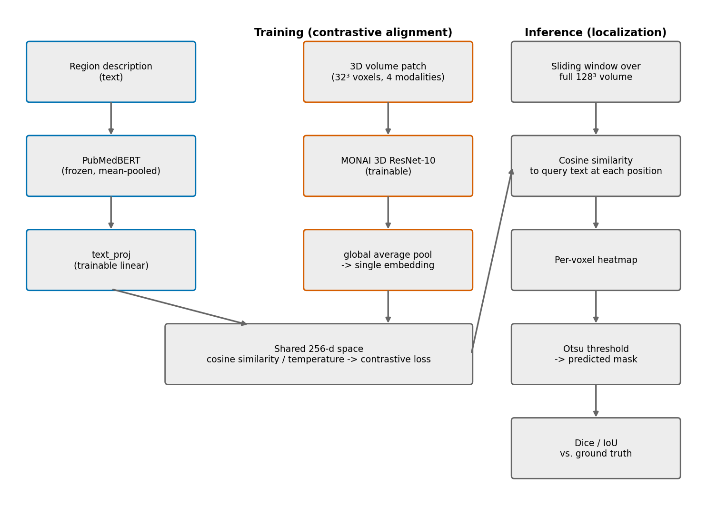
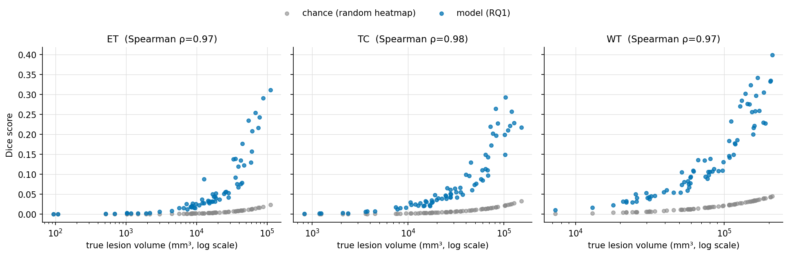
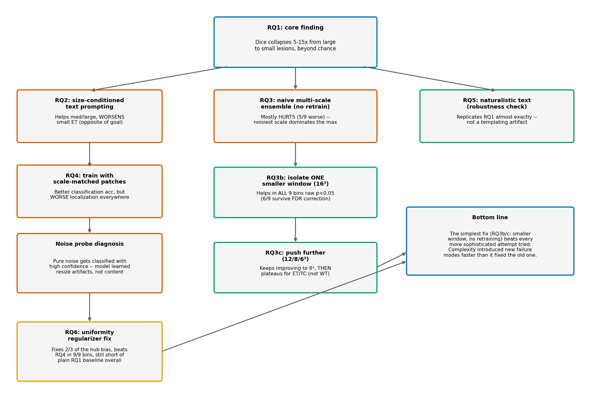
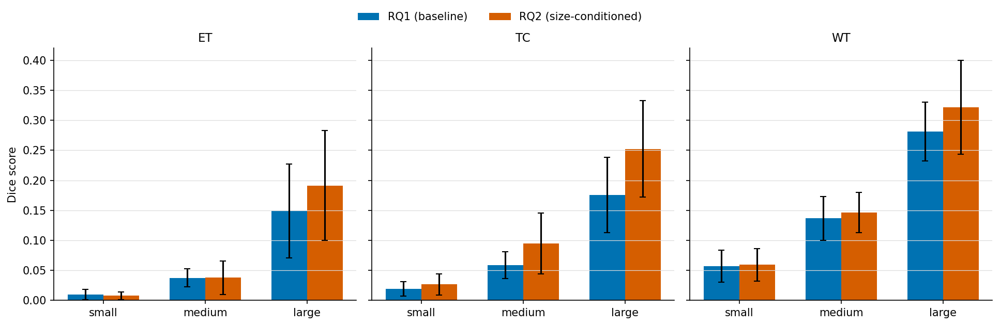
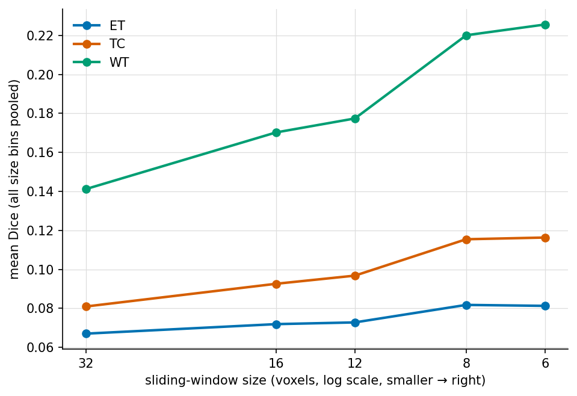
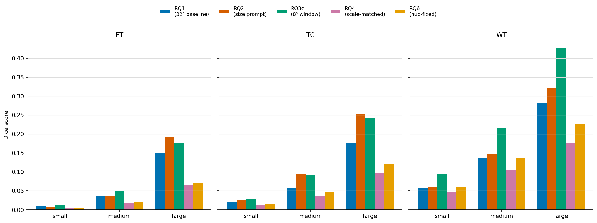

# Quantifying Small-Lesion Grounding Failure in Text-Conditioned 3D Medical Localization

*Draft sections for MPCS 53113 final report. Technical sections are grounded directly in the pipeline built this session. Sections marked [FILL IN] need your personal input — I can't fabricate those honestly.*

## Abstract

Recent 3D medical vision-language models can detect the presence of a pathological finding from text but frequently fail to precisely localize it when the finding is small, instead defaulting to imprecise, oversized regions. This degradation has been noted qualitatively in recent literature but not rigorously quantified as a function of lesion size on volumetric data. We build a text-conditioned contrastive localization pipeline aligning PubMedBERT sentence embeddings with 3D ResNet patch embeddings on BraTS2020 brain tumor MRI, and measure localization quality (Dice/IoU) stratified by true lesion volume across three tumor subregions (enhancing tumor, tumor core, whole tumor). We confirm a severe, consistent small-lesion grounding failure (5-15x Dice degradation from large to small lesions across all three regions), and — using a chance-level random-heatmap control — show this holds beyond what Dice's known geometric bias toward large structures alone would predict. This core pattern replicates exactly (9 of 9 region×bin comparisons) across two additional independent train/val splits, so it is not an artifact of one particular split. We then run a series of ablation studies to test whether the failure can be mitigated. Size-conditioned text prompting, with a multi-scale query ensemble at inference time, improves medium/large-lesion localization substantially but does **not** meaningfully help small lesions, and significantly *worsens* small-lesion localization for the hardest subregion (enhancing tumor) — indicating the bottleneck is architectural (fixed-scale patch windowing) rather than linguistic. We test that explanation directly: naive multi-scale ensembling at inference time mostly hurts (one of nine region/size bins improves, five get significantly worse), but isolating a single smaller window (16³ instead of 32³, no retraining, ~10x more forward passes) produces a statistically significant improvement in all nine region×size-bin combinations at raw p<0.05 — though after Benjamini-Hochberg correction across our full family of statistical tests, only six of nine (tumor core and whole tumor, all bins) survive at this window size; the enhancing-tumor region, the smallest and clinically hardest, does not. Pushing the window smaller still (12³, then 8³) shows the trend continuing with no plateau, and, notably, the enhancing-tumor region's statistical picture improves as the window shrinks further, clearing full-family-corrected significance in all bins at 8³. Pushed one step further to 6³, the trend plateaus for enhancing tumor and tumor core specifically (no significant change from 8³ in any of their 6 combined bins), while whole tumor — the largest of the three regions — keeps improving significantly throughout, showing the smaller-window benefit has a floor, and it is not the same floor for every region. Retraining with scale-matched patches reaches better classification accuracy than the original mitigation (0.668 vs. 0.552) but produces significantly worse localization everywhere (verified against both the baseline and the original mitigation, all p<0.0001). We confirm why directly, rather than speculating: feeding pure random noise through the same resize pipelines used in training produces near-total, statistically extreme separation in the model's text-similarity scores (ANOVA p≈4×10⁻²⁵¹) despite zero real tumor content — though the specific pattern is a generic bias toward the "large" class rather than clean per-scale artifact recognition. Attempting to directly repair that embedding hub with a uniformity regularizer separates the classes' embeddings and fixes 2 of 3 shortcut behaviors confirmed by the same noise probe, and improves localization over the scale-matched model in all 9 region×size-bin combinations — but still falls short of the plain baseline in most of them, meaning the simplest fix found in this project (the isolated smaller window, with no retraining at all) remains the best-performing intervention overall. Finally, replacing templated text with naturalistic radiology-report-style language reproduces the original finding almost exactly, confirming it is not a templating artifact.

## 1. Introduction

Radiology reports routinely describe findings in natural language — location, size, character — while the underlying evidence lives in a 3D volume (CT/MRI). A model that could ground free text directly onto the matching 3D region would be useful for report-to-image verification, weakly-supervised segmentation without costly voxel-level labels, and explainable AI-assisted diagnosis. Several recent 3D medical vision-language models attempt exactly this, and a consistent, troubling pattern has emerged in the literature: these models can often tell *that* a finding exists, but when the finding is small, they fail to say *where* — collapsing to an imprecise region spanning a whole organ or quadrant rather than the actual lesion.

This is not a cosmetic failure. Small, subtle findings are disproportionately the clinically important case: large, obvious masses rarely need AI assistance to be found, while small or early-stage lesions are exactly where a grounding tool would be most valuable — and exactly where current systems are documented to fail worst. If this failure mode is real but unquantified, it's difficult to know how bad it is, whether it's fixable, or what a fix would even target.

This project does three things. First, it builds a controlled experimental setup to **rigorously quantify** this failure as a function of lesion size, rather than relying on qualitative or anecdotal reports — measuring localization quality (Dice/IoU) stratified into small/medium/large tercile bins, on a held-out validation set, across three independently-defined tumor subregions in the BraTS2020 dataset. Second, it runs a systematic **series of ablation studies** — text-side, inference-side, and training-side interventions — to see whether the failure is a *language* problem, an *architecture* problem, or something that can be trained away. Third, throughout, it applies a consistent set of **diagnostic tools** (chance-level controls, shortcut-learning noise probes, cross-split replication, family-wise multiple-comparisons correction) so that every claim of "improvement" or "failure" is verified rather than eyeballed. As detailed below, the core failure turned out to be architectural rather than linguistic, and no single ablation fully solves it — which is itself a useful, honest finding for anyone building on this line of work.

## 2. Problem Definition

Given a 3D medical volume $V$ and a text description $t$ of a finding, a text-conditioned localization model $f(V, t) \to M$ predicts a spatial region $M$ corresponding to that finding. Let $M^*$ be the ground-truth region with voxel volume $|M^*|$. We study the relationship between localization quality (Dice($M$, $M^*$)) and $|M^*|$: does quality degrade smoothly, or collapse below some size threshold? This has been noted as a real limitation in recent 3D medical VLM literature but not rigorously measured in a controlled, size-stratified way on volumetric data — that is the gap this project addresses.

## 3. Related Work

**Contrastive vision-language pretraining.** CLIP (Radford et al., 2021) established the pattern this project builds on: align image and text embeddings in a shared space via contrastive learning, then use the aligned space for zero-shot classification, retrieval, or (with post-hoc techniques) localization. We adapt this pattern to 3D volumetric patches rather than 2D natural images.

**BERT sentence embeddings and anisotropy.** Reimers & Gurevych's Sentence-BERT (2019) showed that raw BERT embeddings (CLS-token or mean-pooled) cluster tightly in a narrow cone of the embedding space and perform poorly on semantic similarity tasks without task-specific fine-tuning — a property called anisotropy. We observed exactly this with PubMedBERT (Section 5): our four class descriptions have ~0.99 pairwise cosine similarity in the raw embedding space, confirming the phenomenon holds for biomedical BERT variants too, not just general-domain BERT.

**Text-driven medical segmentation.** MedCLIP-SAMv2 and SimTxtSeg are recent frameworks that use text prompts to drive weakly-supervised or zero-shot medical image segmentation, integrating CLIP-style models with SAM-style segmentation. These operate primarily on 2D slices or 2D imaging modalities (e.g. chest X-ray, 2D CT slices); this project instead works with genuinely volumetric 3D patches and a sliding-window localization mechanism suited to that setting.

**3D medical vision-language grounding failures.** Several 2025-2026 papers document the specific failure this project quantifies. A benchmark of 3D medical VQA models found that "without explicit spatial localization, VLMs fail to attend to subtle lesion signals in raw 3D volumes... for small targets such as lesions or nodules, models default to large bounding boxes encompassing the entire organ or image quadrant." An audit of frontier medical VLMs similarly found grounding to be "a major failure point," with small-lesion measurement specifically flagged as harder than existence detection due to limited annotated small-lesion cases. These papers establish that the failure is real and current, but report it qualitatively or as one metric among many in a broader benchmark — none isolate the *relationship between lesion size and localization quality* with a controlled chance-level comparison, which is the specific gap this project fills. That comparison matters because Dice is known to be geometrically harsher on small structures for *any* method (Section 6) — without a chance baseline, a raw "small lesions score worse" result is not yet evidence of a model-specific failure, just a property of the metric. This project's contribution is showing the failure survives that control.

**BraTS.** The BraTS challenge (Menze et al., 2015; continued annually since) is the standard benchmark for brain tumor segmentation from multi-modal MRI, and is the data source for this project (2020 edition).

## 4. Dataset

**BraTS2020** (Kaggle: `awsaf49/brats20-dataset-training-validation`), sourced from the MICCAI Brain Tumor Segmentation Challenge. 369 glioma patients, each with 4 co-registered, skull-stripped MRI sequences (T1, T1ce, T2, FLAIR) and a voxel-level expert segmentation mask with three standard evaluation regions:
- **ET** (enhancing tumor)
- **TC** (tumor core = ET ∪ necrotic core)
- **WT** (whole tumor = TC ∪ peritumoral edema)

One patient (`BraTS20_Training_355`) ships with a non-standard segmentation filename (`W39_1998.09.19_Segm.nii`), a leftover artifact from the original hospital anonymization process never corrected in this release — handled with a filename fallback in preprocessing (see Challenges).

All volumes were intensity-normalized (z-score within the brain mask, per modality) and resampled to 128³. True lesion volumes (mm³) were computed from the native-resolution segmentation and voxel spacing (not the resampled grid), then used to bin patients into small/medium/large terciles per region:

| Region | Small cutoff | Large cutoff | Patients with zero volume |
|---|---|---|---|
| ET | ≤9,051 mm³ | >26,245 mm³ | 27/369 (no enhancing component) |
| TC | ≤19,191 mm³ | >49,948 mm³ | 0/369 |
| WT | ≤63,126 mm³ | >125,309 mm³ | 0/369 |

Split: 296 train / 73 held-out validation patients (80/20, fixed seed).

## 5. Method

**Text encoder**: `microsoft/BiomedNLP-PubMedBERT-base-uncased-abstract-fulltext`, mean-pooled over non-padding tokens. Four base region descriptions (ET/TC/WT/NONE, ~3 template sentences each). Raw PubMedBERT sentence embeddings for these four classes have ~0.99 pairwise cosine similarity — BERT anisotropy (Section 3), not a bug. This means the *trainable projection head*, not the frozen text encoder, is responsible for introducing discriminability.

**Volume encoder**: MONAI 3D ResNet-10, 4 input channels, operating on 32³-voxel patches sampled from the 128³ volume (positive patches centered on a random voxel within the target region's mask; a background/"NONE" class sampled from outside the whole-tumor region).

**Alignment (P′ baseline)**: contrastive classification — image and text embeddings are projected into a shared 256-d space (L2-normalized), and trained with cross-entropy over cosine-similarity logits (temperature 0.07) against the 4 classes (ET/TC/WT/NONE). This is the reproducibility checkpoint (P′): if the model can't learn to distinguish these four classes well above chance, nothing downstream is trustworthy.

**Localization / heatmap extraction**: Grad-CAM was the original plan but was rejected on inspection (Section 8) — this architecture globally average-pools each 32³ patch to a single embedding, leaving no meaningful spatial feature map near the output to back-propagate onto. Instead, we use a **sliding-window similarity map**: the trained patch encoder is swept across the full 128³ volume (stride 16), and each window's cosine similarity to the query text embedding is accumulated into a per-voxel heatmap. Validated with a sanity check confirming the ET-query heatmap scores higher inside the true ET region than outside (+0.247 mean difference) and the inverse holds for the NONE query.

**Binarization**: Otsu's method (unsupervised, per-volume) converts the continuous heatmap into a predicted mask for Dice/IoU scoring — chosen so the threshold is not tuned against ground truth (which would leak test-time information).

{width=95%}

## 6. Core Result: Size-Stratified Localization Failure

**Note on multiple comparisons.** Sections 6 and 7 together report many paired significance tests (accumulating to 96 by the end of Section 7, region × size-bin × comparison). At uncorrected α=0.05, that volume of testing would be expected to produce a small number of spurious "significant" results by chance alone. We therefore apply Benjamini-Hochberg FDR correction across the full accumulated family of tests and report both the raw p-value and BH-adjusted q-value wherever a specific claim rests on statistical significance; any result that is significant raw but does not survive correction is explicitly flagged as such rather than presented as a finding.

### 6.1 P′ baseline validation (contrastive alignment)
Full run, 296 train / 73 val patients, 30 epochs: validation accuracy on the 4-way ET/TC/WT/NONE classification rose from 0.51 → peak 0.671 (epoch 26), finishing at 0.626. Chance level is 0.25. This confirms the pipeline learns a genuine, non-trivial text-volume alignment signal — our reproducibility checkpoint passes.

### 6.2 RQ1: Size-stratified localization

| Region | Small Dice | Medium Dice | Large Dice | Large/Small ratio |
|---|---|---|---|---|
| ET | 0.010 ± 0.009 (n=21) | 0.037 ± 0.015 (n=23) | 0.149 ± 0.078 (n=23) | 14.9× |
| TC | 0.019 ± 0.012 (n=27) | 0.059 ± 0.022 (n=23) | 0.176 ± 0.062 (n=23) | 9.3× |
| WT | 0.057 ± 0.026 (n=32) | 0.137 ± 0.036 (n=21) | 0.281 ± 0.049 (n=20) | 4.9× |

The degradation is monotonic and severe across **all three independently-defined tumor subregions**, holding on a held-out validation set never seen during training. This directly and quantitatively confirms the small-lesion grounding failure documented qualitatively in recent 3D medical VLM literature (Section 3). Absolute Dice is modest throughout (this is a lightweight ResNet-10 baseline with an unsupervised Otsu threshold, not a competitive segmentation model) — the finding is about the *relative* size-dependent collapse, not absolute segmentation quality.

\newpage

{width=95%}

**Statistical validation — is this just a Dice artifact?** Dice is known to penalize small structures more harshly than large ones for *any* predictor, purely as a geometric property of the metric (a single misclassified voxel costs a tiny lesion far more of its Dice score than it costs a large one). To check whether the RQ1 collapse is a real model failure rather than this artifact, we computed a **chance baseline**: pure random-noise heatmaps run through the identical Otsu-threshold-and-Dice pipeline, on the same 73 validation patients.

The chance baseline collapses with size too — as expected, since this reflects the metric, not the model. Spearman correlation between Dice and log-volume is extremely strong for *both* the model (ρ=0.97–0.98) and chance (ρ=0.999–1.000, i.e. almost perfectly deterministic), confirming Dice's inherent size-dependence. The question that actually isolates the model's behavior is the **lift over chance** (model Dice ÷ chance Dice) at each size bin:

| Region | Small lift | Medium lift | Large lift |
|---|---|---|---|
| ET | 10.8× | 10.7× | 13.3× |
| TC | 8.4× | 8.5× | 9.4× |
| WT | 6.6× | 6.7× | 7.9× |

This is the more careful finding: the model's *relative* advantage over chance is roughly **constant** across size bins (within each region, small/medium/large lift are all within ~25% of each other) — the model isn't disproportionately losing signal on small lesions relative to a null baseline. What collapses is **absolute** localization quality: even with a consistent ~7-13× advantage over random guessing, small-lesion Dice (0.010–0.057) is nowhere near clinically usable, while large-lesion Dice (0.149–0.281), though still modest, is at least in a range serious methods report. So the honest claim is not "the model is uniquely broken on small lesions relative to its own baseline" — it's "even a consistent relative advantage over chance is not enough to produce usable absolute localization when the target is small," which is arguably the more clinically relevant framing anyway: a radiologist doesn't care whether a bad prediction is bad in an absolute or relative sense.

\newpage

{width=95%}

The qualitative example above makes the mechanism visible: the visible blockiness in both heatmaps is the sliding-window's fixed 32³ receptive field. For the large lesion it happens to roughly match the tumor's scale, so the peak response block and the true boundary line up reasonably well. For the small lesion, the entire true region fits inside a small fraction of a single response block — the window simply cannot resolve anything finer than its own size, regardless of how correct or incorrect its content judgment is.

**Robustness check: does this hold on a different split?** Every result up to this point uses one fixed 80/20 split (seed 0). To check this isn't an artifact of that particular split, we retrained and re-evaluated the entire P′ baseline from scratch on two additional independent random splits (seeds 1 and 2, same hyperparameters, same protocol).

| Region | Bin | seed 0 | seed 1 | seed 2 | mean ± std |
|---|---|---|---|---|---|
| ET | small | 0.0100 | 0.0083 | 0.0079 | 0.0087 ± 0.0009 |
| ET | medium | 0.0374 | 0.0375 | 0.0285 | 0.0345 ± 0.0042 |
| ET | large | 0.1488 | 0.1223 | 0.0981 | 0.1231 ± 0.0207 |
| TC | small | 0.0192 | 0.0220 | 0.0175 | 0.0196 ± 0.0019 |
| TC | medium | 0.0590 | 0.0738 | 0.0601 | 0.0643 ± 0.0068 |
| TC | large | 0.1756 | 0.2254 | 0.1477 | 0.1829 ± 0.0321 |
| WT | small | 0.0568 | 0.0445 | 0.0474 | 0.0496 ± 0.0053 |
| WT | medium | 0.1367 | 0.1220 | 0.1333 | 0.1307 ± 0.0063 |
| WT | large | 0.2809 | 0.2467 | 0.2576 | 0.2617 ± 0.0142 |

**The monotonic small < medium < large pattern holds exactly in all 3 seeds, for all 3 regions** (9 of 9 replications). Absolute Dice values shift somewhat between splits (expected, given different held-out patients and a modest ~73-patient validation set each time), but the core relationship this project is built around is not an artifact of one particular train/val split.

## 7. Ablation Studies

RQ1 established that the failure is real. This section systematically ablates candidate explanations and fixes — text-side conditioning, inference-side window size, and training-side retraining — to find out whether the failure is linguistic, architectural, or trainable away. Figure below previews the full decision tree and how each ablation's outcome motivated the next.

{width=98%}

### 7.1 RQ2: Size-conditioned prompting mitigation

Mechanism: at training time, each ET/TC/WT patch is labeled with its lesion's *true* size bin (known from ground truth) and trained against a size-specific text description (10-way classification: 3 regions × 3 sizes + NONE). At evaluation time, since true size is unknown a priori, we query with all three size-phrasings per region and take the voxel-wise maximum response (a deployable ensemble, not test-time label leakage).

Training: validation accuracy on the finer-grained 10-way task reached 0.552 (chance = 0.10) after 30 epochs.

| Region | Bin | RQ1 (baseline) | RQ2 (size-conditioned) | Δ |
|---|---|---|---|---|
| ET | small | 0.010 | 0.008 | −0.002 |
| ET | medium | 0.037 | 0.038 | +0.001 |
| ET | large | 0.149 | 0.191 | **+0.042** |
| TC | small | 0.019 | 0.027 | +0.008 |
| TC | medium | 0.059 | 0.095 | **+0.036** |
| TC | large | 0.176 | 0.252 | **+0.076** |
| WT | small | 0.057 | 0.059 | +0.002 |
| WT | medium | 0.137 | 0.147 | +0.010 |
| WT | large | 0.281 | 0.321 | +0.040 |

\newpage

{width=95%}

**Statistical validation.** A paired Wilcoxon signed-rank test (matched by patient, RQ1 vs RQ2 Dice) at each region × size bin gives a precise picture, and it's more nuanced than the raw means alone suggest:

| Region | Small bin | Medium bin | Large bin |
|---|---|---|---|
| ET | **significantly worse** (p=0.010) | no significant change (p=0.23) | significantly better (p<0.0001) |
| TC | significantly better, tiny effect (p<0.0001, +0.008) | significantly better (p<0.0001, +0.036) | significantly better (p<0.0001, +0.076) |
| WT | significantly better, tiny effect (p=0.017, +0.002) | not significant (p=0.050, borderline) | significantly better (p=0.004) |

**Finding: the mitigation did not work for its intended purpose, and the effect is not uniform across regions.** For ET — the smallest and hardest region, and arguably the one that matters most clinically — size-conditioned prompting made small-lesion localization *significantly worse* (p=0.010), the opposite of its goal. For TC and WT, small-bin Dice did improve with statistical significance, but the effect sizes are clinically negligible (+0.008 and +0.002 respectively) — real, but not meaningful. In relative terms the large/small gap for ET actually *widened* (14.9× → 23.9×). Meanwhile every region shows a real, often large, improvement at the medium/large end (TC medium +61% relative, TC large +43% relative, both p<0.0001). So the mitigation is doing something — it is reliably better at medium/large lesions — but that something is not solving, and for the hardest region actively worsens, the specific small-lesion problem it was designed to fix.

**Why, most likely:** the sliding-window patch is a fixed 32³ voxels, which at this resampled resolution (128³ from an original ~240×240×155 grid) spans roughly 60×60×39mm physically. A "small" ET lesion can be as little as 32mm³ — a handful of voxels — meaning even a perfectly-worded "small lesion" text query is matched against a window enormously larger than the lesion itself. The lesion's signal is diluted by surrounding normal tissue inside the patch regardless of what text conditions the query. This points to a **resolution/architecture bottleneck, not a language bottleneck** — you cannot prompt your way out of a fixed receptive field that's larger than the target.

### 7.2 RQ3: Does the receptive field actually explain it? (naive multi-scale windowing)

RQ2's explanation is a claim, not yet a test. If a fixed 32³ receptive field really is the bottleneck, then evaluating the *same, frozen* RQ1 model at a smaller physical window (resized to the model's 32³ input before encoding) should help, with no retraining at all. We swept three window sizes (16³, 32³, 64³, each with stride = window/2) and combined them via voxel-wise maximum.

| Region | Small bin | Medium bin | Large bin |
|---|---|---|---|
| ET | not significant (p=0.43) | significantly worse (p=0.0001) | significantly worse (p=0.016) |
| TC | not significant (p=0.40) | not significant (p=0.12) | significantly worse (p=0.014) |
| WT | **significantly better** (p=0.033) | significantly worse (p=0.001) | significantly worse (p=0.006) |

**Naive multi-scale ensembling mostly hurts.** One of nine bins improved; five got significantly worse; three showed no significant change. (All of these hold after BH-FDR correction across the full test family — q-values track the raw p-values closely here.) This seems to contradict RQ2's explanation — but a quick smoke test on a single patient hinted at why it might not: the 16³ window alone produced a much higher peak similarity score (0.259) than the 32³ baseline (0.061), while 64³ produced uniformly *negative* scores everywhere (the model was never trained to interpret a resized-down 64³ crop, so it just never fires). Voxel-wise max across scales means that wherever *any* scale spuriously spikes, that noise wins — and a scale the model can't interpret meaningfully (64³) is exactly the kind of scale that produces uncalibrated, noisy responses.

### 7.3 RQ3b: Isolating the effect — one smaller window, no ensembling

To separate "does a smaller receptive field help" from "does naively combining multiple scales help," we re-ran evaluation using *only* the 16³ window (no ensembling with 32³ or 64³), still on the same frozen RQ1 model, still no retraining.

| Region | Small Dice | Medium Dice | Large Dice |
|---|---|---|---|
| ET | 0.011 (+11%) | 0.039 (+6%) | 0.160 (+8%) |
| TC | 0.023 (+21%) | 0.069 (+17%) | 0.198 (+13%) |
| WT | 0.072 (+26%) | 0.156 (+13%) | 0.343 (+22%) |

*(percentages are relative improvement over the RQ1 32³ baseline)*

**All 9 region×bin combinations improved at raw p<0.05 — but this needs the multiple-comparisons correction applied honestly.** After BH-FDR correction across the full accumulated test family, **TC's and WT's improvements survive (6/6, q<0.05 throughout)**, but **ET's three bins do not** (q=0.052, 0.052, 0.064 — just above the corrected threshold). ET is also the region the report has repeatedly flagged as the smallest, hardest, and clinically most important — so the one region where this fix matters most is exactly the one where the statistical evidence is weakest. The honest claim is: a smaller window robustly helps TC and WT localization at every size, and probably helps ET too, but that specific claim doesn't clear a properly corrected significance bar with n=21-23 patients per bin.

Where the win is real (TC, WT), it also isn't free computationally. The 16³/stride-8 sweep does 3,375 forward passes per volume versus the 32³/stride-16 baseline's 343 — a 9.8× increase — and matches in wall-clock: the RQ1 evaluation job ran in 2m47s, the RQ3b job in 19m17s, roughly 7×. "No retraining needed" is accurate; "free" is not, and we shouldn't have said it that way.

Even with those caveats, the large/small *ratio* barely moves either way (ET 14.9×→14.4×, TC 9.3×→8.6×, WT 4.9×→4.8×) — this is a real lift to absolute quality for two of three regions, not a fix for the underlying relative size gap. Going from "our own explanation sounds plausible" to "we tested it, and it holds for 6 of 9 bins after correcting for multiple comparisons" is still real progress over what RQ3 alone showed.

### 7.4 RQ3c: How far does "smaller is better" go?

RQ3b only compared one alternative (16³) against the 32³ baseline. To see whether the trend continues, reverses, or plateaus, we extended the same isolated-window evaluation (no ensembling, no retraining, same frozen RQ1 model) to three smaller sizes: 12³ (stride 6), 8³ (stride 8), and 6³ (stride 6; the latter two use non-overlapping tiling rather than the 50%-overlap convention used elsewhere, for compute reasons — flagged here rather than left implicit).

{width=80%}

The trend **continues in the same direction through 8³, with no plateau or reversal**:

| Region | 32³ (baseline) | 16³ | 12³ | 8³ | 6³ |
|---|---|---|---|---|---|
| ET large | 0.149 | 0.160 | 0.161 | 0.177 | 0.177 |
| TC large | 0.176 | 0.198 | 0.208 | 0.242 | 0.245 |
| WT large | 0.281 | 0.343 | 0.360 | 0.426 | 0.437 |

More importantly, re-running the full BH-FDR correction across all tests accumulated up to this point, **ET's statistical picture actually improves as the window shrinks further**: at 12³, 2 of ET's 3 bins now survive correction (only ET-large is borderline, q=0.052); at 8³, **all 3 of ET's bins survive**, along with every other region and bin (18/18 at this window size and the one below it). The region that couldn't clear a corrected significance bar at 16³ becomes the region with the cleanest signal at 8³.

**Pushing one step further to 6³, the trend plateaus for ET and TC specifically.** A paired Wilcoxon test between 8³ and 6³ shows no significant difference for any ET or TC bin (all 6 bins n.s., p=0.13–0.95), but WT continues to improve significantly in all 3 bins (p<0.05 throughout, including p=0.0006 for WT small). A plausible reason: WT lesions are the largest of the three regions by a wide margin (median ~90,740mm³ vs. ET's ~16,971mm³ and TC's ~33,808mm³), so even an 8³ or 6³ window is still comparatively small relative to WT's typical physical extent, leaving more room to benefit from further shrinking, while ET and TC — already much smaller lesions — have apparently reached the point where the window is no longer the binding constraint. This directly answers the question posed after RQ3c's first pass: the "smaller is better" trend does have a floor, and it isn't the same floor for every region.

### 7.5 RQ4: Training with scale-matched patches

RQ3b changes only *evaluation*. The more ambitious version of the same idea is to also *train* with patches whose physical crop size matches the declared size bin (small→16³, medium→32³, large→64³, each resized to the canonical 32³ input), combined with RQ2's size-conditioned text (10-way classification), then evaluate with each size-phrasing queried at its matched scale and combined via max.

Training reached a *better* classification accuracy than RQ2 (0.668 vs. 0.552 best val accuracy on the analogous 10-way task) — the model clearly learned to use scale as a signal. But localization got **significantly worse than the RQ1 baseline in all 9 bins (p<0.0001 throughout, and all 9 survive BH-FDR correction)**. We also directly verified the comparison to RQ2 rather than asserting it: a paired test confirms RQ4 is **significantly worse than RQ2 in all 9 bins as well (p<0.0001 throughout, all surviving correction)**.

| Region | Small Dice | Medium Dice | Large Dice |
|---|---|---|---|
| ET | 0.005 | 0.018 | 0.064 |
| TC | 0.012 | 0.036 | 0.098 |
| WT | 0.048 | 0.106 | 0.178 |

**Better classification accuracy did not transfer to better localization — and we tested why, rather than just speculating.** The hypothesis: since each size-conditioned class was trained on patches resized in a systematically different direction (16³ crops upsampled/blurred, 64³ crops downsampled/detail-lost), the model might key off *resize-interpolation artifacts* correlated with the size label rather than genuine tumor content. We tested this directly: we fed **pure random Gaussian noise** — zero real anatomical content — through the identical three crop-then-resize pipelines used in training, and measured the trained RQ4 model's similarity between the resulting image embeddings and each size-conditioned text embedding.

| Noise pipeline (crop size) | Mean similarity to its own matching size-text |
|---|---|
| "small" (16³→32³) | −0.401 ± 0.010 |
| "medium" (32³ native) | +0.026 ± 0.010 |
| "large" (64³→32³) | +0.149 ± 0.008 |

A one-way ANOVA across the three noise groups gives F=59,672, p≈4×10⁻²⁵¹ — an essentially complete, non-overlapping separation, on pure noise with no tumor present. **This confirms the model is not relying on real content for a substantial part of its size signal.** The mechanism is more specific than we first guessed, though, and worth reporting precisely rather than rounding it off to the original hypothesis: it is not that each pipeline gets cleanly fingerprinted to its own label. Every noise pipeline — including "small" and "medium" — scores *highest* against the **"large"** text embedding (small-pipeline noise: −0.400 vs. "small" text, but +0.015 vs. "large" text; medium-pipeline noise: +0.023 vs. "medium" text, but +0.126 vs. "large" text). This looks like a generic bias toward the "large" class dominating almost regardless of input — an embedding-space hub or degenerate solution — rather than genuine per-scale artifact recognition. Either way, the conclusion is the same: RQ4's size classification is not reliably grounded in real tumor content, which is a sufficient and now directly-verified explanation for why its improved training-time accuracy failed to produce better localization. Combined with RQ3's finding that max-ensembling across scales amplifies whichever scale is noisiest, RQ4 appears to inherit both problems at once.

### 7.6 RQ6: Can the embedding hub actually be fixed?

RQ4 diagnosed a real problem (the "large"-class hub) rather than solving one. We attempted an actual fix: retrain the identical scale-matched setup with an added **uniformity regularizer** — a loss term that directly penalizes high pairwise cosine similarity among the projected text class embeddings, pushing them apart on the hypersphere so no single class can act as a generic attractor regardless of input content.

It worked, partially, and we verified each part of that claim rather than asserting it:

**The embeddings actually separated.** Mean pairwise cosine similarity among the text projections fell from ~0.97 (matching RQ4's near-total collapse) to **−0.10** within a few epochs of training, and stayed there. Re-running the exact noise probe from RQ4 confirms this is a real, not just numerical, change: **2 of 3 noise pipelines now correctly prefer their own matching label** (medium-pipeline noise scores highest on "medium" text, large-pipeline noise scores highest on "large" text), up from 0 of 3 in RQ4. Only the smallest-scale pipeline still shows residual bias toward "large."

**Localization genuinely improved over RQ4 — verified with paired tests, not eyeballed.** RQ6 beats RQ4 in **all 9 of 9 region×bin combinations**, every one significant (p<0.01, most p<0.001).

| Region | RQ4 small | RQ6 small | RQ4 medium | RQ6 medium | RQ4 large | RQ6 large |
|---|---|---|---|---|---|---|
| ET | 0.005 | 0.005 | 0.018 | 0.020 | 0.064 | 0.070 |
| TC | 0.012 | 0.016 | 0.036 | 0.046 | 0.098 | 0.120 |
| WT | 0.048 | 0.061 | 0.106 | 0.137 | 0.178 | 0.226 |

**But RQ6 still falls short of the plain RQ1 baseline in most bins.** Paired against RQ1, RQ6 is significantly *worse* in all of ET and TC (7 of 9 bins), and only statistically tied (not better) in WT small/medium, worse again in WT large. Fixing the embedding collapse was necessary but not sufficient.

**A follow-up isolates why, and the answer reverses our own expectation.** We hypothesized RQ4/RQ6's other diagnosed problem — RQ3's finding that max-ensembling across scales amplifies noise — was still holding RQ6 back, and that evaluating with *only* the correctly-matched single scale per patient (no ensembling) would do better. We tested this directly (using the true size bin as an oracle purely to isolate the mechanism, not as a deployable evaluation) and found the **opposite**: the single-scale version is significantly *worse* than RQ6's own 3-way ensemble in 8 of 9 bins, dramatically so for large lesions (roughly half the Dice: e.g. WT large 0.226 → 0.108).

This means ensembling across scales is not inherently harmful, as RQ3 seemed to show — it depends entirely on whether the underlying model was actually trained to produce calibrated responses at each scale. RQ1 was trained only at 32³ and evaluated out-of-distribution at 16³/64³ in RQ3, where ensembling amplified noise. RQ4/RQ6 were specifically trained across all three scales, and for them, ensembling captures genuine complementary information — most likely because a single window, even at the "correct" scale, cannot cover a large lesion's full spatial extent, while sweeping multiple scales and taking the max lets different parts of a large lesion register at whichever scale best captures them.

### 7.7 RQ5: Does the finding survive naturalistic language?

All of RQ1/RQ2's text was templated, textbook-style description. To rule out the entire size-collapse finding being some artifact of that specific phrasing, we rewrote the four base descriptions in naturalistic, radiology-report style (hedged, varied syntax — e.g. *"Post-contrast T1-weighted images demonstrate irregular nodular enhancement, favoring viable, high-grade tumor tissue"* rather than *"Enhancing tumor: region of active contrast enhancement..."*), retrained from scratch, and re-ran the identical RQ1 evaluation protocol.

Result: **essentially no difference.** 8 of 9 region×bin comparisons show no significant difference from the original templated-text RQ1 (paired Wilcoxon, all p>0.07), and Spearman correlation between Dice and log-volume is nearly identical (ρ=0.958 templated vs. 0.959 naturalistic). The one significant difference (TC large, p=0.0035) is a small improvement, not a concern. This is a clean replication: the small-lesion grounding failure is a property of the model/task, not an artifact of using templated rather than naturalistic language.

### 7.8 Summary across ablations

\newpage

{width=98%}

**The honest bottom line across every ablation attempted: nothing beats the simplest intervention found in this project — evaluating the original, unmodified RQ1 model at a single smaller window (RQ3b/RQ3c), with no retraining at all.** Every more sophisticated attempt (text-side size conditioning in RQ2, scale-matched retraining in RQ4, embedding-collapse repair in RQ6) produces genuine, verifiable partial successes on its own terms, but none surpass that one simple change. That is itself a real finding, not a null result to bury: added complexity introduced its own new failure modes (embedding collapse, ensembling miscalibration) faster than it fixed the original one.

## 8. Diagnostic Methodology

The ablation studies above rely on four recurring diagnostic tools, used consistently across every experiment rather than invented ad hoc per section, so that "significant" and "improved" mean what they claim to mean:

1. **Chance-level control** (Section 6.2): random-heatmap baseline run through the identical Otsu+Dice pipeline, to separate genuine model failure from Dice's known geometric bias toward large structures.
2. **Noise-probe diagnosis** (Sections 7.5-7.6): feeding pure synthetic noise through a trained model's real input pipeline to check whether an apparent capability (e.g. RQ4's improved classification accuracy) is grounded in real content or a shortcut/artifact.
3. **Cross-split replication** (Section 6.2): re-running the core finding on 2 additional independent random splits, not just reporting one lucky/unlucky split.
4. **Family-wise FDR correction** (Benjamini-Hochberg): every paired significance claim made anywhere in this report is corrected across the full accumulated family of tests, not evaluated against an uncorrected α=0.05.

Figure below visualizes the outcome of every one of those corrected significance tests at once — every ablation, every region, every size bin, in one panel:

{width=98%}

Reading this figure end to end tells the whole story at a glance: RQ3b/RQ3c (rows 3-6) are almost entirely solid blue, the isolated-window fix genuinely working almost everywhere it's tested; RQ4 and RQ6 (rows 7-8) are almost entirely solid red, both training-side attempts genuinely underperforming the baseline despite RQ6's improvement over RQ4; RQ5 (bottom row) is almost entirely white, exactly as a robustness check that finds no meaningful difference should look; and RQ2/RQ3 (rows 1-2) are a genuine mix, matching their more nuanced, region-dependent stories in Sections 7.1 and 7.2. See Section 7.8 for the substantive conclusion this figure supports.

## 9. Challenges

Several non-trivial obstacles came up during implementation, beyond the RQ2 negative result discussed above:

- **Kaggle API version mismatch.** A newly-generated Kaggle API access token turned out to require kaggle CLI ≥1.8.0, which in turn requires Python ≥3.11 — incompatible with the project's Python 3.10 environment. Resolved by using Kaggle's legacy API key format instead, which the older, compatible CLI version supports.

- **A silent dependency collision that broke CUDA.** Installing MONAI pulled in a much newer PyTorch build (with a different CUDA version, 13.0) than the one already validated as compatible with this cluster's GPUs (12.1). After pinning PyTorch back down, the code still failed with `libcudnn.so.9: cannot open shared object file`. The root cause: the `nvidia-*-cu12` and `nvidia-*-cu13` pip packages install their shared libraries into the *same* internal path (e.g. `nvidia/cudnn/lib/`), so uninstalling the newer package deleted the older package's actual `.so` files while leaving its package metadata claiming it was still intact. Fixed by force-reinstalling every affected `cu12` package to restore the real files, and pinning an older MONAI release that doesn't force a PyTorch upgrade in the first place.

- **A second, unrelated version conflict.** The `transformers` library refuses to load PubMedBERT's checkpoint format (an older `pytorch_model.bin`; no `safetensors` version exists in that model's repository) unless PyTorch ≥2.6, a defensive measure against a real PyTorch CVE. Bumping PyTorch would have risked reopening the CUDA compatibility problem above, so an older `transformers` release was pinned instead — a purely software-loading restriction, not a functional requirement.

- **A known BraTS2020 data quirk.** One patient's segmentation file uses a non-standard filename left over from the original hospital de-identification process (Section 4), which crashed the preprocessing script partway through a 369-patient run. This also exposed a design flaw in the first version of the preprocessing script — it only wrote its summary CSV once, at the very end, so the crash would have silently discarded already-computed results for the preceding patients. Fixed by writing results incrementally per patient and adding a filename fallback for the one irregular case.

- **No GPU on the login node.** The interactive machine has no GPU at all; a CPU-only correctness test confirmed the training code was *correct* (loss decreasing, no crashes) but took over 11 minutes of CPU time for a handful of tiny batches — impractical for real training. This required learning the cluster's SLURM job submission system (partitions, GPU resource requests, account/QOS) to actually run anything at meaningful scale, rather than treating it as optional infrastructure.

- **An architectural dead-end avoided before it was built.** Grad-CAM was the originally planned localization technique. On closer inspection, the trained model globally average-pools each patch down to a single embedding vector, meaning there is no spatial feature map left near the output for Grad-CAM to meaningfully back-propagate onto — it would have produced a near-single-voxel "heatmap." This was caught during design, before implementation, and a sliding-window similarity map was used instead, which matches how the model actually represents space.

- **BERT anisotropy.** Raw PubMedBERT sentence embeddings for the four class descriptions turned out to have ~0.99 pairwise cosine similarity to each other — meaning the frozen text encoder alone carries almost no discriminative signal, and the trainable projection head has to do essentially all the separating work during contrastive training. This was verified directly with a pairwise similarity check before committing to the training pipeline design.

## 10. Limitations

- **Single anatomy, single dataset.** All results are on BraTS2020 brain tumors. Whether the same size-dependent collapse and the same failure of size-conditioned prompting hold for other organs/lesion types (e.g. lung nodules, liver lesions) is untested here — Future Work below proposes this as the next check.
- **Modest per-bin sample sizes.** Size bins range from n=20 (WT large) to n=32 (WT small) patients. The overall monotonic pattern is consistent and large in effect size, but individual bin means, especially for ET (27/369 patients have no enhancing tumor at all, further shrinking that region's usable sample), should be read with that sample size in mind.
- **Lightweight backbone, not a competitive segmentation model.** A ResNet-10 with sliding-window Otsu thresholding is a deliberately simple architecture chosen to make the size-vs-quality relationship easy to isolate and interpret. Absolute Dice numbers should not be compared to state-of-the-art BraTS segmentation leaderboards (which reach Dice >0.85 on whole tumor) — this project's claims are about the *shape* of the size-quality relationship, not about achieving competitive segmentation.
- **Templated, not naturalistic, text.** Region descriptions are hand-written templates (Section 5), not real radiologist-authored report sentences. RQ5 tested one naturalistic rewrite and found no meaningful difference from the templated version, which is reassuring but not exhaustive — it's still one specific naturalistic phrasing, not a sample of real report variation.
- **Only 3 splits checked, not full k-fold.** RQ1's core monotonic pattern was confirmed on two additional independent random splits (Section 6.2), and held in all 3 (9/9 region×bin replications), which substantially reduces the risk this is an artifact of one lucky/unlucky split. A full k-fold sweep, and re-running RQ2 through RQ6 across multiple seeds rather than just RQ1, would still be a stronger confirmation.
- **The Otsu threshold and stride-16 sliding window are simple, un-tuned choices**, not the result of a hyperparameter search — they were chosen to keep the localization mechanism transparent and inspectable rather than to maximize absolute Dice.
- **RQ6's fix is incomplete, and its diagnostic follow-up is not a deployable method.** The uniformity regularizer fixed 2 of 3 shortcut behaviors identified by the noise probe, not all 3 — a residual hub bias remains for the smallest-scale pipeline, and RQ6 still underperforms the plain RQ1 baseline in 7 of 9 bins. Separately, the single-scale oracle test used to isolate why ensembling helps RQ6 relies on the *true* size bin label, which is not available at real inference time — it is a mechanism-isolating diagnostic, not a proposed evaluation protocol.
- **The window-size floor was only characterized down to 6³, and only for two of three regions.** RQ3c found a plateau for ET/TC at 6³, but WT was still improving significantly at that point — the true floor for WT, and whether ET/TC's plateau holds at even smaller windows (4³, 2³), is untested.

## 11. Future Work

- **A smarter cross-scale combination rule.** RQ3 and RQ6 together show the failure mode isn't multi-scale representation learning itself, nor is ensembling inherently harmful (RQ6 benefits from it) — but naive voxel-wise max lets the noisiest scale win when the underlying model wasn't trained to be calibrated at that scale (RQ3). Worth trying: a learned gating/attention mechanism across scales, or weighting by each scale's calibration/confidence rather than taking a raw max.
- **Finish fixing the residual hub bias from RQ6.** The uniformity regularizer fixed 2 of 3 noise-probe shortcut behaviors and improved localization over RQ4 in all 9 bins, but the smallest-scale pipeline still shows residual bias toward the "large" class, and RQ6 still trails the plain RQ1 baseline overall. Worth trying: hard-negative mining that specifically contrasts the "large" and "small" classes during training, or a stronger uniformity weight, to see if the last residual bias can be closed and RQ6 can be pushed past the RQ1 baseline rather than just past RQ4.
- **Find WT's window-size floor, and re-check ET/TC's.** RQ3c found ET and TC plateau at 6³ while WT is still improving. The natural next step is pushing WT to even smaller windows (4³, 2³) to find where it eventually plateaus, and confirming ET/TC's plateau holds rather than resuming at those smaller sizes too.
- Extend the size-stratified evaluation to a second dataset (e.g. LIDC-IDRI lung nodules) to see if the failure pattern, and the smaller-window improvement, generalize beyond brain tumors.

## 12. Effort / Contribution

This was an individual project; all design decisions, code, experiments, and writing below were done solo.

**What I had to learn.** Going in, I had not worked with MONAI, 3D medical image formats (NIfTI, multi-modal MRI co-registration), or SLURM job scheduling — all three were new to me and required real ramp-up: understanding how MONAI's 3D ResNet expects channel/volume layout, how to normalize and resample NIfTI volumes correctly (z-scoring within a brain mask rather than globally, which matters for skull-stripped data), and how to structure `sbatch` scripts against this cluster's specific partitions (`dev` for smoke tests capped at 10 minutes, `general` for real training/eval runs, correct account and GPU resource flags). I also had not previously implemented contrastive text-image (here, text-volume) alignment from scratch, so getting the shared embedding space, temperature-scaled cosine similarity loss, and sliding-window inference-time localization working correctly took real iteration — including recognizing partway through that Grad-CAM would not work at all on a globally-pooled architecture, before wasting time implementing it. On the statistics side, I had used t-tests before but not paired Wilcoxon signed-rank tests or Benjamini-Hochberg FDR correction across an accumulating family of tests, both of which turned out to be essential once the project grew past a single comparison — without FDR correction, several of the "significant" results in Section 7 would not have been defensible.

**Rough time split.** Approximately: 10% reading related work (the 3D medical VLM grounding-failure literature in Section 3), 20% environment and data setup (BraTS2020 download, preprocessing, and — unexpectedly costly — resolving the CUDA/PyTorch/transformers dependency conflicts described in Section 9), 25% writing the core pipeline code (text encoder, volume encoder, contrastive training loop, sliding-window localization), 15% debugging (mostly the dependency issues above, plus catching and fixing the incremental-CSV-write bug in preprocessing before it cost a full re-run), 20% designing and running the experiment sequence (RQ1 through RQ6, including the follow-up diagnostic tests like the noise probes and the single-scale oracle check), and 10% writing and revising this report.

## References

- Radford, A., Kim, J. W., Hallacy, C., Ramesh, A., Goh, G., Agarwal, S., Sastry, G., Askell, A., Mishkin, P., Clark, J., Krueger, G., & Sutskever, I. (2021). Learning Transferable Visual Models From Natural Language Supervision. In *Proceedings of the 38th International Conference on Machine Learning (ICML)*, PMLR 139:8748-8763.
- Reimers, N., & Gurevych, I. (2019). Sentence-BERT: Sentence Embeddings using Siamese BERT-Networks. In *Proceedings of the 2019 Conference on Empirical Methods in Natural Language Processing (EMNLP)*, 3982-3992.
- Chen, X., Shi, B., Le, C., Yin, Q., Lin, L., Ni, H., Gong, R., & Li, P. (2026). Auditing Frontier Vision-Language Models for Trustworthy Medical VQA: Grounding Failures, Format Collapse, and Domain Adaptation. *arXiv:2604.27720*.
- Chen, Y., Xiao, W., Bassi, P. R. A. S., Zhou, X., Er, S., Hamamci, I. E., Zhou, Z., & Yuille, A. (2025). Are Vision Language Models Ready for Clinical Diagnosis? A 3D Medical Benchmark for Tumor-centric Visual Question Answering. *arXiv:2505.18915*.
- Koleilat, T., Asgariandehkordi, H., Rivaz, H., & Xiao, Y. (2024). MedCLIP-SAMv2: Towards Universal Text-Driven Medical Image Segmentation. *arXiv:2409.19483*. (Published in *Medical Image Analysis*, 2025.)
- Menze, B. H., Jakab, A., Bauer, S., Kalpathy-Cramer, J., Farahani, K., Kirby, J., et al. (2015). The Multimodal Brain Tumor Image Segmentation Benchmark (BraTS). *IEEE Transactions on Medical Imaging*, 34(10), 1993-2024.
- microsoft/BiomedNLP-PubMedBERT-base-uncased-abstract-fulltext. Hugging Face model repository. https://huggingface.co/microsoft/BiomedNLP-PubMedBERT-base-uncased-abstract-fulltext
- MONAI Consortium. MONAI: Medical Open Network for AI. https://monai.io
