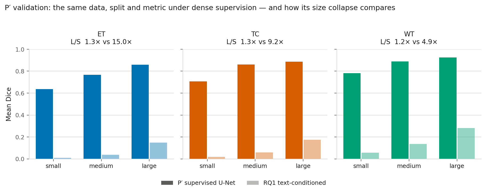
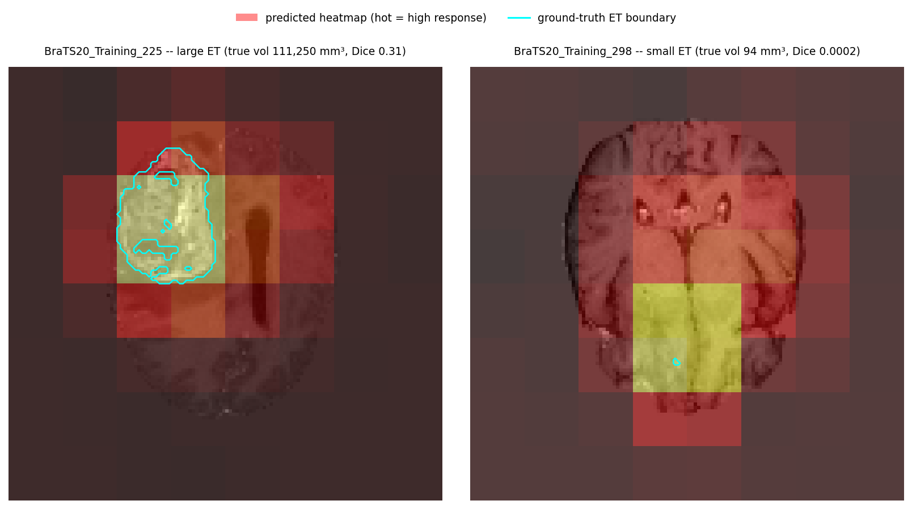
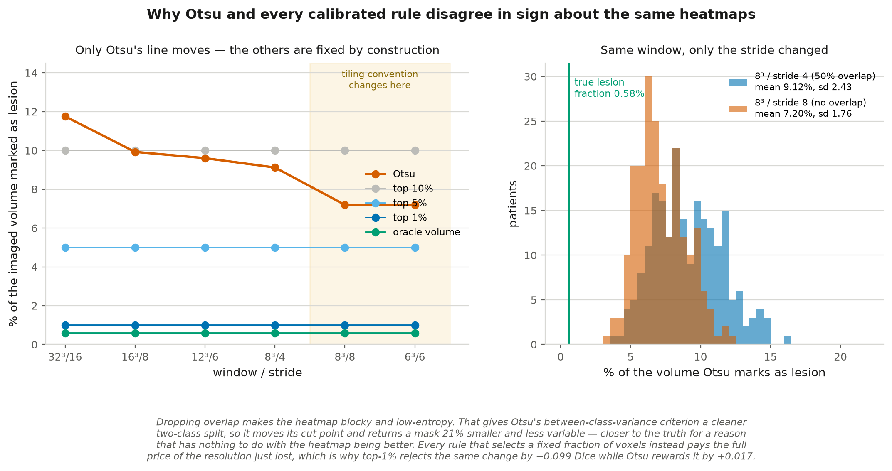
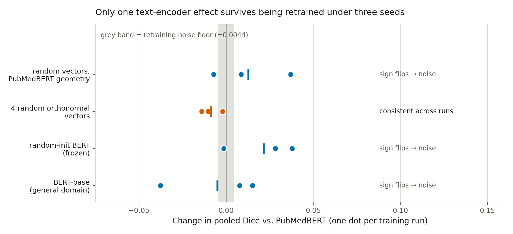
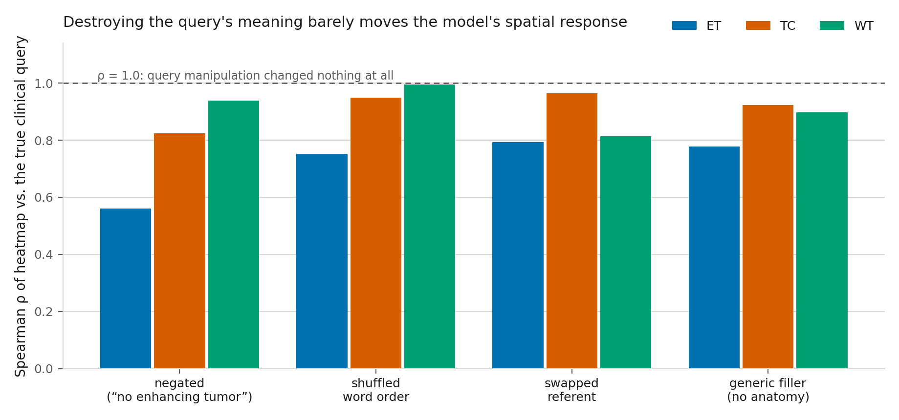
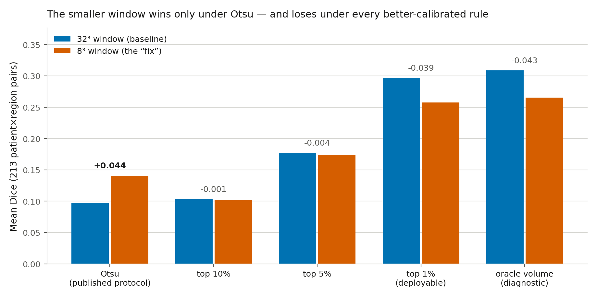
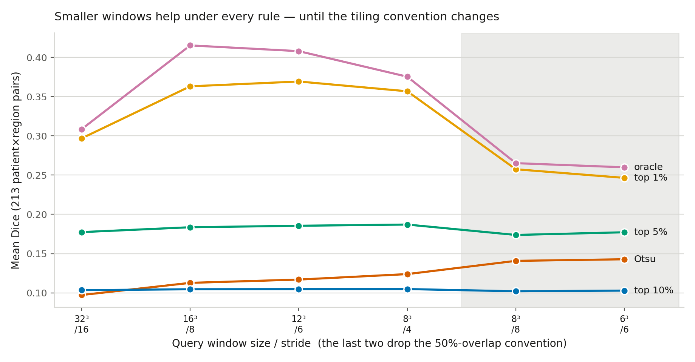
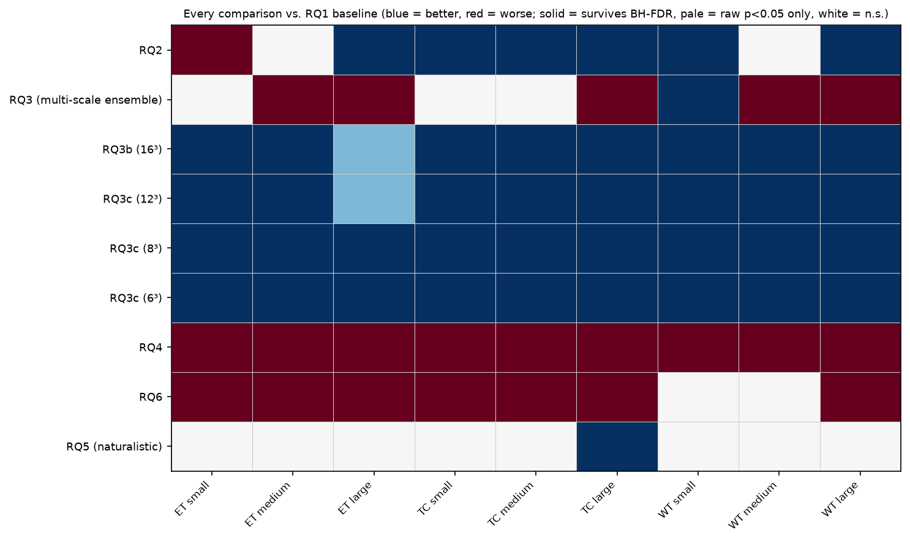

\newpage

# How to read this document

The main report (`report_draft.pdf`) is written as a research paper: tight, and assuming you already know what Dice and contrastive learning are. **This document is the opposite.** It explains everything from the ground up, walks through all fifteen experiments in the order they happened, names every script that produced every number, and says *why* each step was taken.

It is organised as:

| Part | Contents |
|---|---|
| **1** | Plain-language primer — every concept used, explained from scratch |
| **2** | The question, and why it matters |
| **3** | The machinery: data, model, localization, metrics (with the code that does each) |
| **4** | All fifteen experiments, in chronological order |
| **5** | The six conclusions we had to reverse, and how each was caught |
| **6** | Complete inventory: 60 scripts, 111 cluster jobs, 53 result files, 38 figures |
| **7** | How to reproduce everything |

**Scale of the work:** 60 Python files (10,323 lines), 45 cluster job scripts, **111 SLURM jobs totalling 22.4 GPU-hours**, 53 per-patient result tables, 171 statistical tests, 38 figures.

\newpage

# Part 1 — Plain-language primer

Nothing here is assumed. If a term appears later in the document, it is defined here.

## 1.1 The medical imaging side

**MRI volume.** A brain MRI is not a photograph; it is a 3D block of numbers. Think of a loaf of bread sliced thinly: each slice is a 2D image, and stacking them gives a 3D volume. Every point in that block is a **voxel** (a 3D pixel).

**Four modalities.** BraTS scans each patient four different ways (T1, T1ce, T2, FLAIR). Each highlights different tissue — e.g. T1ce uses an injected contrast agent that makes actively growing tumor light up. We feed all four to the model at once, like four colour channels in a photo.

**The three tumor regions.** Radiologists don't label "tumor" as one thing. BraTS defines three nested regions:

- **ET** (enhancing tumor) — the actively growing part. **Smallest**, hardest to find, most clinically urgent.
- **TC** (tumor core) — ET plus the dead tissue at its centre. Medium.
- **WT** (whole tumor) — TC plus the swelling around it. **Largest**, easiest.

Nested means ET ⊂ TC ⊂ WT. This matters constantly: a "large" ET is physically smaller than a "small" WT, which is why every measurement in this project is computed *per region*.

**Segmentation mask.** An expert's voxel-by-voxel labelling of which voxels are tumor. This is our ground truth.

## 1.2 The measurement side

**Dice score.** The standard way to score a predicted region against the true one:

$$\text{Dice} = \frac{2 \times |\text{overlap}|}{|\text{prediction}| + |\text{truth}|}$$

1.0 means perfect overlap, 0.0 means none. **The crucial property:** Dice is geometrically harsher on small targets. If the true lesion is 10 voxels and you miss by 5, you lose half your score. If it is 10,000 voxels and you miss by 5, you lose almost nothing. *Any* method scores worse on small lesions — which is precisely why this project needed controls before claiming its model has a small-lesion problem.

**Size bins.** We sort patients into three equal-sized groups (**terciles**) by their true lesion volume: small / medium / large. Computed per region, from the original-resolution scan.

**The pointing game.** A second, different metric: *is the model's single strongest response inside the true lesion?* Yes or no. Unlike Dice this has no size penalty — a voxel either is or isn't inside. It answers "did the model find the lesion" separately from "did it draw the outline correctly." Borrowed from the weakly-supervised localization literature (Zhang et al., 2018).

**Chance baseline.** Feed pure random noise through the identical scoring pipeline. Whatever score that produces is what "no information at all" looks like. If our model scores 0.01 and random noise scores 0.001, the model has real signal even though 0.01 sounds terrible.

## 1.3 The language side

**BERT.** A neural network that turns a sentence into a list of ~768 numbers (an **embedding**) capturing its meaning. **PubMedBERT** is a version trained on biomedical papers, so it should understand "enhancing tumor."

**Anisotropy** — important, and a real problem here. Raw BERT embeddings of different sentences all point in nearly the same direction. Our four class descriptions have **0.99 cosine similarity** to each other, where 1.0 means identical. So the frozen encoder barely distinguishes them at all, and a small trainable layer has to do the separating. This turned out to be central: see RQ7.

**Contrastive learning.** Train two encoders — one for text, one for images — to place matching pairs close together in a shared space and non-matching pairs far apart. This is how CLIP works. Once trained, you can ask "how similar is this image patch to this sentence?" and get a number.

**Cosine similarity.** The angle between two embedding vectors. +1 = same direction, 0 = unrelated, −1 = opposite. Our similarity scores are all cosines.

## 1.4 The engineering side

**Sliding window.** Our model looks at small cubes (patches), not whole volumes. To search a whole brain we slide a cube across it, scoring each position, building a **heatmap** — a 3D map of "how much does this spot match the text?"

**Stride.** How far the cube moves each step. Stride = half the cube size means consecutive windows overlap 50%. **Stride = cube size means no overlap.** This distinction looks like a boring implementation detail. It caused one of our biggest errors (Part 5).

**Thresholding / binarization.** The heatmap is continuous, but Dice needs a yes/no mask. So we pick a cut-off. **Otsu's method** picks it automatically from the image's own histogram. We chose it because it never sees ground truth, so it can't cheat — but it turned out to be the single largest source of error in the project.

**SLURM.** The cluster's job scheduler. You write a script saying "give me a GPU for 2 hours and run this," submit it, and wait in a queue.

## 1.5 The statistics side

**Paired test.** Each patient is scored under both methods, so we compare *per patient* and ask whether the differences lean one way. Much more sensitive than comparing group averages.

**Wilcoxon signed-rank test.** The paired test we use. We use it instead of a *t*-test because Dice scores are bounded, lopsided, and pile up near zero for small lesions — a *t*-test assumes a bell curve we don't have.

**p-value.** Probability of seeing this difference if there were really no effect. Small = surprising if nothing is going on.

**The multiple comparisons problem.** Run 171 tests at the usual p<0.05 bar and about 9 will look "significant" from pure luck. **Benjamini-Hochberg (BH) correction** raises the bar to compensate. Every significance claim in this project is BH-corrected across all 171 tests.

**Effect size.** p-values say "is it real"; effect sizes say "is it big." With 20–32 patients per bin you can get a real but meaningless difference, so we report both, and flag results that are significant but tiny (|Δ| < 0.01).

**Seeds and the unit of replication.** A "seed" fixes the random numbers, so it determines both the data split and the starting weights. **Key idea, and one we initially got wrong:** if you train a model *once* and test on 213 patients, your 213 measurements tell you about *that one trained model*, not about the method. To claim the method works you must retrain several times. Treating one run's patients as independent evidence is called **pseudo-replication**, and it produced a p-value of 6×10⁻³⁵ for an effect that turned out to be noise (RQ7).

\newpage

# Part 2 — The question, and why it matters

## 2.1 The problem

Modern AI can look at a medical scan and a sentence and tell you *whether* they match. What it struggles with is telling you *where*. Recent papers on 3D medical vision-language models report that when a lesion is small, these systems "default to large bounding boxes encompassing the entire organ or image quadrant" — they say "yes, there's a tumor" and then gesture vaguely at half the brain.

**Why this specifically matters.** Large obvious tumors don't need AI help; a radiologist sees them immediately. Small early-stage lesions are exactly where a second opinion is valuable — and exactly where these systems reportedly fail. So the failure is concentrated precisely on the cases that matter.

**The gap.** The literature reports this *qualitatively* — as an observation, or one number in a big benchmark table. Nobody had measured the relationship between lesion size and localization quality in a controlled way, with the controls needed to prove it is a model failure rather than a property of the scoring metric.

## 2.2 What this project asked

1. **Is it real?** Measure the size–quality relationship properly, with a chance baseline and a supervised reference.
2. **Is it a language problem?** If the model doesn't understand the text, better text should help.
3. **Is it an architecture problem?** If the model can't *see* at the right scale, changing how we look should help.
4. **Can it be fixed?** Try the plausible fixes and report honestly.

## 2.3 The answer, in one paragraph

The failure is real and is **specific to text-conditioned localization** — a conventional supervised network on identical data barely degrades at all. It is **not a language problem**: replacing the language model with random numbers changes nothing measurable, and the text query behaves as a class label that happens to be spelled in English. It **is** an architecture problem, and exactly one fix works — querying the frozen model with a smaller window. Reaching that answer required reversing six of our own conclusions, all caught by controls rather than by statistics.

\newpage

# Part 3 — The machinery

## 3.1 Data pipeline

**`preprocess.py`** (190 lines) — turns raw scans into training-ready arrays.

*What it does:* loads each patient's four MRI files, normalizes intensities, resizes to a uniform 128×128×128 grid, and records each patient's true lesion volumes.

*Three decisions worth explaining:*

- **Z-scoring inside the brain mask only.** These scans are skull-stripped, so most of the volume is empty black space. Normalizing over the whole array would let that background dominate the average and squash the actual tissue contrast. So we compute statistics using only non-background voxels.
- **Lesion volumes measured *before* resizing.** Size bins are the independent variable of this entire project. Measuring them on the resized grid would fold resizing error into the very thing we're studying.
- **Incremental CSV writes.** The first version accumulated results in memory and wrote once at the end. It crashed on patient 355 (below) — which would have discarded all 354 patients of completed work. Now each patient is written as it finishes.

*A real data quirk:* patient `BraTS20_Training_355` ships its segmentation under the filename `W39_1998.09.19_Segm.nii` — a leftover from hospital anonymization, never fixed in the public release. Handled with a filename fallback.

**`text_encoder.py`** (204 lines) — the single source of all text in the project. Defines the region descriptions and embeds them with PubMedBERT. Three variants: templated (baseline), size-conditioned (RQ2/RQ4), naturalistic radiology-style (RQ5).

**`build_rq7_text_variants.py`** (166 lines) and **`build_rq8_probe_texts.py`** (181 lines) — build the encoder-ablation and compositionality-probe text sets. Details in Part 4.

{width=100%}

{width=100%}

**What these two figures establish.** The split is 296/73 and the bins are reasonably balanced (n = 20–32 per validation bin). ET is the thinnest region because 27 of 369 patients have no enhancing component at all. And the right-hand panel above shows the structural fact that governs the whole project: the three regions overlap so heavily in absolute volume that a *large* enhancing tumor is physically smaller than a *small* whole tumor. Any global size threshold would therefore be measuring "which region is this" rather than "how big is this lesion."

## 3.2 The model

**`model.py`** (51 lines) — `TextVolumeAligner`, the whole model in one small class.

Two branches meeting in a shared space:

- **Image branch:** a MONAI 3D ResNet-10 that takes a 32×32×32 patch (4 channels) and outputs 256 numbers.
- **Text branch:** one linear layer mapping PubMedBERT's 768 numbers to the same 256.

Both outputs are normalized to unit length, so a dot product between them *is* a cosine similarity.

**Why the asymmetry?** A whole ResNet on one side, a single linear layer on the other. Because of anisotropy: the frozen text encoder gives us four nearly-identical vectors, so the trainable linear layer must do all the separating. **RQ7 later showed it does essentially *all* the work** — you can replace PubMedBERT with random vectors and lose nothing.

![The anisotropy problem, measured. Left: the four class descriptions as PubMedBERT emits them — 0.99 cosine to each other, meaning the frozen biomedical encoder barely tells "enhancing tumor" apart from "no tumor". Centre: the same four after the trained linear head, which is where the separation comes from. Right, looking ahead to RQ7: each text condition we later substituted, ordered by that same statistic — the three conditions that keep PubMedBERT's geometry are noise regardless of what they mean, and the one that discards it is the only one that reliably costs anything.](figures/fig_anisotropy.png){width=100%}

**`dataset.py`** (102 lines) — serves training patches. Contains `region_mask()`, the single definition of ET/TC/WT used by every other file in the project. Defining it once matters: if two scripts disagreed about what "tumor core" means, every cross-experiment comparison would be silently wrong.

## 3.3 Localization — and a design dead-end avoided

**The original plan was Grad-CAM**, the standard "which pixels mattered?" technique. On inspection it cannot work here: our model **globally average-pools** each patch down to a single 256-number vector. That pooling throws away all spatial information, so there is no spatial map left for Grad-CAM to attribute onto. It would have produced a meaningless near-single-voxel blob.

This was caught during design, before implementation. Reported as a genuine finding, not hidden: knowing *why* an obvious approach fails is worth as much as the approach that worked.

**`localize.py`** (72 lines) — the replacement. `sliding_window_heatmap()` sweeps the trained encoder across the whole volume and accumulates each window's similarity into a per-voxel heatmap, dividing by coverage count so overlaps average rather than sum.

Its one clever feature carries the whole project: it can query at a **different physical window size than the model was trained at**, by resizing each window before encoding. That is what made the entire window sweep possible with no retraining.

{width=92%}

## 3.4 Metrics — defined once, imported everywhere

**`evaluate_rq1.py`** (185 lines) defines three functions that **every** other evaluation script imports rather than redefines:

- `otsu_threshold()` — Otsu's automatic cut-off
- `dice_iou()` — Dice and IoU
- `size_bin()` — small/medium/large assignment

This is deliberate. If each experiment defined its own Dice, a difference between experiments could be a difference in *measurement* rather than in *models*. Sharing the code makes that impossible. The supervised P′ reference imports the same functions, which is what makes it a valid check on the pipeline.

## 3.5 Pre-flight checks

Before trusting any result we ran two checks:

**`sanity_check_localize.py`** — does the heatmap even point the right way? Result: querying with the ET description scores **+0.247 higher inside** the true ET region than outside, and the "no tumor" query shows the inverse. The localizer works.

**`compute_chance_baseline.py`** — random-noise heatmaps through the identical pipeline:

| Region | Small | Medium | Large |
|---|---|---|---|
| ET | 0.0009 | 0.0035 | 0.0112 |
| TC | 0.0023 | 0.0070 | 0.0186 |
| WT | 0.0086 | 0.0205 | 0.0355 |

Note the chance baseline *also* rises with size — that is Dice's geometric bias, visible in isolation.

\newpage

# Part 4 — Every experiment

Fifteen experiments, in the order they happened. Each: **what we asked · what we ran · what came out · what it meant.**

## P′ — Does our pipeline actually work?

**The question.** Every number in this project comes from one pipeline: our preprocessing, our split, our Dice. If any of that had a bug, "small lesions localize badly" would be unfalsifiable from the inside — we could not tell a real failure from a misaligned mask.

The standard remedy, and what the course guidelines ask for: run the *same setup* on a problem someone else has already solved, and check you land where published work lands.

**What we ran.** `train_pprime_supervised.py` + `evaluate_pprime_supervised.py` (slurm: `train_pprime.sbatch`, `evaluate_pprime.sbatch`). A conventional supervised 3D U-Net on **the identical** preprocessed volumes, split, region definitions, and `dice_iou()`. Only the model and supervision differ. 200 epochs, 37 minutes.

**Result — the pipeline is sound:**

| Region | Our P′ | Published BraTS2020 range | Verdict |
|---|---|---|---|
| ET | 0.758 | 0.70 – 0.80 | in range |
| TC | 0.812 | 0.80 – 0.87 | in range |
| WT | 0.851 | 0.86 – 0.89 | 0.009 short |

**Result — and something better.** Because P′ is scored by the identical size bins, we can compare its size collapse directly:

| Region | P′ supervised | Text-conditioned (RQ1) |
|---|---|---|
| ET | **1.3×** | 15.0× |
| TC | **1.3×** | 9.2× |
| WT | **1.2×** | 4.9× |

**Why this is the most important single result.** The obvious deflationary reading of this whole project is: *"small lesions are just hard, and Dice punishes them — you've discovered a property of the metric."* P′ kills that. A supervised model on identical data with the identical metric scores **0.64 on the smallest enhancing tumors** where the text-conditioned model scores **0.01**. Small lesions are learnable here. Text-conditioned grounding is what fails.

{width=98%}

## RQ1 — Quantifying the failure

**The question.** How much does localization degrade with lesion size?

**What we ran.** `train_baseline.py` → `evaluate_rq1.py` (`train_baseline.sbatch`, `evaluate_rq1.sbatch`). Training: 24 minutes; evaluation: 2m47s.

**Model validation first:** 4-way classification accuracy reached **0.671** against 0.25 chance. The alignment learns real signal.

**Result:**

| Region | Small | Medium | Large | Large/Small |
|---|---|---|---|---|
| ET | 0.010 | 0.037 | 0.149 | **15.0×** |
| TC | 0.019 | 0.059 | 0.176 | **9.2×** |
| WT | 0.057 | 0.137 | 0.281 | **4.9×** |

**The control that matters.** Dice punishes small targets for everyone, so we compare **lift over chance**:

| Region | Small lift | Medium lift | Large lift |
|---|---|---|---|
| ET | 10.8× | 10.7× | 13.3× |
| TC | 8.4× | 8.5× | 9.4× |
| WT | 6.6× | 6.7× | 7.9× |

Lift is roughly **constant** across sizes. The careful reading: the model isn't disproportionately losing signal on small lesions *relative to chance*; what collapses is **absolute usability**. A consistent 7–13× advantage over random guessing still isn't enough to be clinically useful when the target is small.

{width=100%}

**Replication.** Retrained on two more splits (`train_baseline_seed1/2.sbatch`). The monotonic small < medium < large pattern held in **9 of 9** region×bin comparisons.

{width=95%}

{width=95%}

## RQ2 — Can better prompts fix it?

**The question.** If we *tell* the model the lesion is small, does it look for something small?

**What we ran.** `train_rq2.py` → `evaluate_rq2.py`. 10-way classification (3 regions × 3 sizes + background) with size-specific descriptions. At test time the true size is unknown, so we query all three phrasings and take the voxel-wise maximum.

**Result (as originally measured):** helped medium/large, but **worsened small enhancing tumor** — the opposite of the goal. Training accuracy 0.552.

**This section was later overturned.** See RQ13: the improvement was an artifact of the threshold, not a property of the model. The negative half survived.

{width=90%}

## RQ3 — Is it the receptive field? (naive version)

**The question.** RQ2 suggests the bottleneck isn't language. The obvious suspect is that the 32³ window is simply too coarse. First attempt: query at three scales (16³/32³/64³) and combine by taking the maximum.

**What we ran.** `evaluate_rq3_multiscale.py`. No retraining — the frozen RQ1 model, queried differently.

**Result: mostly hurt.** 1 of 9 bins improved, 5 got significantly worse.

**Why.** Taking a maximum across scales means the *noisiest* scale wins at every voxel. The model was never trained to produce comparable scores at 16³ and 64³, so their outputs aren't on the same footing — the max just amplifies whichever is loudest.

{width=95%}

## RQ3b — Isolate one smaller window

**The question.** RQ3 changed two things (window size *and* ensembling). Separate them: use a single 16³ window, no ensembling.

**What we ran.** `evaluate_rq3b_scale16_only.py` (19m17s — ~10× the baseline's forward passes).

**Result:** improved in **all 9 bins** at raw p<0.05. After BH correction, TC and WT survive (6/9); ET's three bins land just above the bar (q = 0.052, 0.052, 0.064).

**Honest reporting note.** ET is the region we care about most and the one where the evidence is weakest. We reported it as "probably helps but doesn't clear a corrected bar," not as a win.

{width=90%}

## RQ3c — How far does "smaller is better" go?

**What we ran.** `evaluate_window_sweep.py` at 12³, 8³, 6³ (`evaluate_window12/8/6.sbatch`; 52, 23, 64 minutes).

**Result as measured at the time:** kept improving through 8³, then plateaued for ET/TC at 6³ while WT kept climbing.

**This was wrong, in an instructive way.** The 8³ and 6³ runs also changed the stride convention — see Part 5.3.

{width=80%}

## RQ4 — Train with matched scales

**The question.** RQ3b changed only evaluation. What if we also *train* with crops matched to lesion size (small→16³, medium→32³, large→64³, all resized to 32³)?

**What we ran.** `train_rq4.py` → `evaluate_rq4.py`.

**Result: better classification, worse localization.** Accuracy rose to 0.668 (vs RQ2's 0.552), but localization got **significantly worse in all 9 bins** (p<0.0001 throughout).

{width=100%}

**We tested why rather than speculating.** `test_rq4_shortcut_hypothesis.py` fed **pure random noise** — zero anatomy — through the same three crop-and-resize pipelines:

| Noise pipeline | Similarity to its own size-text |
|---|---|
| "small" (16³→32³) | −0.401 ± 0.010 |
| "medium" (32³ native) | +0.026 ± 0.010 |
| "large" (64³→32³) | +0.149 ± 0.008 |

One-way ANOVA: **F = 59,672, p ≈ 4×10⁻²⁵¹**. Near-total separation on inputs containing no tumor whatsoever.

**What this proves.** The model learned to recognise **resize-interpolation artifacts** — the blur signature of upscaling a 16³ crop, the detail loss of downscaling a 64³ one — not tumor content. This is **shortcut learning**, caught directly rather than inferred.

{width=100%}

**A refinement we reported precisely.** The mechanism is not clean per-scale fingerprinting. *Every* noise pipeline scores highest against the **"large"** text embedding. That is an embedding-space **hub** — one class acting as a generic attractor regardless of input. Reporting the mechanism we actually found, rather than the one we hypothesised, is what made RQ6 possible.

## RQ6 — Can the hub be repaired?

**The question.** RQ4 diagnosed a problem. Can we fix it?

**What we ran.** `train_rq6.py` → `evaluate_rq6.py`. Same scale-matched setup plus a **uniformity regularizer** (Wang & Isola, 2020) — a loss term penalising high pairwise similarity among the projected class embeddings, pushing them apart so no class can dominate.

**Result: partial success, verified in three parts.**

1. Embeddings genuinely separated (`test_rq6_hub_bias.py`): pairwise similarities now range −0.51 to +0.39, no longer collapsed.
2. **2 of 3** shortcut behaviours fixed — the medium and large pipelines now prefer their own labels; the small pipeline still wrongly prefers "large." (Under RQ4 the large-crop pipeline also happened to prefer "large", but only because *every* pipeline did — that is the hub, not scale recognition, so it does not count as a third fix being undone.)
3. Beat RQ4 in **all 9** bins — but still **below the plain baseline in 7 of 9**.

{width=100%}

**Honest verdict:** a real, measurable, partial repair that still doesn't beat doing nothing.

**A mechanism check we were careful to label.** `evaluate_rq6_single_scale.py` uses the *true* size bin to pick one scale. That uses ground truth and is **not deployable** — reported purely to isolate where RQ6's benefit comes from.

## RQ5 — Does it survive real radiology language?

**The question.** All our text is templated, textbook-style. Is the whole finding an artifact of stilted phrasing?

**What we ran.** `train_rq5.py` → `evaluate_rq5.py`, with descriptions rewritten in hedged, varied, radiology-report style.

**Result on one run:** essentially no difference (8/9 bins n.s.), Spearman ρ 0.958 vs 0.959. Reported as a clean robustness check.

**Later revised** — across three seeds it is consistently *better*, not neutral. See Part 5.2.

## RQ11 — How much of the collapse is the *threshold*?

**The question.** Every Dice number so far is the product of two stages: a heatmap, then a threshold. The chance control can't separate them, because random heatmaps go through the same threshold and the artifact cancels out. So: how much of the "collapse" is grounding, and how much is binarization?

**What we ran.** `evaluate_rq11_threshold_confound.py` — recompute each heatmap once, then binarize **five** ways: Otsu, fixed top-10%/5%/1%, and an **oracle** taking exactly as many voxels as the truth contains (uses ground truth; a diagnostic ceiling, never a method).

**Result 1 — Otsu is badly miscalibrated, in the worst possible direction:**

| Region | Bin | True volume | Otsu predicted | Over-prediction |
|---|---|---|---|---|
| ET | small | 4,124 mm³ | 920,036 mm³ | **223×** |
| ET | large | 50,716 mm³ | 718,728 mm³ | 14× |
| WT | small | 38,995 mm³ | 1,371,023 mm³ | 35× |
| WT | large | 164,364 mm³ | 1,022,709 mm³ | 6× |

Otsu returns a near-constant 8–15% of the brain regardless of target size. Worse, the correlation between true and predicted volume is **negative** (ρ = −0.26 to −0.48) — it emits *larger* masks for *smaller* lesions, mechanically manufacturing part of the size effect.

{width=100%}

And the direct version of the same point: across the whole window sweep, Otsu is the *only* rule whose selected fraction of the volume can move at all. Dropping overlap at a fixed 8³ window shrinks its mask from 9.12% of the brain to 7.20% — closer to the truth, for a reason that has nothing to do with the heatmap being better. That shift is exactly what it collects the Dice reward for in Part 5.3.

{width=100%}

**Result 2 — the collapse is real but was overstated:**

| Region | L/S under Otsu | L/S under oracle |
|---|---|---|
| ET | 15.0× | **14.4×** |
| TC | 9.2× | **5.6×** |
| WT | 4.9× | **2.4×** |

Honest headline: **2.4–14.4×**, not 5–15×.

{width=100%}

**Result 3 — the pointing game finds where the real failure lives.** Chance-corrected accuracy is roughly uniform at 46–122× chance everywhere — with one stark exception:

> **Small enhancing tumor: the model's peak response lands inside the true lesion in 0 of 21 patients.** Exactly chance. Median distance to the nearest lesion voxel: 23.7 mm.

That is not a boundary-drawing failure — but it is not a failure to search either, and the difference took a third tie-breaking rule to establish. The winning 16³ block *contains* part of the lesion in 9 of 21 cases, 36× the block-level chance of 1.19%. So the model has found the lesion to within a 26 mm block and has no information about where inside it the lesion sits. An earlier draft wrote “the model is not pointing at the lesion at all”; the block rule does not support that, and the narrower version is a better fit to the architecture story anyway. See Part 5.6.

{width=100%}

{width=100%}

**A free improvement.** The fixed top-1% rule needs no ground truth and beats Otsu everywhere, by 3–4× for ET.

## RQ7 — Does the text encoder matter at all?

**The question.** Every experiment so far changed *what the text says*. This one changes *what produces the embedding*.

**What we ran.** `build_rq7_text_variants.py` → `train_rq7.py` → `evaluate_rq7.py`, four conditions × three seeds (12 training runs):

- **BERT-base** — general-domain instead of biomedical
- **Random-init BERT** — the architecture with random weights, never trained
- **4 random orthonormal vectors** — pure class IDs, no language at all
- **Random vectors at PubMedBERT's geometry** — semantically empty, but same anisotropic shape

The last two are the key decomposition: comparing PubMedBERT against random vectors *at its own geometry* isolates **meaning**; comparing orthonormal against anisotropic random vectors isolates **geometry**.

**The single-seed result looked spectacular and was wrong.** Random-init BERT appeared to *beat* PubMedBERT by +0.038 at **p ≈ 6×10⁻³⁵**.

That p-value is indefensible. Each condition was trained **once**, so the unit of randomization is the training run, not the patient — treating 213 patients from one run as 213 independent observations is pseudo-replication. The check that exposed it: retraining the *identical* PubMedBERT model under three seeds moves pooled Dice by 0.0086 all by itself.

**Retrained under three seeds each (`analyze_rq7_multiseed.py`):**

| Condition | seed 0 | seed 1 | seed 2 | mean | verdict |
|---|---|---|---|---|---|
| BERT-base | +0.0151 | −0.0378 | +0.0078 | −0.005 | sign flips → **noise** |
| Random-init BERT | +0.0379 | +0.0283 | −0.0014 | +0.022 | sign flips → **noise** |
| Random @ PubMedBERT geometry | −0.0072 | +0.0370 | +0.0085 | +0.013 | sign flips → **noise** |
| **4 random orthonormal** | −0.0140 | −0.0103 | −0.0020 | **−0.009** | consistent, 2× noise floor |

Noise floor = 0.0044.

**Three conclusions, and the first two are uncomfortable:**

1. **Biomedical pretraining is worth nothing measurable here.** Swapping PubMedBERT for general BERT produces an effect that changes sign between runs.
2. **Neither is language.** Replacing the encoder with random vectors is also indistinguishable from noise — *provided* those vectors carry PubMedBERT's anisotropic geometry. The only condition that reliably hurts is the one that discards that geometry. So: **meaning contributes nothing detectable; embedding geometry contributes a small but reproducible amount.**
3. **The core finding is encoder-independent** — the size collapse persists under every text condition and seed.

{width=98%}

**And a second, cheaper check that says the same thing.** Every RQ7 run saved two checkpoints — its last epoch and its best validation epoch. Scoring the *same trained runs* at the other checkpoint turns the +0.0379 "random-init BERT wins" result into −0.0008. Nothing about the text encoder changed. Two unrelated perturbations — reseed the run, or move the checkpoint — each erase the effect, which is much stronger than either on its own.

{width=94%}

## RQ8 — Is the query language, or a label?

**The question.** RQ7 shows the encoder is replaceable. RQ8 asks the trained model directly: does it respond to linguistic structure at all?

**What we ran.** `build_rq8_probe_texts.py` → `evaluate_rq8_compositionality.py`. Four manipulations, evaluation only:

- **negated** — "*no* enhancing tumor is seen" (keeps the words, inverts the meaning)
- **shuffled** — word order destroyed (keeps the bag of words, removes syntax)
- **swapped** — the region's head term replaced by another region's
- **generic** — contentless filler naming no anatomy at all

Built-in correctness gate: the "original" condition must reproduce RQ1's CSV exactly.

**Result — the model barely notices:**

| Manipulation | Cosine to original *after* the trained projection | Heatmap correlation |
|---|---|---|
| negated | 0.940 – 0.962 | 0.561 – 0.939 |
| shuffled | 0.962 – 0.974 | 0.753 – 0.996 |
| swapped | 0.954 – 0.981 | 0.793 – 0.965 |
| generic | 0.940 – 0.947 | 0.777 – 0.924 |

Every manipulation stays above **0.94 cosine** after the very layer supposed to make these classes discriminable.

**Two findings that should not happen if the model reads language:**

- For whole tumor, **contentless filler beats the real clinical description** (+0.017), and a **wrong-region term beats it by more** (+0.033).
- Shuffling word order changes whole-tumor Dice by −0.0009 (n.s.). **Syntax is worth nothing for the largest region.**

**Embedding distance doesn't predict behaviour change** (ρ = +0.41, p = 0.19). If the embedding carried graded meaning, moving it further should change behaviour more. It doesn't.

{width=100%}

**Conclusion.** The text query functions as an **opaque class identifier that happens to be spelled in English**. This also explains RQ5's null far better than "the finding is robust to phrasing": no phrasing change matters much when the pathway is a lookup, not a parse.

{width=98%}

## Seed replication of the ablations

**The question.** RQ7 taught us the unit of replication is the run. Every ablation verdict rested on a single run each.

**What we ran.** `train_seed_replication.sbatch` / `evaluate_seed_replication.sbatch` for RQ2/RQ4/RQ5/RQ6 × seeds 1,2 (16 jobs), then `analyze_seed_replication.py`.

| Ablation | seed 0 | seed 1 | seed 2 | mean | bins replicating 3/3 |
|---|---|---|---|---|---|
| RQ2 | +0.0227 | +0.0098 | +0.0258 | +0.019 | 4/9 |
| RQ4 | −0.0376 | −0.0466 | −0.0109 | −0.032 | 6/9 |
| RQ5 | +0.0035 | +0.0528 | +0.0641 | +0.040 | 6/9 |
| RQ6 | −0.0231 | −0.0378 | −0.0295 | −0.030 | 7/9 |

{width=100%}

All four hold direction. **But RQ5 was reported as "no difference" — and across three runs it is consistently better.** See Part 5.2.

## RQ12 — Is the window result real?

Covered in full in Part 5.3, since it is a correction story. Summary of the final measurements:

**With tiling held fixed, smaller windows help under every rule:**

| Rule | 32³/16 | 16³/8 | 12³/6 | 8³/4 | Trend |
|---|---|---|---|---|---|
| Otsu | 0.0972 | 0.1127 | 0.1169 | 0.1239 | +0.027 |
| top 10% | 0.1034 | 0.1046 | 0.1047 | 0.1048 | +0.001 |
| top 5% | 0.1774 | 0.1836 | 0.1855 | 0.1870 | +0.010 |
| **top 1%** | 0.2968 | 0.3631 | **0.3693** | 0.3568 | **+0.060** |
| **oracle** | 0.3085 | **0.4152** | 0.4079 | 0.3754 | **+0.067** |

**Pointing improves for ET in every bin — including the previously-hopeless one:**

| Region | Bin | 32³ | 8³/stride-4 |
|---|---|---|---|
| ET | small | 0.000 | **0.190** |
| ET | medium | 0.130 | **0.565** |
| ET | large | 0.348 | **0.609** |
| WT | small | 0.531 | **0.812** |
| WT | large | 0.850 | **1.000** |
| TC | large | 0.696 | 0.217 (worse) |

{width=98%}

{width=98%}

**One thing the pooled curve hides.** Broken out per region under the calibrated rules, the three regions want three different windows: enhancing tumor peaks at 12³, tumor core at 16³ and then falls away sharply, whole tumor is still climbing at the smallest window tested. That is the same regional split the pointing game found independently — two dissimilar metrics agreeing, which is what Section 8's triangulation tool is for.

{width=100%}

**And it is not free.** The recommended 12³/stride-6 setting does 8,000 forward passes per volume against the baseline's 343 — 23×, and 52 minutes against 2m47s for the whole validation set. Cheap against retraining an arm (24 min, plus labels and an optimiser); not free.

{width=88%}

## RQ13 — Do the retrained arms survive a better threshold?

**The question.** RQ12 proved Otsu is not a neutral instrument on the inference-side arms. RQ2/RQ4/RQ6 had only ever been scored under it — and they're suspect for a mechanical reason: each builds its heatmap by taking a **maximum over three queries**, which reshapes the histogram Otsu keys on.

**What we ran.** `evaluate_ablation_thresholds.py` × 3 arms → `analyze_rq13.py`. Reproduction gate: the re-scored Otsu column matches each published CSV to <3.5×10⁻⁵ pooled.

| Arm | Otsu | top 10% | top 5% | top 1% | oracle |
|---|---|---|---|---|---|
| **RQ2** | **+0.023** (p=8×10⁻¹⁷) | −0.001 | −0.004 | +0.006 (n.s.) | +0.000 (n.s.) |
| RQ4 | −0.038 | −0.007 | −0.024 | −0.032 | −0.024 |
| RQ6 | −0.023 | −0.008 | −0.036 | −0.060 | −0.040 |

{width=100%}

**RQ2's improvement is an artifact.** Under every calibrated rule it vanishes. Size-conditioned prompting does not improve localization; it produces a heatmap Otsu happens to binarize favourably. Its *negative* half (worsens small ET) is unaffected.

**RQ4 and RQ6's negative verdicts are robust** under all five rules.

**The pattern worth noting:** the miscalibrated binarizer distorted every *close* comparison while leaving the large negative effects intact — exactly the regime careful ablation work lives in.

\newpage

# Part 5 — The six conclusions we had to reverse

This is the most valuable part of the project. Each of these was plausible, statistically significant, internally consistent — and wrong. None was caught by a p-value.

## 5.1 The size collapse was overstated (caught by pipeline decomposition)

**Claimed:** 5–15× degradation, attributed to grounding.
**Reality:** roughly half of it, for two of three regions, came from the *threshold* — which over-predicts volume by up to 223× and is *anti*-correlated with lesion size.
**Corrected:** 2.4–14.4×.
**Why the earlier controls missed it:** the chance baseline passes through the same threshold, so the artifact cancels out of the ratio and stays invisible.

## 5.2 Two statistical conclusions (caught by replicating at the right unit)

**RQ7 — demoted.** "Random-init BERT beats PubMedBERT, p ≈ 6×10⁻³⁵" became noise once each condition was trained three times. One trained model measured on 213 patients tells you about that model, not the method.

**RQ5 — upgraded.** Reported as "no difference." Across three seeds it is consistently *better* (+0.040, positive in all three runs, 9× the noise floor). The seed-0 result was a fluke of one split. Honest caveat: with n=3 runs the formal test is p=0.16, so we report it as consistent-in-direction, not significant.

## 5.3 The window result — reversed twice (caught by metric triangulation, then confound isolation)

The most instructive episode in the project.

**Version 1 (Otsu only).** "Smaller windows monotonically better, all the way to 6³, with a plateau for ET/TC." Statistically strong, 18/18 bins clearing correction at 8³.

**Version 2 (calibrated thresholds).** Re-scored under five binarizers, the 32³-vs-8³ comparison *reversed*: +0.044 under Otsu became −0.039 under top-1%. Conclusion written: the win is an Otsu artifact.

**Version 3 (overlap-matched control).** Version 2 was itself confounded. The original sweep used **50% overlap** at 32³/16³/12³ but switched to **non-overlapping tiling** at 8³ and 6³ to save compute — noted in the draft as an aside, not treated as a design change. So the 32-vs-8 comparison differed in *two* ways at once.

Adding an 8³/stride-4 run (matched overlap) settled it:

- With tiling fixed, **smaller windows help under every rule**, and 2–3× *more* under calibrated rules (+0.060) than Otsu could show (+0.027). **RQ3b/RQ3c's original claim survives and was understated.**
- The calibrated curves reveal an interior optimum at **12³–16³** that Otsu's monotone curve hid.
- The "plateau at 6³" is **withdrawn** — it rested entirely on the two tiling-changed points.

**The by-product is the sharpest result in the project.** At a fixed 8³ window, changing *only* the stride:

| Rule | 8³ overlapped | 8³ non-overlapped | Δ |
|---|---|---|---|
| **Otsu** | 0.1239 | 0.1407 | **+0.017 (prefers non-overlap)** |
| top 1% | 0.3568 | 0.2574 | **−0.099 (rejects it)** |
| oracle | 0.3754 | 0.2652 | **−0.110 (rejects it)** |

**Otsu and every calibrated rule disagree in *sign* about the same heatmaps, both at p < 10⁻³².** Dropping overlap makes the heatmap blocky and low-entropy, which gives Otsu's histogram criterion a cleaner two-class split and a *better* score — while every rule that selects a fixed fraction of voxels is penalised for the lost resolution. Otsu doesn't merely add noise; **it rewards a specific degradation of the heatmap.**

## 5.4 A metric that wasn't well-defined (caught by checking what it measures)

The pointing game presumes a well-defined peak. But a sliding window with stride *s* gives every voxel the mean of the windows covering it, and all voxels in the same *s*³ block share an identical window set — so the heatmap is **piecewise-constant over *s*³ blocks**. `argmax` returns the *first* voxel of the winning block in array order — its **corner**, up to *s* voxels from anything peak-like.

Verified directly: median tie count is **exactly 4096 at stride 16** and **exactly 512 at stride 8** — matching *s*³ in both cases.

Fixed by taking the centroid of the tied-maximum plateau. Several numbers changed materially (WT-small: 6/32 → 17/32 hits). **The headline claim — ET-small at 0 of 21 — survived both rules**, which is why it stayed the headline.

## 5.5 RQ2's improvement (caught by pipeline decomposition, again)

Covered above under RQ13. Reported at p = 8×10⁻¹⁷; vanishes under every calibrated threshold.

## 5.6 What the ET-small failure actually is (caught by bounding a rule)

The last one, and the only one that made the paper's thesis *stronger* rather than weaker.

5.4 replaced one rule for locating an ambiguous peak with a better one. That invites an obvious question it did not ask: how much of the headline result is the rule? A third rule had been written to the same CSVs and never used — not "where is the peak" but "does the winning plateau touch the lesion at all". It is not a pointing rule, so it needs its own chance baseline: the fraction of the 512 stride-aligned 16³ blocks that the ground-truth mask intersects, computed per patient from the masks.

**Small enhancing tumor, n = 21:**

| Rule | Hits | Chance | Lift |
|---|---|---|---|
| argmax corner | 0 / 21 | 0.05% | 0× |
| plateau centroid | **0 / 21** | 0.05% | 0× |
| peak block touches lesion | **9 / 21** | 1.19% | **36×** |

Both *point* rules agree, so the headline stands: the model never points at a small enhancing tumor. But the block rule shows it is not lost either — 36× chance is squarely inside the 12–40× band every other region×bin occupies.

**What changed.** The sentence "the model is not pointing at the lesion at all" is withdrawn. The claim that survives is narrower and sharper: *the model localizes small enhancing tumor to within a 26 mm block and has no information about where inside that block the lesion is.* That is the fixed-receptive-field bottleneck this whole project argues for — and here it is measured directly rather than inferred from Dice.

{width=100%}

**Why this one is different from the other five.** Every earlier reversal took something away. This one replaced an overreach with a mechanism. It is also the cheapest of the six: the column had been sitting in the CSVs since the RQ12 run, and nothing had to be re-computed except a chance baseline from the masks.

## What this adds up to

**A shared confound is not a cancelled confound.** Every arm in this project used the same binarizer, which we argued made comparisons internally fair. That argument was wrong: arms that interact *differently* with a shared instrument can be ranked backwards by it — and no amount of paired testing or FDR correction across those arms will reveal it, because the confound is upstream of every test.

Also: **a single control is not a verdict.** Version 2 above *was* a control, and it was itself confounded.

{width=100%}

\newpage

# Part 6 — Complete inventory

## 6.1 Every Python file (60 files, 10,323 lines)

**Data pipeline**

| File | LOC | Purpose |
|---|---|---|
| `preprocess.py` | 190 | NIfTI loading, brain-mask z-scoring, resize to 128³, native-resolution lesion volumes |
| `text_encoder.py` | 204 | PubMedBERT wrapper; all three text variants |
| `build_rq7_text_variants.py` | 166 | The four encoder-ablation conditions |
| `build_rq8_probe_texts.py` | 181 | The five compositionality probes |

**Datasets and model**

| File | LOC | Purpose |
|---|---|---|
| `dataset.py` | 102 | Baseline patch sampler; defines `region_mask()` |
| `dataset_rq2.py` | 110 | Size-conditioned patches, fixed crop |
| `dataset_rq4.py` | 90 | Scale-matched patches (16/32/64 → 32) |
| `dataset_pprime.py` | 105 | Full-volume dense-label loader for P′ |
| `model.py` | 51 | `TextVolumeAligner` |
| `localize.py` | 72 | `sliding_window_heatmap()` |

**Training (7 files)** — `train_baseline.py` (118), `train_rq2.py` (128), `train_rq4.py` (128), `train_rq5.py` (128), `train_rq6.py` (146), `train_rq7.py` (152), `train_pprime_supervised.py` (195)

**Evaluation (15 files)** — `evaluate_rq1.py` (185, defines the shared metrics), `evaluate_rq2.py` (121), `evaluate_rq3_multiscale.py` (113), `evaluate_rq3b_scale16_only.py` (73), `evaluate_window_sweep.py` (86), `evaluate_rq4.py` (126), `evaluate_rq5.py` (112), `evaluate_rq6.py` (124), `evaluate_rq6_single_scale.py` (113), `evaluate_rq7.py` (119), `evaluate_rq8_compositionality.py` (193), `evaluate_rq11_threshold_confound.py` (234), `evaluate_grounding_sweep.py` (195), `evaluate_ablation_thresholds.py` (190), `evaluate_pprime_supervised.py` (118)

**Diagnostics (4 files)** — `compute_chance_baseline.py` (60), `sanity_check_localize.py` (72), `test_rq4_shortcut_hypothesis.py` (102), `test_rq6_hub_bias.py` (75)

**Analysis (11 files)** — `analyze_full_family.py` (267, all 171 tests + BH), `analyze_seed_replication.py` (209), `analyze_rq7.py` (251), `analyze_rq7_multiseed.py` (180), `analyze_rq8.py` (184), `analyze_rq11.py` (147), `analyze_rq12.py` (254), `analyze_rq13.py` (141), `analyze_appendix.py` (465, the eight blocks the CSVs held and nothing had extracted), `analyze_all_comparisons.py` (109), `analyze_results.py` (71)

**Figures (13 files)** — `make_figures.py` (107), `make_overlay_figure.py` (67), `generate_example_heatmaps.py` (51), `make_figure4_scale_comparison.py` (71), `make_figure5_window_curve.py` (68), `make_figure_architecture.py` (106), `make_figure_leaderboard.py` (70), `make_figure_roadmap.py` (145), `make_figure_significance_heatmap.py` (105), `make_figures_rq7_rq8_rq12.py` (265), `make_figures_dataset_and_evidence.py` (463), `make_figures_supplementary.py` (883), `make_figures_appendix.py` (712)

## 6.2 Cluster jobs — 111 SLURM jobs, 22.4 GPU-hours

Notable runtimes: baseline training 24m · P′ training 37m · RQ3b eval 19m · window-6 eval 64m · window-12 eval 52m · RQ8 probes 15m · 8³/stride-4 eval 32m.

**Development discipline:** every experiment was smoke-tested on the 10-minute `dev` partition before submitting a real job (11 `smoke_test_*.sbatch` scripts). This caught several bugs that would otherwise have wasted hours of queue time. Eight RQ7 seed jobs failed on first submission (a bad argument) and were caught in 8 seconds each because of it.

## 6.3 Figures (38)

**Dataset (2):** `fig_dataset_split` · `fig_dataset_volumes`

**Method and results (10):** `fig_architecture` · `fig1_dice_vs_volume` · `fig2_rq1_vs_rq2` · `fig3_example_overlays` · `fig4_scale_comparison` · `fig5_window_curve` · `fig_leaderboard` · `fig_roadmap` · `fig_significance_heatmap` · `fig_pprime_size`

**Evidence for specific claims (8):** `fig_rq7_encoder` · `fig_rq8_compositionality` · `fig_rq12_threshold_reversal` · `fig_rq12_window_curve` · `fig_otsu_calibration` · `fig_pointing_game` · `fig_seed_replication` · `fig_shortcut_probe`

**Evidence for claims that had been tables only (9, `make_figures_supplementary.py`):**

| Figure | The claim it carries | Where |
|---|---|---|
| `fig_anisotropy` | the four class descriptions at 0.99 cosine before the projection, spread after it; every RQ7 condition by its geometry | §5, §7.8 |
| `fig_lift_over_chance` | model against the random-heatmap control, and the flat lift ratio | §6.2 |
| `fig_threshold_ladder` | the collapse under all five binarizers, with the Otsu→oracle cost per bin | §6.3 |
| `fig_pointing_distance` | the peak-to-lesion distances behind the median column, both window sizes | §6.3, §7.11 |
| `fig_rq3_multiscale` | naive ensembling: 1 bin better, 5 significantly worse | §7.2 |
| `fig_accuracy_vs_localization` | every arm's training curve, and accuracy plotted against localization | §7.5 |
| `fig_rq6_uniformity` | the uniformity repair verified in all three of its parts | §7.6 |
| `fig_rq8_embedding_vs_behavior` | displacement against behavioural change (ρ=+0.41, p=0.19) | §7.9 |
| `fig_rq13_arms` | the three retrained arms re-scored under every rule | §7.12 |

**Measurements the CSVs held that nothing had looked at (9, `make_figures_appendix.py`):**

| Figure | The claim it carries | Where |
|---|---|---|
| `fig_iou_dice` | the second overlap metric, written since the first run and never quoted — 7 of 7 arms keep their sign | §6.2 |
| `fig_per_patient_spread` | the bounded, right-skewed 20–32-patient distributions every mean in the report averages | §6.2 |
| `fig_effect_sizes` | all 171 tests by magnitude against adjusted significance; 47 are significant and negligible | §8 |
| `fig_bh_correction` | the BH step-up itself, and a check that a growing family changes no earlier verdict | §8 |
| `fig_checkpoint_sensitivity` | RQ7 at both checkpoints — the +0.038 headline is −0.0008 at the other one | §7.8 |
| `fig_pointing_rules` | all three tie-breaking rules with a block-level chance baseline; the ET-small refinement | §6.3 |
| `fig_otsu_selected_fraction` | what each rule actually selects — the mechanism behind the sign disagreement, measured | §7.11 |
| `fig_window_curve_per_region` | the pooled 12³–16³ optimum broken into three regions that want three windows | §7.11 |
| `fig_cost_benefit` | forward passes per volume against the Dice each window buys | §7.11 |

Every figure regenerates from the result CSVs and training logs; none was drawn by hand. Colours use the Okabe-Ito colourblind-safe palette, verified computationally (all pairs clear ΔE ≥ 8 under simulated protanopia and deuteranopia).

{width=98%}

{width=98%}

## 6.4 Result files (53 CSVs)

One row per (patient, region) with Dice, IoU, size bin and true volume. Naming: `<experiment>_localization_scores.csv` for seed 0; `_seed1`/`_seed2` for replications. The RQ11/RQ12/RQ13 files add a `threshold_method` column (five rows per patient) plus pointing-game columns. `full_family_statistics.csv` is the derived table of all 171 tests.

**Every number in both reports is recomputed from these files by a script.** None is transcribed by hand.

## 6.5 Two engineering practices worth naming

**Built-in correctness gates.** Several scripts verify themselves against earlier results:

- `evaluate_rq8_compositionality.py` — its "original" condition must reproduce RQ1's CSV
- `evaluate_grounding_sweep.py` — at window 32 must reproduce RQ11's (212/213 rows bit-identical)
- `evaluate_ablation_thresholds.py` — its Otsu column must reproduce each arm's published CSV (<3.5×10⁻⁵)

**Filenames that encode the experiment.** After the tiling confound, RQ12 output filenames include *stride* as well as window size — because a window-only name would have silently overwritten one condition with another. That is the same class of bug as the confound itself: two different things sharing one label.

\newpage

# Part 7 — Reproducing everything

**Environment:** Python 3.10, PyTorch 2.4.0+cu121, MONAI 1.4.0, transformers 4.40.0.

1. **Data** — download BraTS2020 (`awsaf49/brats20-dataset-training-validation`) into `data/BraTS2020_TrainingData/`
2. **Preprocess** — `python src/preprocess.py`
3. **Text** — `python src/text_encoder.py`, then `build_rq7_text_variants.py`, `build_rq8_probe_texts.py`
4. **Validate the pipeline** — `train_pprime_supervised.py` then `evaluate_pprime_supervised.py`. *Do this before trusting anything downstream.*
5. **Baseline** — `train_baseline.py` (add `--seed 1` / `--seed 2` for replications)
6. **Experiments** — each `train_rqN.py` / `evaluate_rqN.py` with its matching `slurm/*.sbatch`. Smoke-test on `dev` first.
7. **Statistics** — `analyze_full_family.py` reproduces all 171 tests with BH correction; `analyze_appendix.py` the eight blocks in Part 6.3's last table
8. **Figures** — the thirteen figure scripts; `make_figures_supplementary.py` and `make_figures_appendix.py` last, since they read the RQ11/RQ12/RQ13 CSVs, the training logs and the preprocessed masks
9. **Report** — `pandoc report_draft.md -o report_draft.pdf --pdf-engine=xelatex -V mainfont="DejaVu Serif" --toc`

**Repository:** [github.com/rajhansini/Diagnosing-Small-Lesion-Grounding-Failure-in-Text-Conditioned-3D-Medical-Localization](https://github.com/rajhansini/Diagnosing-Small-Lesion-Grounding-Failure-in-Text-Conditioned-3D-Medical-Localization)

\newpage

# Closing summary

**What was built.** A complete text-conditioned 3D localization pipeline: preprocessing, contrastive alignment, sliding-window localization, five binarization rules, three localization metrics, and a twelve-tool diagnostic layer — 60 files, 10,323 lines, 111 cluster jobs, 38 figures.

**What was found.**

1. The small-lesion grounding failure is **real** — 2.4–14.4× degradation after controlling for the metric — and **specific to text conditioning**: a supervised model on identical data degrades only 1.2–1.3×.
2. It is **not a language problem**. Biomedical pretraining is worth nothing measurable; random vectors work as well as PubMedBERT; negating the query barely moves the model. The text is a class label spelled in English.
3. Exactly **one intervention works** — a smaller query window (12³–16³), no retraining — worth +0.060 Dice under a deployable threshold, and it lifts enhancing-tumor pointing in every size bin, taking the previously-at-chance small-ET bin from 0/21 to 4/21.
4. Replacing Otsu with a fixed top-1% threshold is a **second free improvement**, worth 2–4× Dice.

**What was learned, and what is most transferable.** Six conclusions in this work were overturned *after* being written up — every one by a control, none by a p-value. The general lesson: **a shared confound is not a cancelled confound.** When every arm of a comparison passes through the same miscalibrated instrument, the comparison still looks clean while being ranked backwards. And a single control is not a verdict — our first correction to the window result was itself confounded, and only a second control settled it.

That is the honest shape of this project: a modest positive finding, a strong negative one about language, and a methodology that repeatedly caught its own author being wrong.
